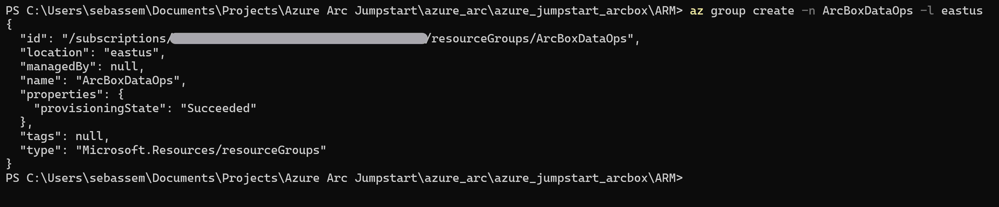

## Jumpstart ArcBox for DataOps

ArcBox for DataOps is a special "flavor" of ArcBox that is intended for users who want to experience Azure Arc-enabled SQL Managed Instance capabilities in a sandbox environment.


### Use cases

- Sandbox environment for getting hands-on with Azure Arc technologies and [Azure Arc-enabled SQL Managed Instance landing zone accelerator](PLACEHOLDER)
- Accelerator for Proof-of-concepts or pilots
- Training solution for Azure Arc skills development
- Demo environment for customer presentations or events
- Rapid integration testing platform
- Infrastructure-as-code and automation template library for building hybrid cloud management solutions

## Azure Arc capabilities available in ArcBox for DataOps

### Azure Arc-enabled Kubernetes

ArcBox for DataOps deploys three Kubernetes clusters to give you multiple options for exploring Azure Arc-enabled Kubernetes capabilities and potential integrations.

- _**ArcBox-CAPI-Data-xxxx**_ - A single-node Rancher K3s cluster which is then transformed to a [Cluster API](https://cluster-api.sigs.k8s.io/user/concepts.html) management cluster using the Cluster API Provider for Azure (CAPZ), and a workload cluster (_ArcBox-CAPI-Data_) is deployed onto the management cluster. The workload cluster is onboarded as an Azure Arc-enabled Kubernetes resource. ArcBox automatically deploys an Azure Arc Data Controller, an Active Directory connector and an Azure Arc-enabled SQL Managed Instance on top of the connected cluster.
- _**ArcBox-AKS-Data-xxxx**_ - An AKS cluster that is connected to Azure as an Azure Arc-enabled Kubernetes resource. ArcBox automatically deploys an Azure Arc Data Controller, an Active Directory connector and an Azure Arc-enabled SQL Managed Instance on top of the connected cluster.
- _**ArcBox-AKS--DR-Data-xxxx**_ - An AKS cluster that is deployed in a separate virtual network, designating a disaster recovery site. This cluster is then connected to Azure as an Azure Arc-enabled Kubernetes resource. ArcBox automatically deploys an Azure Arc Data Controller, an Active Directory connector and an Azure Arc-enabled SQL Managed Instance on top of the connected cluster. This cluster is then configured with _ArcBox-CAPI-Data-xxxx_ to be part of a distributed availability group for disaster recovery.

### Sample applications

ArcBox for DataOps deploys two sample applications on the _ArcBox-CAPI-Data-xxxx_ and the _ArcBox-AKS--DR-Data-xxxx_ clusters.

The sample applications included in ArcBox are:

- **Bookstore** - An MVC web application. ArcBox will deploy **one Kubernetes pod replica** of the _Bookstore_ application in the _arc_ namespace onto the _ArcBox-CAPI-Data-xxxx_ and the _ArcBox-AKS--DR-Data-xxxx_ clusters.

- **DB Connection app** - An MVC application. ArcBox will deploy **one Kubernetes pod replica** as part of the Bookstore app.

  - _bookbuyer_ is an HTTP client making requests to bookstore.
  - _bookstore_ is a server, which responds to HTTP requests. It is also a client making requests to the _bookwarehouse_ service.
  - _bookwarehouse_ is a server and should respond only to _bookstore_.
  - _mysql_ is a MySQL database only reachable by _bookwarehouse_.
  - _bookstore-v2_ - this is the same container as the first bookstore, but for [Open Service Mesh (OSM)](#open-service-mesh-integration) traffic split scenario we will assume that it is a new version of the app we need to upgrade to.

The _bookbuyer_, _bookstore_, and _bookwarehouse_ pods will be in separate Kubernetes namespaces with the same names. _mysql_ will be in the _bookwarehouse_ namespace. _bookstore-v2_ will be in the _bookstore_ namespace.

### Azure Monitor integration

ArcBox deploys metrics and logs upload to Azure Monitor for the deployed data services, in addition to the out-of-the-box Grafana and Kibana dashboards that get deployed as part of Arc-enabled Data services.

### Hybrid Unified Operations

ArcBox deploys several management and operations services that work with ArcBox's Azure Arc resources. These resources include an an Azure Automation account, an Azure Log Analytics workspace, an Azure Monitor workbook, Azure Policy assignments for deploying Kubernetes cluster monitoring and security extensions on the included clusters, Azure Policy assignment for adding tags to resources, and a storage account used for staging resources needed for the deployment automation.

## ArcBox Azure Consumption Costs

ArcBox resources generate Azure consumption charges from the underlying Azure resources including core compute, storage, networking, and auxiliary services. Note that Azure consumption costs vary depending on the region where ArcBox is deployed. Be mindful of your ArcBox deployments and ensure that you disable or delete ArcBox resources when not in use to avoid unwanted charges. Please see the [Jumpstart FAQ](https://aka.ms/Jumpstart-FAQ) for more information on consumption costs.

## Deployment Options and Automation Flow

ArcBox provides multiple paths for deploying and configuring ArcBox resources. Deployment options include:

- Azure portal
- ARM template via Azure CLI
- Azure Bicep
- HashiCorp Terraform


ArcBox uses an advanced automation flow to deploy and configure all necessary resources with minimal user interaction. The previous diagrams provide an overview of the deployment flow. A high-level summary of the deployment is:

- User deploys the primary ARM template (_azuredeploy.json_), Bicep file (_main.bicep_), or Terraform plan (_main.tf_). These objects contain several nested objects that will run simultaneously.
  - Client virtual machine ARM template/plan - deploys a domain-joined Client Windows VM. This is a Windows Server VM that comes preconfigured with kubeconfig files to work with the three Kubernetes clusters, as well multiple tools such as VSCode, Azure Data Studio and SQL Server Management Studio to make working with ArcBox simple and easy.
  - Storage account template/plan - used for staging files in automation scripts.
  - Management artifacts template/plan - deploys Azure Log Analytics workspace, its required Solutions, a domain controller and two virtual networks.
- User remotes into the Client Windows VM using domain credentials, which automatically kicks off multiple scripts that:
  - Onboards the AKS clusters to Azure Arc as Arc-enabled Kubernetes clusters.
  - Deploys a data controller, AD connector and an Azure Arc-enabled SQL Managed Instance on each cluster.
  - Creates the necessary DNS records for the Azure Arc-enabled SQL Managed Instance's endpoints.
  - Configures a distributed availability group between the Azure Arc-enabled SQL Managed Instances deployed on the _ArcBox-CAPI-Data-xxxx_ and the _ArcBox-AKS-DR-Data-xxxx_ clusters.
  - Deploys the _Bookstore_ application on the _ArcBox-CAPI-Data-xxxx_ and the _ArcBox-AKS-DR-Data-xxxx_ clusters.
  - Deploy an Azure Monitor workbook that provides example reports and metrics for monitoring and visualizing ArcBox's various components.

## Prerequisites

- [Install or update Azure CLI to version 2.36.0 and above](https://docs.microsoft.com/cli/azure/install-azure-cli?view=azure-cli-latest). Use the below command to check your current installed version.

  ```shell
  az --version
  ```

- Login to AZ CLI using the ```az login``` command.

- Ensure that you have selected the correct subscription you want to deploy ArcBox to by using the ```az account list --query "[?isDefault]"``` command. If you need to adjust the active subscription used by Az CLI, follow [this guidance](https://docs.microsoft.com/cli/azure/manage-azure-subscriptions-azure-cli#change-the-active-subscription).

- ArcBox must be deployed to one of the following regions. **Deploying ArcBox outside of these regions may result in unexpected behavior or deployment errors.**

  - East US
  - East US 2
  - Central US
  - West US 2
  - North Europe
  - West Europe
  - France Central
  - UK South
  - Australia East
  - Japan East
  - Korea Central
  - Southeast Asia

- **ArcBox DataOps requires 42 B-series vCPUs and 56 DSv4 vCPUs** when deploying with default parameters such as VM series/size. Ensure you have sufficient vCPU quota available in your Azure subscription and the region where you plan to deploy ArcBox. You can use the below Az CLI command to check your vCPU utilization.

  ```shell
  az vm list-usage --location <your location> --output table
  ```

  

- Some Azure subscriptions may also have SKU restrictions that prevent deployment of specific Azure VM sizes. You can check for SKU restrictions used by ArcBox by using the below command:

  ```shell
  az vm list-skus --location <your location> --size Standard_D2s --all --output table
  az vm list-skus --location <your location> --size Standard_D4s --all --output table
  ```

  In the screenshots below, the first screenshot shows a subscription with no SKU restrictions in West US 2. The second shows a subscription with SKU restrictions on D4s_v4 in the East US 2 region. In this case, ArcBox will not be able to deploy due to the restriction.

  

  

- Create an Azure service principal (SP). To deploy ArcBox, an Azure service principal assigned with multiple role-based access control (RBAC) roles is required:

  - "Contributor" - Required for provisioning Azure resources
  - "Security admin" - Required for installing Microsoft Defender for Cloud Azure Arc-enabled Kubernetes extension and dismiss alerts
  - "Security reader" - Required for being able to view Azure Arc-enabled Kubernetes Cloud Defender extension findings
  - "Monitoring Metrics Publisher" - Required for being Azure Arc-enabled data services billing, monitoring metrics, and logs management

    To create it login to your Azure account run the below commands (this can also be done in [Azure Cloud Shell](https://shell.azure.com/).

    ```shell
    az login
    subscriptionId=$(az account show --query id --output tsv)
    az ad sp create-for-rbac -n "<Unique SP Name>" --role "Contributor" --scopes /subscriptions/$subscriptionId
    az ad sp create-for-rbac -n "<Unique SP Name>" --role "Security admin" --scopes /subscriptions/$subscriptionId
    az ad sp create-for-rbac -n "<Unique SP Name>" --role "Security reader" --scopes /subscriptions/$subscriptionId
    ```

    For example:

    ```shell
    subscriptionId=$(az account show --query id --output tsv)
    az ad sp create-for-rbac -n "JumpstartArcBox" --role "Contributor" --scopes /subscriptions/$subscriptionId
    az ad sp create-for-rbac -n "JumpstartArcBox" --role "Security admin" --scopes /subscriptions/$subscriptionId
    az ad sp create-for-rbac -n "JumpstartArcBox" --role "Security reader" --scopes /subscriptions/$subscriptionId
    az ad sp create-for-rbac -n "JumpstartArcBox" --role "Monitoring Metrics Publisher" --scopes /subscriptions/$subscriptionId
    ```

    Output should look similar to this.

    ```json
    {
    "appId": "XXXXXXXXXXXXXXXXXXXXXXXXXXXX",
    "displayName": "JumpstartArcBox",
    "password": "XXXXXXXXXXXXXXXXXXXXXXXXXXXX",
    "tenant": "XXXXXXXXXXXXXXXXXXXXXXXXXXXX"
    }
    ```

    > **NOTE: If you create multiple subsequent role assignments on the same service principal, your client secret (password) will be destroyed and recreated each time. Therefore, make sure you grab the correct password.**

    > **NOTE: The Jumpstart scenarios are designed with as much ease of use in-mind and adhering to security-related best practices whenever possible. It is optional but highly recommended to scope the service principal to a specific [Azure subscription and resource group](https://docs.microsoft.com/cli/azure/ad/sp?view=azure-cli-latest) as well considering using a [less privileged service principal account](https://docs.microsoft.com/azure/role-based-access-control/best-practices)**

- [Generate SSH Key](https://help.github.com/articles/generating-a-new-ssh-key-and-adding-it-to-the-ssh-agent/) (or use existing ssh key). The SSH key is used to configure secure access to the Linux virtual machines that are used to run the Kubernetes clusters.

  ```shell
  ssh-keygen -t rsa -b 4096 -C "your_email@example.com"
  ```

## Deployment Option 1: Azure portal

- Click the <a href="https://portal.azure.com/#create/Microsoft.Template/uri/https%3A%2F%2Fraw.githubusercontent.com%2Fmicrosoft%2Fazure_arc%2Farcbox_dataops%2Fazure_jumpstart_arcbox%2FARM%2Fazuredeploy.json" target="_blank"></a> button and enter values for the the ARM template parameters.

  

  

  

## Deployment Option 2: ARM template with Azure CLI

- Clone the Azure Arc Jumpstart repository

    ```shell
    git clone https://github.com/microsoft/azure_arc.git
    ```

- Edit the [azuredeploy.parameters.json](https://github.com/microsoft/azure_arc/blob/arcbox_dataops/azure_jumpstart_arcbox/ARM/azuredeploy.parameters.json) ARM template parameters file and supply some values for your environment.
  - _`sshRSAPublicKey`_ - Your SSH public key
  - _`spnClientId`_ - Your Azure service principal id
  - _`spnClientSecret`_ - Your Azure service principal secret
  - _`spnTenantId`_ - Your Azure tenant id
  - _`windowsAdminUsername`_ - Client Windows VM Administrator name
  - _`windowsAdminPassword`_ - Client Windows VM Password. Password must have 3 of the following: 1 lower case character, 1 upper case character, 1 number, and 1 special character. The value must be between 12 and 123 characters long.
  - _`logAnalyticsWorkspaceName`_ - Name for the ArcBox Log Analytics workspace
  - _`flavor`_ - Use the value "DataOps" to specify that you want to deploy the DataOps flavor of ArcBox
  - _`deployBastion`_ - Set to true if you want to use Azure Bastion to connect to _ArcBox-Client_
  - _`githubUser`_ - Specify the name of your GitHub account where you cloned the Sample Apps repo

  

- Now you will deploy the ARM template. Navigate to the local cloned [deployment folder](https://github.com/microsoft/azure_arc/tree/arcbox_dataops/azure_jumpstart_arcbox) and run the below command:

  ```shell
  az group create --name <Name of the Azure resource group> --location <Azure Region>
  az deployment group create \
  --resource-group <Name of the Azure resource group> \
  --template-file azuredeploy.json \
  --parameters azuredeploy.parameters.json 
  ```

  

  

## Deployment Option 3: Azure Bicep deployment via Azure CLI

- Clone the Azure Arc Jumpstart repository

  ```shell
  git clone https://github.com/microsoft/azure_arc.git
  ```

- Upgrade to latest Bicep version

  ```shell
  az bicep upgrade
  ```

- Edit the [main.parameters.json](https://github.com/microsoft/azure_arc/blob/arcbox_dataops/azure_jumpstart_arcbox/bicep/main.parameters.json) template parameters file and supply some values for your environment.
  - _`sshRSAPublicKey`_ - Your SSH public key
  - _`spnClientId`_ - Your Azure service principal id
  - _`spnClientSecret`_ - Your Azure service principal secret
  - _`spnTenantId`_ - Your Azure tenant id
  - _`windowsAdminUsername`_ - Client Windows VM Administrator name
  - _`windowsAdminPassword`_ - Client Windows VM Password. Password must have 3 of the following: 1 lower case character, 1 upper case character, 1 number, and 1 special character. The value must be between 12 and 123 characters long.
  - _`logAnalyticsWorkspaceName`_ - Name for the ArcBox Log Analytics workspace
  - _`flavor`_ - Use the value "DataOps" to specify that you want to deploy the DataOps flavor of ArcBox
  - _`deployBastion`_ - Set to true if you want to use Azure Bastion to connect to _ArcBox-Client_
  - _`githubUser`_ - Specify the name of your GitHub account where you cloned the Sample Apps repo

  

- Now you will deploy the Bicep file. Navigate to the local cloned [deployment folder](https://github.com/microsoft/azure_arc/tree/main/azure_jumpstart_arcbox/bicep) and run the below command:

  ```shell
  az login
  az group create --name "<resource-group-name>"  --location "<preferred-location>"
  az deployment group create -g "<resource-group-name>" -f "main.bicep" -p "main.parameters.json"
  ```

## Deployment Option 4: HashiCorp Terraform Deployment

- Clone the Azure Arc Jumpstart repository

  ```shell
  git clone https://github.com/microsoft/azure_arc.git
  ```

- Download and install the latest version of Terraform [here](https://www.terraform.io/downloads.html)

  > **NOTE: Terraform 1.x or higher is supported for this deployment. Tested with Terraform v1.0.9+.**

- Create a `terraform.tfvars` file in the root of the terraform folder and supply some values for your environment.

  ```HCL
  azure_location      = "westus2"
  resource_group_name = "ArcBoxDataOps"
  spn_client_id       = "1414133c-9786-53a4-b231-f87c143ebdb1"
  spn_client_secret   = "fakeSecretValue123458125712ahjeacjh"
  spn_tenant_id       = "33572583-d294-5b56-c4e6-dcf9a297ec17"
  client_admin_ssh    = "C:/Temp/rsa.pub"
  deployment_flavor   = "DataOps"
  deploy_bastion      = false
  github_username     = "GitHubUser"
  ```

- Variable Reference:
  - **_`azure_location`_** - Azure location code (e.g. 'eastus', 'westus2', etc.)
  - **_`resource_group_name`_** - Resource group which will contain all of the ArcBox artifacts
  - **_`spn_client_id`_** - Your Azure service principal id
  - **_`spn_client_secret`_** - Your Azure service principal secret
  - **_`spn_tenant_id`_** - Your Azure tenant id
  - **_`client_admin_ssh`_** - SSH public key path, used for Linux VMs
  - **_`deployment_flavor`_** - Use the value "DataOps" to specify that you want to deploy the DataOps flavor of ArcBox
  - _`deployBastion`_ - Set to true if you want to use Azure Bastion to connect to _ArcBox-Client_
  - _`client_admin_username`_ - Admin username for Windows & Linux VMs
  - _`client_admin_password`_ - Admin password for Windows VMs. Password must have 3 of the following: 1 lower case character, 1 upper case character, 1 number, and 1 special character. The value must be between 12 and 123 characters long.
  - **_`workspace_name`_** - Unique name for the ArcBox Log Analytics workspace
  - _`github_username`_ - Specify the name of your GitHub account where you cloned the Sample Apps repo

  > **NOTE: Any variables in bold are required. If any optional parameters are not provided, defaults will be used.**

- Now you will deploy the Terraform file. Navigate to the local cloned [deployment folder](https://github.com/microsoft/azure_arc/tree/main/azure_jumpstart_arcbox/bicep) and run the commands below:

  ```shell
  terraform init
  terraform plan -out=infra.out
  terraform apply "infra.out"
  ```
  
- Example output from `terraform init`:

  

- Example output from `terraform plan -out=infra.out`:

  

- Example output from `terraform apply "infra.out"`:

  

## Start post-deployment automation

Once your deployment is complete, you can open the Azure portal and see the ArcBox resources inside your resource group. You will be using the _ArcBox-Client_ Azure virtual machine to explore various capabilities of ArcBox such as GitOps configurations and Key Vault integration. You will need to remotely access _ArcBox-Client_.

  

   > **NOTE: For enhanced ArcBox security posture, RDP (3389) and SSH (22) ports are not open by default in ArcBox deployments. You will need to create a network security group (NSG) rule to allow network access to port 3389, or use [Azure Bastion](https://docs.microsoft.com/azure/bastion/bastion-overview) or [Just-in-Time (JIT)](https://docs.microsoft.com/azure/defender-for-cloud/just-in-time-access-usage?tabs=jit-config-asc%2Cjit-request-asc) access to connect to the VM.**

### Connecting to the ArcBox Client virtual machine

Various options are available to connect to _ArcBox-Client_ VM, depending on the parameters you supplied during deployment.

- [RDP](https://azurearcjumpstart.io/azure_jumpstart_arcbox/DataOps/#connecting-directly-with-rdp) - available after configuring access to port 3389 on the _ArcBox-NSG_, or by enabling [Just-in-Time access (JIT)](https://azurearcjumpstart.io/azure_jumpstart_arcbox/DataOps/#connect-using-just-in-time-accessjit).
- [Azure Bastion](https://azurearcjumpstart.io/azure_jumpstart_arcbox/DataOps/#connect-using-azure-bastion) - available if ```true``` was the value of your _`deployBastion`_ parameter during deployment.

#### Connecting directly with RDP

By design, ArcBox does not open port 3389 on the network security group. Therefore, you must create an NSG rule to allow inbound 3389.

- Open the _ArcBox-NSG_ resource in Azure portal and click "Add" to add a new rule.

  

  

- Specify the IP address that you will be connecting from and select RDP as the service with "Allow" set as the action. You can retrieve your public IP address by accessing [https://icanhazip.com](https://icanhazip.com) or [https://whatismyip.com](https://whatismyip.com).

  

  

  

#### Connect using Azure Bastion

- If you have chosen to deploy Azure Bastion in your deployment, use it to connect to the VM.

  

  > **NOTE: When using Azure Bastion, the desktop background image is not visible. Therefore some screenshots in this guide may not exactly match your experience if you are connecting to _ArcBox-Client_ with Azure Bastion.**

#### Connect using just-in-time access (JIT)

If you already have [Microsoft Defender for Cloud](https://docs.microsoft.com/azure/defender-for-cloud/just-in-time-access-usage?tabs=jit-config-asc%2Cjit-request-asc) enabled on your subscription and would like to use JIT to access the Client VM, use the following steps:

- In the Client VM configuration pane, enable just-in-time. This will enable the default settings.

  

  

  

#### The Logon scripts

- Once you log into the _ArcBox-Client_ VM, multiple automated scripts will open and start running. These scripts usually take 10-20 minutes to finish, and once completed, the script windows will close automatically. At this point, the deployment is complete.

  

- Deployment is complete! Let's begin exploring the features of Azure Arc-enabled Kubernetes with ArcBox for DataOps!

  

  

## Using ArcBox

After deployment is complete, it's time to start exploring ArcBox. Most interactions with ArcBox will take place either from Azure itself (Azure portal, CLI, or similar) or from inside the _ArcBox-Client_ virtual machine using Azure Data Studio or SQL Server Management Studio. When remoted into the VM, here are some things to try:

### Azure Arc-enabled SQL Managed Instance stress simulation

### Azure Arc-enabled SQL Managed Instance monitoring using Grafana and Kibana

### Application

### High availability

### Point-in-time restore

### Disaster Recovery

### Additional optional scenarios on the _ArcBox-K3s_ cluster

#### Azure Arc-enabled SQL Managed Instance scaling

#### Migration to Azure Arc-enabled SQL Managed Instance

### ArcBox Azure Monitor workbook

Open the [ArcBox Azure Monitor workbook documentation](https://azurearcjumpstart.io/azure_jumpstart_arcbox/workbook/flavors/DataOps) and explore the visualizations and reports of hybrid cloud resources.

  

### Included tools

The following tools are including on the _ArcBox-Client_ VM.

- kubectl, kubectx, helm
- Chocolatey
- Visual Studio Code
- Putty
- 7zip
- Terraform
- Git
- ZoomIt

### Next steps
  
ArcBox is a sandbox that can be used for a large variety of use cases, such as an environment for testing and training or a kickstarter for proof of concept projects. Ultimately, you are free to do whatever you wish with ArcBox. Some suggested next steps for you to try in your ArcBox are:

- Use the included kubectx to switch contexts between the two Kubernetes clusters
- Deploy new GitOps configurations with Azure Arc-enabled Kubernetes
- Build policy initiatives that apply to your Azure Arc-enabled resources
- Write and test custom policies that apply to your Azure Arc-enabled resources
- Incorporate your own tooling and automation into the existing automation framework
- Build a certificate/secret/key management strategy with your Azure Arc resources

## Clean up the deployment

To clean up your deployment, simply delete the resource group using Azure CLI or Azure portal.

```shell
az group delete -n <name of your resource group>
```


## Basic Troubleshooting

Occasionally deployments of ArcBox may fail at various stages. Common reasons for failed deployments include:

- Invalid service principal id, service principal secret or service principal Azure tenant ID provided in _azuredeploy.parameters.json_ file.
- Invalid SSH public key provided in _azuredeploy.parameters.json_ file.
  - An example SSH public key is shown here. Note that the public key includes "ssh-rsa" at the beginning. The entire value should be included in your _azuredeploy.parameters.json_ file.

      

- Not enough vCPU quota available in your target Azure region - check vCPU quota and ensure you have at least 52 available. See the [prerequisites](#prerequisites) section for more details.
- Target Azure region does not support all required Azure services - ensure you are running ArcBox in one of the supported regions listed in the above section "ArcBox Azure Region Compatibility".

### Exploring logs from the _ArcBox-Client_ virtual machine

Occasionally, you may need to review log output from scripts that run on the _ArcBox-Client_, _ArcBox-CAPI-MGMT_ or _ArcBox-K3s_ virtual machines in case of deployment failures. To make troubleshooting easier, the ArcBox deployment scripts collect all relevant logs in the _C:\ArcBox\Logs_ folder on _ArcBox-Client_. A short description of the logs and their purpose can be seen in the list below:

| Logfile | Description |
| ------- | ----------- |
| _C:\ArcBox\Logs\Bootstrap.log_ | Output from the initial bootstrapping script that runs on _ArcBox-Client_. |
| _C:\ArcBox\Logs\DataOpsLogonScript.log_ | Output of _DataOpsLogonScript.ps1_ which configures the Hyper-V host and guests and onboards the guests as Azure Arc-enabled servers. |
| _C:\ArcBox\Logs\installCAPI.log_ | Output from the custom script extension which runs on _ArcBox-CAPI-MGMT_ and configures the Cluster API for Azure cluster and onboards it as an Azure Arc-enabled Kubernetes cluster. If you encounter ARM deployment issues with _ubuntuCapi.json_ then review this log. |
| _C:\ArcBox\Logs\installK3s.log_ | Output from the custom script extension which runs on _ArcBox-K3s_ and configures the Rancher cluster and onboards it as an Azure Arc-enabled Kubernetes cluster. If you encounter ARM deployment issues with _ubuntuRancher.json_ then review this log. |
| _C:\ArcBox\Logs\MonitorWorkbookLogonScript.log_ | Output from _MonitorWorkbookLogonScript.ps1_ which deploys the Azure Monitor workbook. |
| _C:\ArcBox\Logs\K3sGitOps.log_ | Output from K3sGitOps.ps1 which deploys GitOps configurations on _ArcBox-K3s_. This script must be manually run by the user. Therefore the log is only present if the user has run the script. |
| _C:\ArcBox\Logs\K3sRBAC.log_ | Output from K3sRBAC.ps1 which deploys GitOps RBAC configurations on _ArcBox-K3s_. This script must be manually run by the user. Therefore the log is only present if the user has run the script. |

  

### Exploring installation logs from the Linux virtual machines

In the case of a failed deployment, pointing to a failure in either the _ubuntuRancherDeployment_ or the _ubuntuCAPIDeployment_ Azure deployments, an easy way to explore the deployment logs is available directly from the associated virtual machines.

- Depending on which deployment failed, connect using SSH to the associated virtual machine public IP:
  - _ubuntuCAPIDeployment_ - _ArcBox-CAPI-MGMT_ virtual machine.
  - _ubuntuRancherDeployment_ - _ArcBox-K3s_ virtual machine.

    

    

    > **NOTE: Port 22 is not open by default in ArcBox deployments. You will need to [create an NSG rule](https://azurearcjumpstart.io/azure_jumpstart_arcbox/DataOps/#connecting-directly-with-rdp) to allow network access to port 22, or use Azure Bastion or JIT to connect to the VM.**

- As described in the message of the day (motd), depending on which virtual machine you logged into, the installation log can be found in the *jumpstart_logs* folder. This installation logs can help determine the root cause for the failed deployment.
  - _ArcBox-CAPI-MGMT_ log path: *jumpstart_logs/installCAPI.log*
  - _ArcBox-K3s_ log path: *jumpstart_logs/installK3s.log*

      

- From the screenshot below, looking at _ArcBox-CAPI-MGMT_ virtual machine CAPI installation log using the `cat jumpstart_logs/installCAPI.log` command, we can see the _az login_ command failed due to bad service principal credentials.

  

  

If you are still having issues deploying ArcBox, please [submit an issue](https://github.com/microsoft/azure_arc/issues/new/choose) on GitHub and include a detailed description of your issue, the Azure region you are deploying to, the flavor of ArcBox you are trying to deploy. Inside the _C:\ArcBox\Logs_ folder you can also find instructions for uploading your logs to an Azure storage account for review by the Jumpstart team.

### Known issues

- Microsoft Defender is not enabled for _ArcBox-CAPI-Data_ connected cluster.
