## Jumpstart ArcBox for DataOps

ArcBox for DataOps is a special "flavor" of ArcBox that is intended for users who want to experience Azure Arc-enabled SQL Managed Instance capabilities in a sandbox environment.


### Use cases

- Sandbox environment for getting hands-on with Azure Arc technologies and [Azure Arc-enabled SQL Managed Instance landing zone accelerator](https://aka.ms/ArcLZAcceleratorReady)
- Accelerator for Proof-of-concepts or pilots
- Training solution for Azure Arc skills development
- Demo environment for customer presentations or events
- Rapid integration testing platform
- Infrastructure-as-code and automation template library for building hybrid cloud management solutions

## Azure Arc capabilities available in ArcBox for DataOps

### Azure Arc-enabled Kubernetes

ArcBox for DataOps deploys three Kubernetes clusters to give you multiple options for exploring Azure Arc-enabled Kubernetes capabilities and potential integrations.

- _**ArcBox-CAPI-Data-xxxx**_ - A single-node Rancher K3s cluster which is then transformed to a [Cluster API](https://cluster-api.sigs.k8s.io/user/concepts.html) management cluster using the Cluster API Provider for Azure (CAPZ), and a workload cluster (_ArcBox-CAPI-Data_) is deployed onto the management cluster. The workload cluster is onboarded as an Azure Arc-enabled Kubernetes resource. ArcBox automatically deploys an Azure Arc Data Controller, an Active Directory connector and an Azure Arc-enabled SQL Managed Instance on top of the connected cluster.
- _**ArcBox-AKS-Data-xxxx**_ - An AKS cluster that is connected to Azure as an Azure Arc-enabled Kubernetes resource. ArcBox automatically deploys an Azure Arc Data Controller, an Active Directory connector and an Azure Arc-enabled SQL Managed Instance on top of the connected cluster.
- _**ArcBox-AKS-DR-Data-xxxx**_ - An AKS cluster that is deployed in a separate virtual network, designating a disaster recovery site. This cluster is then connected to Azure as an Azure Arc-enabled Kubernetes resource. ArcBox automatically deploys an Azure Arc Data Controller, an Active Directory connector and an Azure Arc-enabled SQL Managed Instance on top of the connected cluster. This cluster is then configured with _ArcBox-CAPI-Data-xxxx_ to be part of a distributed availability group for disaster recovery.

### Sample applications

ArcBox for DataOps deploys two sample applications on the _ArcBox-CAPI-Data-xxxx_ and the _ArcBox-AKS-DR-Data-xxxx_ clusters.

The sample applications included in ArcBox are:

- **The Bookstore Application** - An MVC web application. ArcBox will deploy **one Kubernetes pod replica** of the _Bookstore_ application in the _arc_ namespace onto the _ArcBox-CAPI-Data-xxxx_ and the _ArcBox-AKS-DR-Data-xxxx_ clusters.

- **DB Connection Application** - An MVC application. ArcBox will deploy **one Kubernetes pod replica** as part of the DB connection app and an Ingress controller to demonstrate the active connections to the different Azure Arc-enabled SQL Managed Instances replicas.

### Azure Monitor integration

ArcBox deploys metrics and logs upload to Azure Monitor for the deployed data services, in addition to the out-of-the-box Grafana and Kibana dashboards that get deployed as part of Arc-enabled Data services.

### Hybrid Unified Operations

ArcBox allows you to experience various Azure Arc-enabled SQL Managed Instance unified operations like Point-in-Time restore, disaster recovery, high availability, monitoring and migration. Once deployed, you will be able to connect to the SQL instances deployed on the three clusters and test different operations with the aid of a bookstore application.

## ArcBox Azure Consumption Costs

ArcBox resources generate Azure consumption charges from the underlying Azure resources including core compute, storage, networking, and auxiliary services. Note that Azure consumption costs vary depending on the region where ArcBox is deployed. Be mindful of your ArcBox deployments and ensure that you disable or delete ArcBox resources when not in use to avoid unwanted charges. Please see the [Jumpstart FAQ](https://aka.ms/Jumpstart-FAQ) for more information on consumption costs.

## Deployment Options and Automation Flow

ArcBox provides multiple paths for deploying and configuring ArcBox resources. Deployment options include:

- Azure portal
- ARM template via Azure CLI
- Azure Bicep
- HashiCorp Terraform


ArcBox uses an advanced automation flow to deploy and configure all necessary resources with minimal user interaction. The previous diagrams provide an overview of the deployment flow. A high-level summary of the deployment is:

- User deploys the primary ARM template (_azuredeploy.json_), Bicep file (_main.bicep_), or Terraform plan (_main.tf_). These objects contain several nested objects that will run simultaneously.
  - Client virtual machine ARM template/plan - deploys a domain-joined Client Windows VM. This is a Windows Server VM that comes preconfigured with kubeconfig files to work with the three Kubernetes clusters, as well multiple tools such as VSCode, Azure Data Studio and SQL Server Management Studio to make working with ArcBox simple and easy.
  - Storage account template/plan - used for staging files in automation scripts.
  - Management artifacts template/plan - deploys Azure Log Analytics workspace, its required Solutions, a domain controller and two virtual networks.
- User remotes into the Client Windows VM using domain credentials, which automatically kicks off multiple scripts that:
  - Onboards the AKS clusters to Azure Arc as Arc-enabled Kubernetes clusters.
  - Deploys a data controller, AD connector and an Azure Arc-enabled SQL Managed Instance on each cluster.
  - Creates the necessary DNS records for the Azure Arc-enabled SQL Managed Instance's endpoints.
  - Configures a distributed availability group between the Azure Arc-enabled SQL Managed Instances deployed on the _ArcBox-CAPI-Data-xxxx_ and the _ArcBox-AKS-DR-Data-xxxx_ clusters.
  - Deploys the _Bookstore_ application on the _ArcBox-CAPI-Data-xxxx_ and the _ArcBox-AKS-DR-Data-xxxx_ clusters.
  - Deploy an Azure Monitor workbook that provides example reports and metrics for monitoring and visualizing ArcBox's various components.

## Prerequisites

- [Install or update Azure CLI to version 2.40.0 and above](https://docs.microsoft.com/cli/azure/install-azure-cli?view=azure-cli-latest). Use the below command to check your current installed version.

  ```shell
  az --version
  ```

- Login to AZ CLI using the ```az login``` command.

- Ensure that you have selected the correct subscription you want to deploy ArcBox to by using the ```az account list --query "[?isDefault]"``` command. If you need to adjust the active subscription used by Az CLI, follow [this guidance](https://docs.microsoft.com/cli/azure/manage-azure-subscriptions-azure-cli#change-the-active-subscription).

- ArcBox must be deployed to one of the following regions. **Deploying ArcBox outside of these regions may result in unexpected behavior or deployment errors.**

  - East US
  - East US 2
  - Central US
  - West US 2
  - North Europe
  - West Europe
  - France Central
  - UK South
  - Australia East
  - Japan East
  - Korea Central
  - Southeast Asia

- **ArcBox DataOps requires 42 B-series vCPUs and 56 DSv4 vCPUs** when deploying with default parameters such as VM series/size. Ensure you have sufficient vCPU quota available in your Azure subscription and the region where you plan to deploy ArcBox. You can use the below Az CLI command to check your vCPU utilization.

  ```shell
  az vm list-usage --location <your location> --output table
  ```

  

- Some Azure subscriptions may also have SKU restrictions that prevent deployment of specific Azure VM sizes. You can check for SKU restrictions used by ArcBox by using the below command:

  ```shell
  az vm list-skus --location <your location> --size Standard_D2s --all --output table
  az vm list-skus --location <your location> --size Standard_D4s --all --output table
  ```

  In the screenshots below, the first screenshot shows a subscription with no SKU restrictions in West US 2. The second shows a subscription with SKU restrictions on D4s_v4 in the East US 2 region. In this case, ArcBox will not be able to deploy due to the restriction.

  

  
  
- Register necessary Azure resource providers by running the following commands.

    ```shell
    az provider register --namespace Microsoft.Kubernetes --wait
    az provider register --namespace Microsoft.KubernetesConfiguration --wait
    az provider register --namespace Microsoft.ExtendedLocation --wait
    az provider register --namespace Microsoft.AzureArcData --wait
    az provider register --namespace Microsoft.OperationsManagement --wait
    ```

- Create Azure service principal (SP). To deploy ArcBox, an Azure service principal assigned with the _Owner_ role-based access control (RBAC) role is required. You can use Azure Cloud Shell (or other Bash shell), or PowerShell to create the service principal.

  - (Option 1) Create service principal using [Azure Cloud Shell](https://shell.azure.com/) or Bash shell with Azure CLI:

    ```shell
    az login
    subscriptionId=$(az account show --query id --output tsv)
    az ad sp create-for-rbac -n "<Unique SP Name>" --role "Owner" --scopes /subscriptions/$subscriptionId
    ```

    For example:

    ```shell
    az login
    subscriptionId=$(az account show --query id --output tsv)
    az ad sp create-for-rbac -n "JumpstartArcBoxSPN" --role "Owner" --scopes /subscriptions/$subscriptionId
    ```

    Output should look similar to this:

    ```json
    {
    "appId": "XXXXXXXXXXXXXXXXXXXXXXXXXXXX",
    "displayName": "JumpstartArcBox",
    "password": "XXXXXXXXXXXXXXXXXXXXXXXXXXXX",
    "tenant": "XXXXXXXXXXXXXXXXXXXXXXXXXXXX"
    }
    ```
  
  - (Option 2) Create service principal using PowerShell. If necessary, follow [this documentation](https://learn.microsoft.com/powershell/azure/install-az-ps?view=azps-8.3.0) to install or update Azure PowerShell to version 10.4.0 or above.

    ```PowerShell
    $account = Connect-AzAccount
    $spn = New-AzADServicePrincipal -DisplayName "<Unique SPN name>" -Role "Owner" -Scope "/subscriptions/$($account.Context.Subscription.Id)"
    echo "SPN App id: $($spn.AppId)"
    echo "SPN secret: $($spn.PasswordCredentials.SecretText)"
    ```

    For example:

    ```PowerShell
    $account = Connect-AzAccount
    $spn = New-AzADServicePrincipal -DisplayName "JumpstartArcBoxSPN" -Role "Owner" -Scope "/subscriptions/$($account.Context.Subscription.Id)"
    echo "SPN App id: $($spn.AppId)"
    echo "SPN secret: $($spn.PasswordCredentials.SecretText)"
    ```

    Output should look similar to this:

    

    > **NOTE: If you create multiple subsequent role assignments on the same service principal, your client secret (password) will be destroyed and recreated each time. Therefore, make sure you grab the correct password.**

    > **NOTE: The Jumpstart scenarios are designed with as much ease of use in-mind and adhering to security-related best practices whenever possible. It is optional but highly recommended to scope the service principal to a specific [Azure subscription and resource group](https://docs.microsoft.com/cli/azure/ad/sp?view=azure-cli-latest) as well considering using a [less privileged service principal account](https://docs.microsoft.com/azure/role-based-access-control/best-practices)**

- [Generate a new SSH key pair](https://docs.microsoft.com/azure/virtual-machines/linux/create-ssh-keys-detailed) or use an existing one (Windows 10 and above now comes with a built-in ssh client). The SSH key is used to configure secure access to the Linux virtual machines that are used to run the Kubernetes clusters.

  ```shell
  ssh-keygen -t rsa -b 4096
  ```

  To retrieve the SSH public key after it's been created, depending on your environment, use one of the below methods:
  - In Linux, use the `cat ~/.ssh/id_rsa.pub` command.
  - In Windows (CMD/PowerShell), use the SSH public key file that by default, is located in the _`C:\Users\WINUSER/.ssh/id_rsa.pub`_ folder.

  SSH public key example output:

  ```shell
  ssh-rsa o1djFhyNe5NXyYk7XVF7wOBAAABgQDO/QPJ6IZHujkGRhiI+6s1ngK8V4OK+iBAa15GRQqd7scWgQ1RUSFAAKUxHn2TJPx/Z/IU60aUVmAq/OV9w0RMrZhQkGQz8CHRXc28S156VMPxjk/gRtrVZXfoXMr86W1nRnyZdVwojy2++sqZeP/2c5GoeRbv06NfmHTHYKyXdn0lPALC6i3OLilFEnm46Wo+azmxDuxwi66RNr9iBi6WdIn/zv7tdeE34VAutmsgPMpynt1+vCgChbdZR7uxwi66RNr9iPdMR7gjx3W7dikQEo1djFhyNe5rrejrgjerggjkXyYk7XVF7wOk0t8KYdXvLlIyYyUCk1cOD2P48ArqgfRxPIwepgW78znYuwiEDss6g0qrFKBcl8vtiJE5Vog/EIZP04XpmaVKmAWNCCGFJereRKNFIl7QfSj3ZLT2ZXkXaoLoaMhA71ko6bKBuSq0G5YaMq3stCfyVVSlHs7nzhYsX6aDU6LwM/BTO1c= user@pc
  ```

## Deployment Option 1: Azure portal

- Click the <a href="https://portal.azure.com/#create/Microsoft.Template/uri/https%3A%2F%2Fraw.githubusercontent.com%2Fmicrosoft%2Fazure_arc%2Fmain%2Fazure_jumpstart_arcbox%2FARM%2Fazuredeploy.json" target="_blank"></a> button and enter values for the the ARM template parameters.

  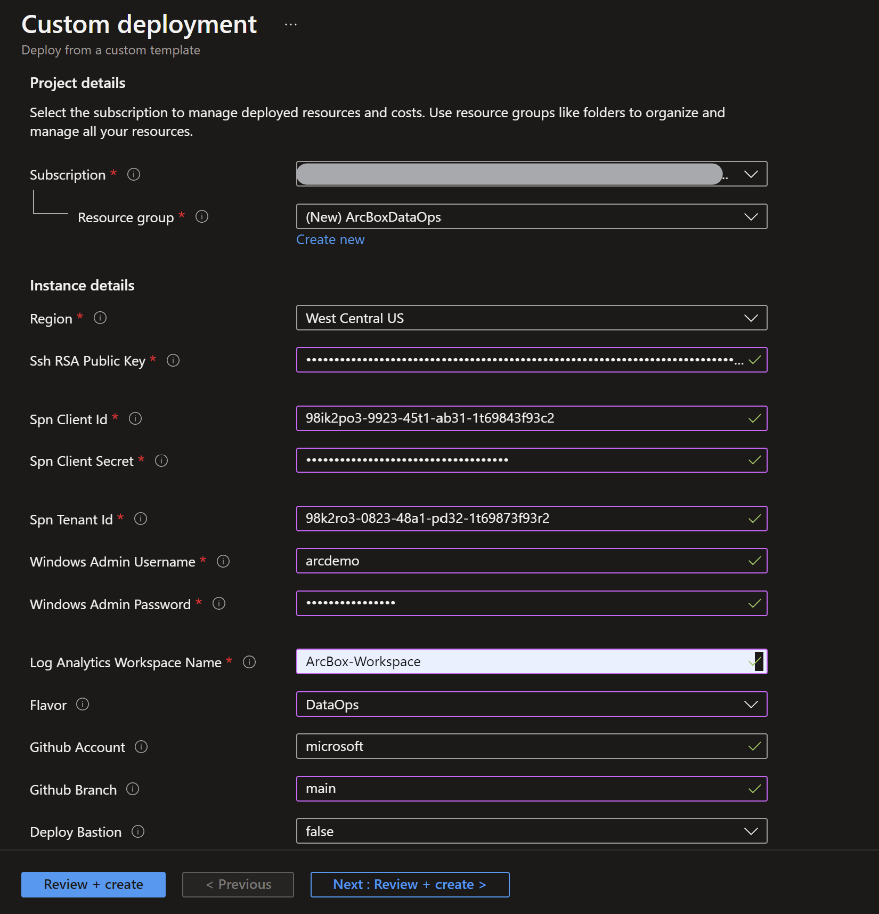

  

  
  
    > **NOTE: The deployment can take up to 45 minutes. If it keeps running for more than that, please check the [troubleshooting guide](https://azurearcjumpstart.io/azure_jumpstart_arcbox/dataops/#basic-troubleshooting).**

## Deployment Option 2: ARM template with Azure CLI

- Clone the Azure Arc Jumpstart repository

    ```shell
    git clone https://github.com/microsoft/azure_arc.git
    ```

- Edit the [azuredeploy.parameters.json](https://github.com/microsoft/azure_arc/blob/main/azure_jumpstart_arcbox/ARM/azuredeploy.parameters.json) ARM template parameters file and supply some values for your environment.
  - _`sshRSAPublicKey`_ - Your SSH public key
  - _`spnClientId`_ - Your Azure service principal id
  - _`spnClientSecret`_ - Your Azure service principal secret
  - _`spnTenantId`_ - Your Azure tenant id
  - _`windowsAdminUsername`_ - Client Windows VM Administrator name
  - _`windowsAdminPassword`_ - Client Windows VM Password. Password must have 3 of the following: 1 lower case character, 1 upper case character, 1 number, and 1 special character. The value must be between 12 and 123 characters long
  - _`logAnalyticsWorkspaceName`_ - Name for the ArcBox Log Analytics workspace that will be created
  - _`flavor`_ - Use the value "DataOps" to specify that you want to deploy the DataOps flavor of ArcBox
  - _`deployBastion`_ - Set to true if you want to use Azure Bastion to connect to _ArcBox-Client_

  

- Now you will deploy the ARM template. Navigate to the local cloned [deployment folder](https://github.com/microsoft/azure_arc/tree/main/azure_jumpstart_arcbox) and run the below command:

  ```shell
  az group create --name <Name of the Azure resource group> --location <Azure Region>
  az deployment group create \
  --resource-group <Name of the Azure resource group> \
  --template-file azuredeploy.json \
  --parameters azuredeploy.parameters.json 
  ```

  

  
  
  > **NOTE: The deployment can take up to 45 minutes. If it keeps running for more than that, please check the [troubleshooting guide](https://azurearcjumpstart.io/azure_jumpstart_arcbox/dataops/#basic-troubleshooting).**

## Deployment Option 3: Azure Bicep deployment via Azure CLI

- Clone the Azure Arc Jumpstart repository

  ```shell
  git clone https://github.com/microsoft/azure_arc.git
  ```

- Upgrade to latest Bicep version

  ```shell
  az bicep upgrade
  ```

- Edit the [main.parameters.json](https://github.com/microsoft/azure_arc/blob/main/azure_jumpstart_arcbox/bicep/main.parameters.json) template parameters file and supply some values for your environment.
  - _`sshRSAPublicKey`_ - Your SSH public key
  - _`spnClientId`_ - Your Azure service principal id
  - _`spnClientSecret`_ - Your Azure service principal secret
  - _`spnTenantId`_ - Your Azure tenant id
  - _`windowsAdminUsername`_ - Client Windows VM Administrator name
  - _`windowsAdminPassword`_ - Client Windows VM Password. Password must have 3 of the following: 1 lower case character, 1 upper case character, 1 number, and 1 special character. The value must be between 12 and 123 characters long
  - _`logAnalyticsWorkspaceName`_ - Name for the ArcBox Log Analytics workspace that will be created
  - _`flavor`_ - Use the value "DataOps" to specify that you want to deploy the DataOps flavor of ArcBox
  - _`deployBastion`_ - Set to true if you want to use Azure Bastion to connect to _ArcBox-Client_

  

- Now you will deploy the Bicep file. Navigate to the local cloned [deployment folder](https://github.com/microsoft/azure_arc/tree/main/azure_jumpstart_arcbox/bicep) and run the below command:

  ```shell
  az login
  az group create --name "<resource-group-name>"  --location "<preferred-location>"
  az deployment group create -g "<resource-group-name>" -f "main.bicep" -p "main.parameters.json"
  ```
  
  > **NOTE: The deployment can take up to 45 minutes. If it keeps running for more than that, please check the [troubleshooting guide](https://azurearcjumpstart.io/azure_jumpstart_arcbox/dataops/#basic-troubleshooting).**

## Deployment Option 4: HashiCorp Terraform Deployment

- Clone the Azure Arc Jumpstart repository

  ```shell
  git clone https://github.com/microsoft/azure_arc.git
  ```

- Download and install the latest version of Terraform [here](https://www.terraform.io/downloads.html)

  > **NOTE: Terraform 1.x or higher is supported for this deployment. Tested with Terraform v1.0.9+.**

- Create a `terraform.tfvars` file in the root of the terraform folder and supply some values for your environment.

  ```HCL
  azure_location      = "westus2"
  resource_group_name = "ArcBoxDataOps"
  spn_client_id       = "1414133c-9786-53a4-b231-f87c143ebdb1"
  spn_client_secret   = "fakeSecretValue123458125712ahjeacjh"
  spn_tenant_id       = "33572583-d294-5b56-c4e6-dcf9a297ec17"
  client_admin_ssh    = "C:/Temp/rsa.pub"
  deployment_flavor   = "DataOps"
  deploy_bastion      = false
  ```

- Variable Reference:
  - **_`azure_location`_** - Azure location code (e.g. 'eastus', 'westus2', etc.)
  - **_`resource_group_name`_** - Resource group which will contain all of the ArcBox artifacts
  - **_`spn_client_id`_** - Your Azure service principal id
  - **_`spn_client_secret`_** - Your Azure service principal secret
  - **_`spn_tenant_id`_** - Your Azure tenant id
  - **_`client_admin_ssh`_** - SSH public key path, used for Linux VMs
  - **_`deployment_flavor`_** - Use the value "DataOps" to specify that you want to deploy the DataOps flavor of ArcBox
  - _`deployBastion`_ - Set to true if you want to use Azure Bastion to connect to _ArcBox-Client_
  - _`client_admin_username`_ - Admin username for Windows & Linux VMs
  - _`client_admin_password`_ - Admin password for Windows VMs. Password must have 3 of the following: 1 lower case character, 1 upper case character, 1 number, and 1 special character. The value must be between 12 and 123 characters long.
  - **_`workspace_name`_** - Unique name for the ArcBox Log Analytics workspace that will be created

  > **NOTE: Any variables in bold are required. If any optional parameters are not provided, defaults will be used.**

- Now you will deploy the Terraform file. Navigate to the local cloned [deployment folder](https://github.com/microsoft/azure_arc/tree/main/azure_jumpstart_arcbox/bicep) and run the commands below:

  ```shell
  terraform init
  terraform plan -out=infra.out
  terraform apply "infra.out"
  ```
  
- Example output from `terraform init`:

  

- Example output from `terraform plan -out=infra.out`:

  

- Example output from `terraform apply "infra.out"`:

  
  
  > **NOTE: The deployment can take up to 45 minutes. If it keeps running for more than that, please check the [troubleshooting guide](https://azurearcjumpstart.io/azure_jumpstart_arcbox/dataops/#basic-troubleshooting).**

## Start post-deployment automation

Once your deployment is complete, you can open the Azure portal and see the ArcBox resources inside your resource group. You will be using the _ArcBox-Client_ Azure virtual machine to explore various capabilities of ArcBox such as GitOps configurations and Key Vault integration. You will need to remotely access _ArcBox-Client_.

  

   > **NOTE: For enhanced ArcBox security posture, RDP (3389) and SSH (22) ports are not open by default in ArcBox deployments. You will need to create a network security group (NSG) rule to allow network access to port 3389, or use [Azure Bastion](https://docs.microsoft.com/azure/bastion/bastion-overview) or [Just-in-Time (JIT)](https://docs.microsoft.com/azure/defender-for-cloud/just-in-time-access-usage?tabs=jit-config-asc%2Cjit-request-asc) access to connect to the VM.**

### Connecting to the ArcBox Client virtual machine

Various options are available to connect to _ArcBox-Client_ VM, depending on the parameters you supplied during deployment.

- [RDP](https://azurearcjumpstart.io/azure_jumpstart_arcbox/DataOps/#connecting-directly-with-rdp) - available after configuring access to port 3389 on the _ArcBox-NSG_, or by enabling [Just-in-Time access (JIT)](https://azurearcjumpstart.io/azure_jumpstart_arcbox/DataOps/#connect-using-just-in-time-accessjit).
- [Azure Bastion](https://azurearcjumpstart.io/azure_jumpstart_arcbox/DataOps/#connect-using-azure-bastion) - available if ```true``` was the value of your _`deployBastion`_ parameter during deployment.

#### Connecting directly with RDP

By design, ArcBox does not open port 3389 on the network security group. Therefore, you must create an NSG rule to allow inbound 3389.

- Open the _ArcBox-NSG_ resource in Azure portal and click "Add" to add a new rule.

  

  

- Specify the IP address that you will be connecting from and select RDP as the service with "Allow" set as the action. You can retrieve your public IP address by accessing [https://icanhazip.com](https://icanhazip.com) or [https://whatismyip.com](https://whatismyip.com).

  

  

  

#### Connect using Azure Bastion

- If you have chosen to deploy Azure Bastion in your deployment, use it to connect to the VM.

  

  > **NOTE: When using Azure Bastion, the desktop background image is not visible. Therefore some screenshots in this guide may not exactly match your experience if you are connecting to _ArcBox-Client_ with Azure Bastion.**

#### Connect using just-in-time access (JIT)

If you already have [Microsoft Defender for Cloud](https://docs.microsoft.com/azure/defender-for-cloud/just-in-time-access-usage?tabs=jit-config-asc%2Cjit-request-asc) enabled on your subscription and would like to use JIT to access the Client VM, use the following steps:

- In the Client VM configuration pane, enable just-in-time. This will enable the default settings.

  

  

  
  
#### Client VM credentials

After configuring access to the Client VM, you have to connect using the UPN format whether you are connecting using RDP or Azure Bastion.
Example:

- Username: arcdemo@&#65279;jumpstart.local

  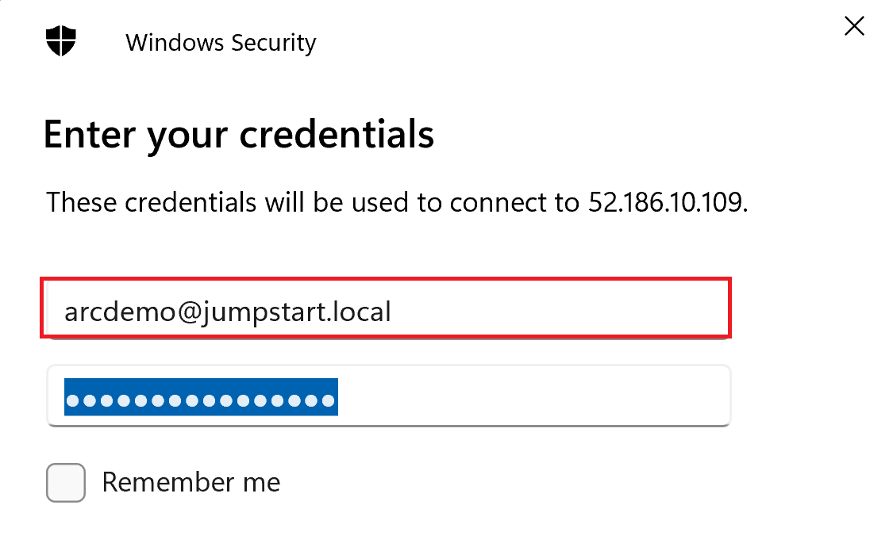

  

> **Warning: Logging into the Client VM without the UPN format _username@&#65279;jumpstart.local_ will prevent the automation from running automatically.**

#### The Logon scripts

- Once you log into the _ArcBox-Client_ VM, multiple automated scripts will open and start running. These scripts usually take up to 60 minutes to finish, and once completed, the script windows will close automatically. At this point, the deployment is complete.

  

- Deployment is complete! Let's begin exploring the features of Azure Arc-enabled Kubernetes with ArcBox for DataOps!

  

  

## Using ArcBox

After deployment is complete, it's time to start exploring ArcBox. Most interactions with ArcBox will take place either from Azure itself (Azure portal, CLI, or similar) or from inside the _ArcBox-Client_ virtual machine using Azure Data Studio or SQL Server Management Studio. When remoted into the VM, here are some things to try:

### Azure Arc-enabled SQL Managed Instance stress simulation

Included in ArcBox, is a dedicated SQL stress simulation tool named SqlQueryStress automatically installed for you on the Client VM. SqlQueryStress will allow you to generate load on the Azure Arc-enabled SQL Managed Instance that can be done used to showcase how the SQL database and services are performing as well to highlight operational practices described in the next section.

- To start with, open the SqlQueryStress desktop shortcut and connect to the CAPI SQL Managed Instance primary endpoint Ip address. This can be found in the _SQLMI Endpoints_ text file desktop shortcut that was created for you. Or you can get the primary endpoint from the Azure portal.

  

  

  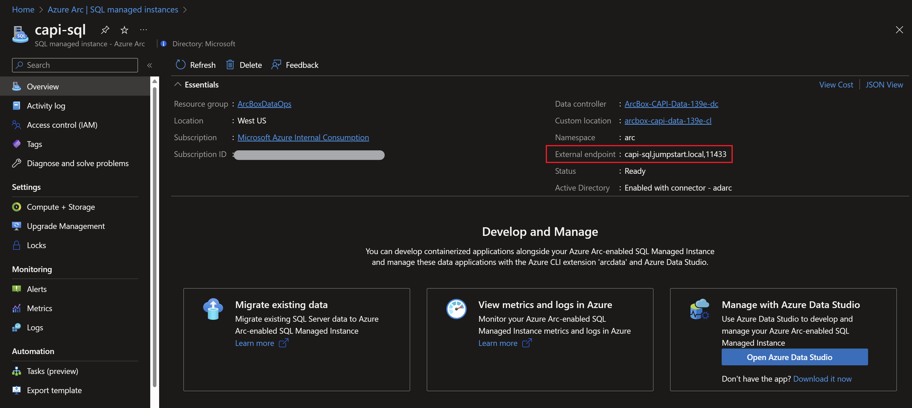

- To connect, use "Integrated Authentication" and select the deployed sample AdventureWorks database (you can use the "Test" button to check the connection).

  

- To generate some load, we will be running a simple stored procedure. Copy the below procedure and change the number of iterations you want it to run as well as the number of threads to generate even more load on the database. In addition, change the delay between queries to 1ms for allowing the stored procedure to run for a while. Click on Go to start generating load.

    ```sql
    exec [dbo].[uspGetEmployeeManagers] @BusinessEntityID = 8
    ```

- As you can see from the example below, the configuration settings are 100,000 iterations, five threads per iteration, and a 1ms delay between queries. These configurations should allow you to have the stress test running for a while.

  

  

### Azure Arc-enabled SQL Managed Instance monitoring using Grafana

When deploying Azure Arc-enabled SQL Managed Instance, a [Grafana](https://grafana.com/) instance is also automatically deployed on the same Kubernetes cluster and include built-in dashboards for both Kubernetes infrastructure as well SQL Managed Instance monitoring.

- Now that you have the SqlQueryStress stored procedure running and generating load, we can look how this is shown in the the built-in Grafana dashboard. As part of the automation, a new URL desktop shortcut simply named "Grafana" was created.

  

- [Optional] The IP address for this instance represents the Kubernetes LoadBalancer external IP that was provision as part of Azure Arc-enabled data services. Use the _kubectl get svc -n arc_ command to view the metricsui external service IP address.

  

- To log in, use the same username and password that is in the SQLMI Endpoints text file desktop shortcut

  

- Navigate to the built-in "SQL Managed Instance Metrics" dashboard.

  

  

- Change the dashboard time range to "Last 5 minutes" and re-run the stress test using SqlQueryStress (in case it was already finished).

  

- You can now see how the SQL graphs are starting to show increased activity and load on the database instance.

  

  

### Application

ArcBox deploys bookstore application on the _ArcBox-CAPI-Data_ workload cluster.

- Click on the _Bookstore_ icon on the desktop to open _Bookstore_ application.

  

  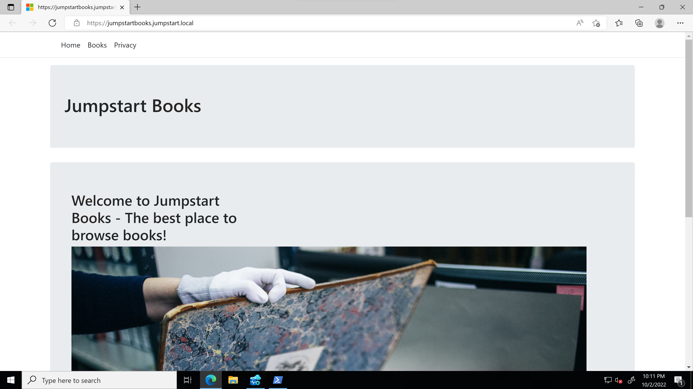

- The App creates a new Database _demo_ and inserts 4 records. Click on the books tab to review the records.

  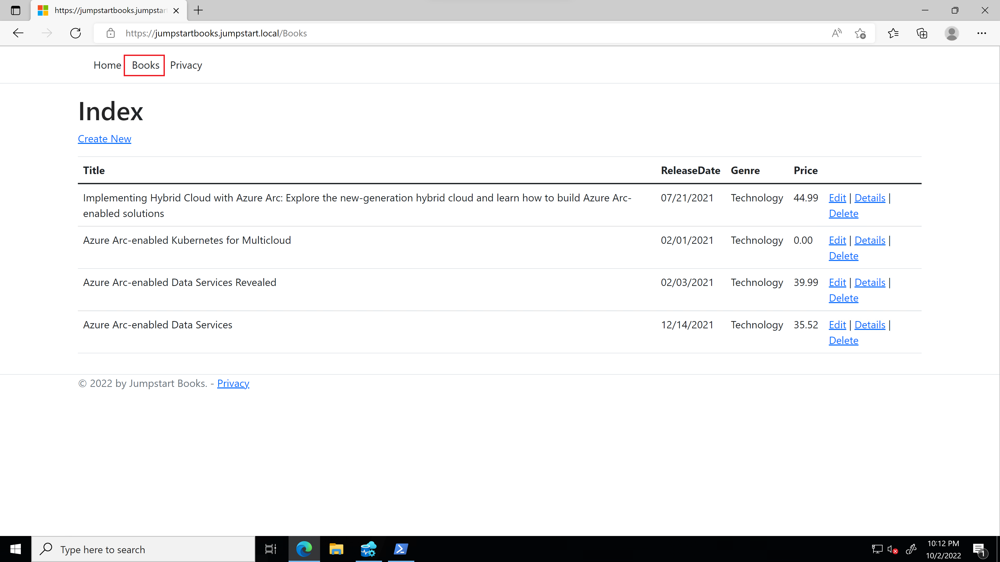

- Open _Azure Data Studio_ and query the _demo_ DB to review the records inserted in the database.

  

  

  

- ArcBox deploys the Bookstore application's service, creates the Ingress and creates a DNS record to resolve to CAPI cluster Ingress IP. Open PowerShell and run below commands to validate.

  ```shell
  kubectx capi
  kubectl --namespace arc get ingress
  nslookup jumpstartbooks.jumpstart.local
  ```

  

### High availability

When deploying Azure Arc-enabled SQL Managed Instance in the Business Critical tier, up to three SQL pods replicas will be deployed to assemble an availability group. The availability group includes three Kubernetes replicas with a primary instance and two secondary instances that can be configured to be readable secondaries. This availability groups managed the failover process to achieve high availability.

  

- Right click and run the _DataOpsTestAppScript.ps1_ script placed under _C:\ArcBox\DataOps_. The script will deploy the DB Connection App.

  

- DB Connection App connects to the primary SQL Managed Instance and inserts new book every second, and logs information of server it is connected to. Open PowerShell and run the below commands and follow the logs.

  ```shell
  $pod=kubectl --namespace arc get pods --selector=app=dbconnecttest --output="jsonpath={.items..metadata.name}"
  kubectl --namespace arc logs $pod -f
  ```
  
  
  
  

- To test failover between the replicas, we will simulate a "crash" that will trigger an HA event and will force one of the secondary replicas to get promoted to a primary replica. Open two side-by-side PowerShell sessions. On the left side session review the deployed pods. The right-side session will be used to follow the DB Connection App logs. Delete the Primary replica by running below commands.

  ```shell
  kubectl --namespace arc get pods
  kubectl --namespace arc delete pod capi-sql-0
  ```

- On the right-side session, you can see some failures once the pod is deleted simulating a primary replica crash. In that time one of the secondary replicas is being promoted to secondary to start receiving requests from the application.

  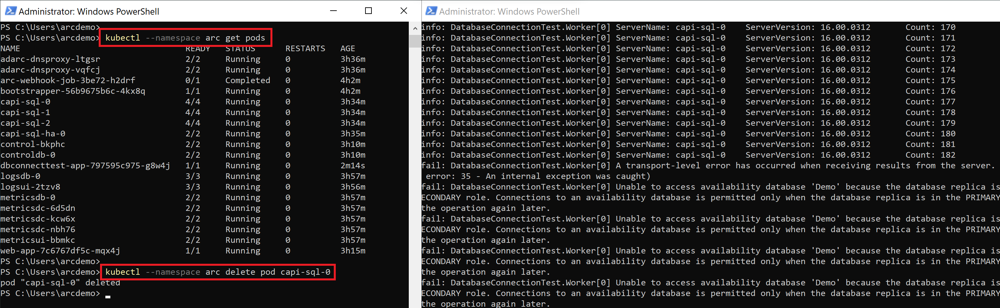

- It might take a few minutes for the availability group to return to an healthy state. The secondary replica and _capi-sql-1_ was promoted to primary and DB Connection App is able to insert new records in the database.

  

- Open _Azure Data Studio_ and query the _demo_ DB to review the records inserted in the database. Also,review the data inserted in App browser.

  

  

### Point-in-time restore

Arc-enabled SQL Managed Instance is deployed as part of ArcBox deployment. By default [automatic backups](https://learn.microsoft.com/azure/azure-arc/data/point-in-time-restore#automatic-backups) of the databases are enabled in Arc-enabled SQL Managed Instances. Full backup is performed when a new database is created or restored and subsequent full backups are performed weekly. Differential backups are taken every 12 hours and transaction log backups every 5 minutes. Default retention period of these backups is 7 days and is [configurable](https://learn.microsoft.com/azure/azure-arc/data/point-in-time-restore#configure-retention-period).

This section provides instructions on how to perform point in time restore from the automatic backups available in Arc-enabled SQL Managed Instance to recover lost or corrupted data.

To view backups of full, differential, and transaction logs wait for more than 12 hours after deploying the ArcBox DataOps flavor. Once these backups are available follow instructions below to perform a point in time restore of database. If you would like to test this feature immediately, you can simply use the latest backup set when restoring.

- Once you login to the ArcBox-Client VM using RDP or bastion host, locate Azure Data Studio icon on the desktop and open.


- Click on _ArcBoxDAG_ to connect to the **capi-sql** Arc-enabled SQL Managed Instance and view databases. Right click and select **Manage** to view databases. Alternatively you can expand _ArcBoxDAG_ connection to view databases.

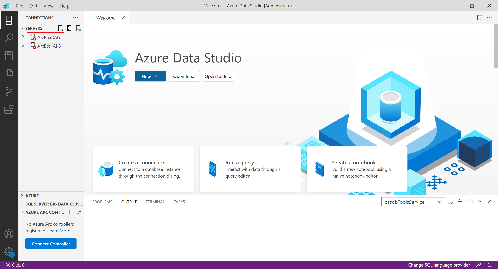


- In order to restore database you need to find the last well known backup copy that you would like to restore. You can list all the available backups by running the following SQL query in **msdb** database.

```sql
SELECT TOP (1000) [backup_set_id]
      ,[database_name]
      ,[backup_start_date]
      ,[backup_finish_date]
      ,[type]
      ,[backup_size]
      ,[server_name]
      ,[machine_name]
      ,[last_valid_restore_time]
  FROM [msdb].[dbo].[backupset]
  WHERE database_name = 'AdventureWorks2019'
```

- Run this query in Azure Data Studio to display available backups. Right click **msdb**, select New Query and copy paste above query in the query editor and click Run.

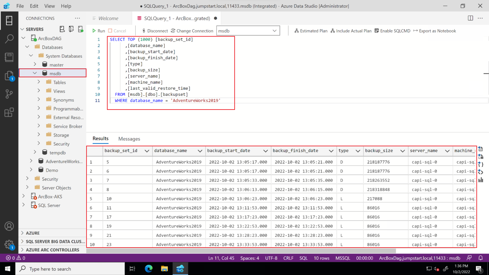

- Identify the backup set that you would like to restore and make note of the **backup_finish_date** value to use in the restore step. Modify the date format as **2022-09-20T23:14:13.000000Z**

- Connect to the Arc Data Controller to restore database using Azure Data Studio. Click on the Connect controller button under Azure Arc Controllers to connecting to an existing data controller.

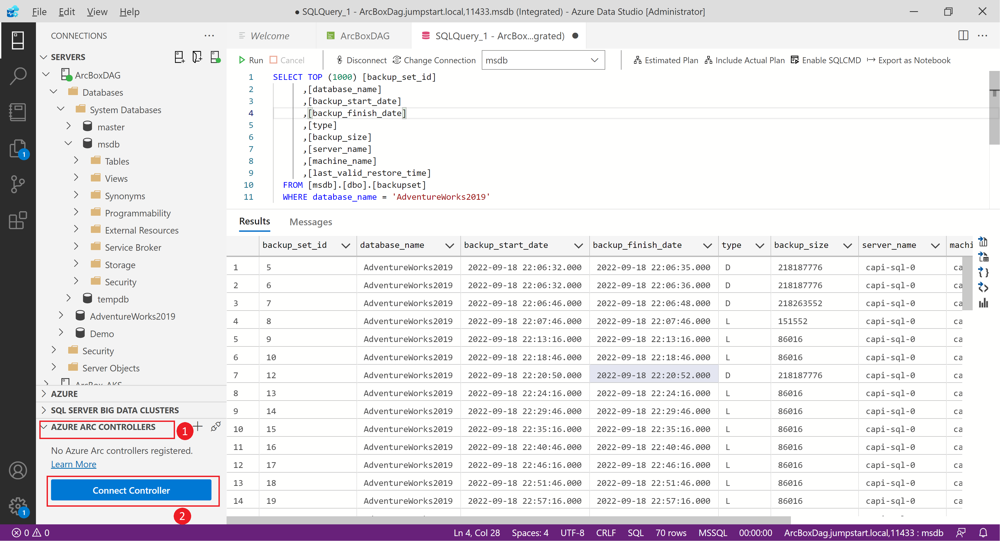

- Specify **arc** as the namespace, leave the default values (leave **Name** as empty) and click on Connect


- Once connection is successful, expand Azure Arc Controllers, expand _arcbox-capi-dc_ to view Arc-enabled SQL Managed Instance

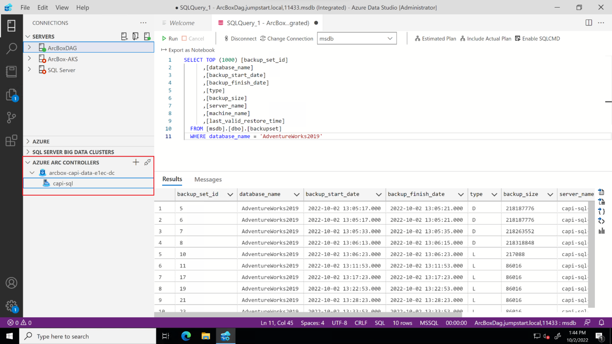

- Right-click on the _capi-sql_ Arc-enabled SQL Managed Instance and select Manage.


- Click on "Connect to Server" and enter database username and password to connect to the SQL Managed Instance to view the databases. It can take about a minute to start populating the databases.


- Click on "Backups" to view databases and available backups to restore


- Click on the "Restore" link as shown below to restore the _AdventureWorks2019_ database.


- Specify target database name to restore and backup set datetime that is noted down in the previous steps and click on Restore.


- Wait until database restore operation is complete and refresh the _ArcBoxDAG_ connection to refresh and view restored database.

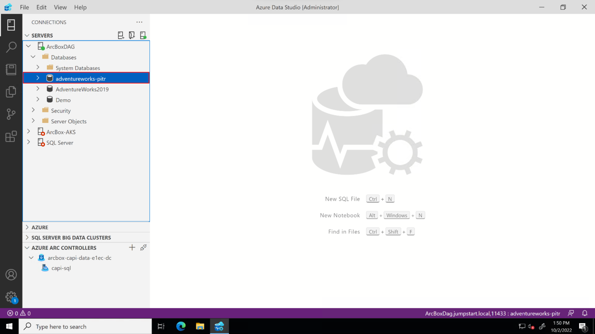

### Disaster Recovery

The _ArcBox-CAPI-Data-xxxx_ and the _ArcBox-AKS-DR-Data-xxxx_ clusters are deployed into a distributed availability group to simulate two different sites. Use the _az sql instance-failover-group-arc_ command to initiate a failover from the primary SQL instance to the secondary DR instance.

- Open PowerShell and run below commands to initiate the failover.

  ```shell
  kubectx capi
  az sql instance-failover-group-arc update --name primarycr --role secondary --k8s-namespace arc --use-k8s
  ```

  

- Right click and run the _DataOpsAppDRScript.ps1_ script placed under _C:\ArcBox\DataOps_ to deploy the Bookstore application on the DR cluster to simulate application failover.

  

- The DR script deploys the Bookstore app service, creates the Ingress and creates a DNS record to resolve to AKS DR cluster Ingress IP. Open PowerShell and run below commands to validate.

  ```shell
  kubectx aks-dr
  kubectl --namespace arc get ingress
  nslookup dataops.jumpstart.local
  ```

  

- Now that we perform a successful failover, we can re-validate and make sure replication still works as expected.

  

### Additional optional scenarios on the _ArcBox-AKS-Data-xxxx_ cluster

#### Migration to Azure Arc-enabled SQL Managed Instance

As part of ArcBox, a SQL Server is deployed in a nested VM on the Client VM to allow you to test migrating a database to Azure Arc-enabled SQL Managed Instance.

- To connect to the nested SQL Server instance, you can find the connection details in the Azure Data Studio.

  

  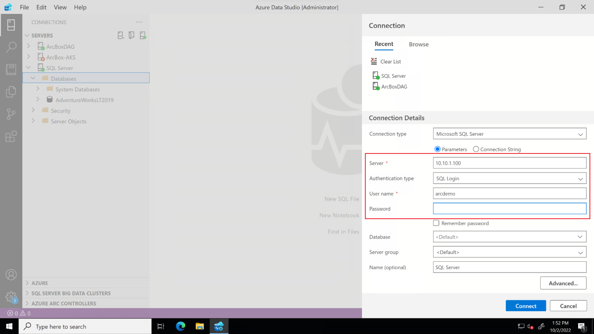

- You can also connect using Microsoft SQL Server Management Studio (SSMS).

  

- Connect to the AKS primary SQL Managed Instance's endpoint IP address. This can be found in the _SQLMI Endpoints_ text file desktop shortcut and select the authentication to be _Windows Authentication_.

  

  

- Connect also to the nested SQL server using the details you got from Azure Data Studio. Use the password you entered when provisioning ArcBox.

  

  

- You can see that _AdventureWorks_ database is only available in the nested SQL Server.

  

- Expand the nested SQL Server instance and navigate to the AdventureWorks database and execute the following query, use the same username and password as the previous step.

  ```sql
  BACKUP DATABASE AdventureWorksLT2019
  TO DISK = 'C:\temp\AdventureWorksLT2019.bak'
  WITH FORMAT, MEDIANAME = 'AdventureWorksLT2019' ;
  GO
  ```

  

  

- To migrate the backup created to the Arc-enabled SQL Managed Instance, open a new PowerShell session and use the following PowerShell snippet to:
  - Copy the created backup to the client VM from the nested SQL Server instance
  - Copy the backup to the Azure Arc-enabled SQL Managed Instance pod
Initiate the backup restore process

  ```powershell
  Set-Location -Path c:\temp
  #Connecting to the nested Windows Server VM
  $nestedWindowsUsername = "Administrator"
  $nestedWindowsPassword = "ArcDemo123!!"
  $secWindowsPassword = ConvertTo-SecureString $nestedWindowsPassword -AsPlainText -Force
  $winCreds = New-Object System.Management.Automation.PSCredential ($nestedWindowsUsername, $secWindowsPassword)
  $session = New-PSSession -VMName Arcbox-SQL -Credential $winCreds
  #Copying the database backup to the Client VM
  Copy-Item -FromSession $session -Path C:\temp\AdventureWorksLT2019.bak -Destination C:\Temp\AdventureWorksLT2019.bak
  #Copying the database to the AKS SQL Managed Instance
  kubectx aks
  kubectl cp ./AdventureWorksLT2019.bak aks-sql-0:var/opt/mssql/data/AdventureWorksLT2019.bak -n arc -c arc-sqlmi
  #Initiating restore on the AKS SQL Managed Instance
  kubectl exec aks-sql-0 -n arc -c arc-sqlmi -- /opt/mssql-tools/bin/sqlcmd -S localhost -U $Env:AZDATA_USERNAME -P $Env:AZDATA_PASSWORD -Q "RESTORE DATABASE AdventureWorksLT2019 FROM  DISK = N'/var/opt/mssql/data/AdventureWorksLT2019.bak' WITH MOVE 'AdventureWorksLT2012_Data' TO '/var/opt/mssql/data/AdventureWorksLT2012.mdf', MOVE 'AdventureWorksLT2012_Log' TO '/var/opt/mssql/data/AdventureWorksLT2012_log.ldf'"
  ```

  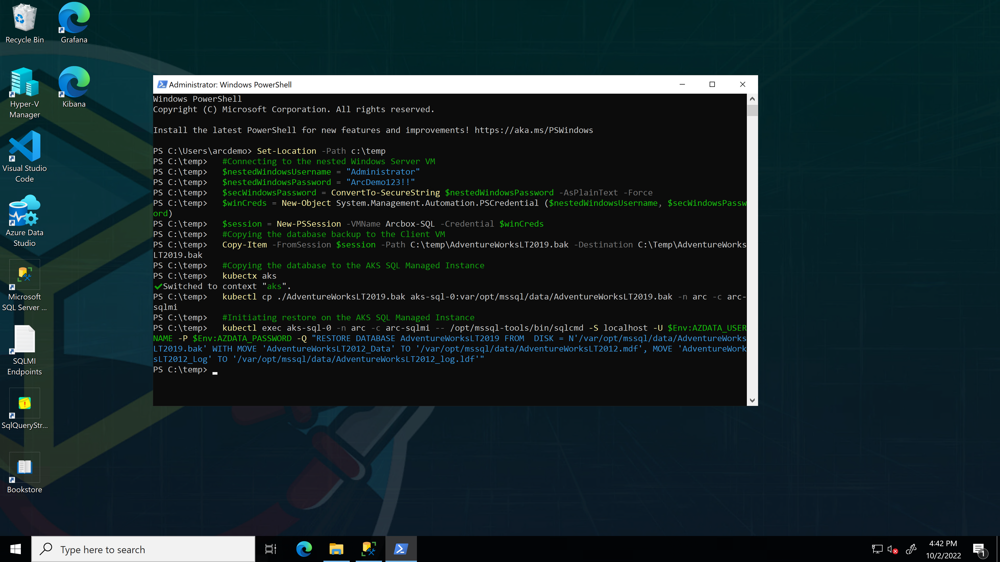

- Navigate to the Azure Arc-enabled SQL Managed Instance in the Microsoft SQL Server Management Studio (SSMS) and you can see that the _AdventureWorks_ database has been restored successfully.

  

### ArcBox Azure Monitor workbook

Open the [ArcBox Azure Monitor workbook documentation](https://azurearcjumpstart.io/azure_jumpstart_arcbox/workbook/flavors/DataOps) and explore the visualizations and reports of hybrid cloud resources.

  

### Arc-enabled SQL Server - Best practices assessment

As part of the ArcBox deployment, SQL Server best practices assessment is configured and run. Open _ArcBox-SQL_ Arc-enabled SQL Server resource from the resource group deployed or Azure Arc service blade to view SQL Server best practice assessment results.

- The following screenshot shows the SQL Server best practices assessment page and the scheduled and previously ran assessments. If this page does not show assessment results click on the Refresh button to show assessments. Once displayed the assessments and results click on _View assessment_ results to see results.

  

  

  

### Microsoft Defender for Cloud - SQL servers on machines

This section guides you through different settings for enabling Microsoft Defender for Cloud - SQL servers on machines. Most of these settings are already enabled during the logon script execution when login to _ArcBox-Client_ Azure VM. Even though these are pre-configured there might be delays in showing them in the Azure portal.

- Following are the settings of Microsoft Defender for Cloud - SQL servers on machines configured using automation scripts and can be reviewed in the Azure portal.

  

  

- The below screenshots show Arc-enabled SQL Server Defender for Cloud enablement and protection status. Defender for Cloud for SQL Server is enabled at the subscription level, but the protection status is still showing as not enabled.

Please note it may take some time to show this status in the Azure portal, but still able to detect SQL threats generated by the test scripts.

  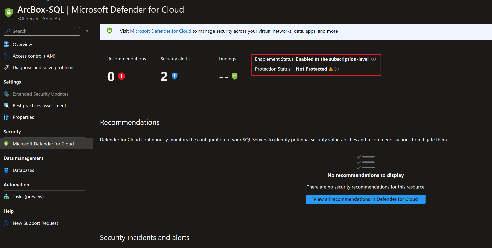

- The below screenshot shows the SQL threats detected by Microsoft Defender for Cloud.

  

   > **NOTE: Once in a while executing Defender for SQL test script (_testDefenderForSQL.ps1_) may fail due to delays in deploying SQLAdvancedThreatProtection Log Analytics solution and may not generate security incidents and alerts. If you do not find these security incidents and alerts, log in to nested SQL server VM _ArcBox-SQL_ in Hyper-V and execute the test script manually as shown below.**

- The below screenshot shows the test script used to generate SQL threats, detect, and alert using Defender for Cloud for SQL servers. This script is copied on the nested _ArcBox-SQL_ Hyper-V virtual machine and can be used to run additional tests to generate security incidents and alerts.

  

- Open PowerShell window and change the directory to _C:\ArcBox\agentScript_ folder and run _testDefenderForSQL.ps1_ PowerShell script to generate Defender for SQL incidents and alerts.

  

- The below screenshot shows an email alert sent by Defender for Cloud when a SQL threat is detected. By default, this email is sent to the registered contact email at the subscription level.
  

### Included tools

The following tools are including on the _ArcBox-Client_ VM.

- kubectl, kubectx, helm
- Chocolatey
- Visual Studio Code
- Microsoft SQL Server Management Studio
- Azure Data Studio
- SQL StressTest application
- Putty
- 7zip
- Terraform
- Git
- ZoomIt

### Next steps

ArcBox is a sandbox that can be used for a large variety of use cases, such as an environment for testing and training or a kickstarter for proof of concept projects. Ultimately, you are free to do whatever you wish with ArcBox. Some suggested next steps for you to try in your ArcBox are:

- Use the included kubectx to switch contexts between the three Kubernetes clusters
- Explore the different visualizations in Grafana
- Scale the SQL Managed Instance's cores and memory up and down
- Test failover and failback  scenarios to and from the DR instance

## Clean up the deployment

To clean up your deployment, simply delete the resource group using Azure CLI or Azure portal.

```shell
az group delete -n <name of your resource group>
```


## Basic Troubleshooting

Occasionally deployments of ArcBox may fail at various stages. Common reasons for failed deployments include:

- Automation scripts do not start after login - this is usually caused by logging into the client VM with wrong format of the username. Login needs to be done using domain credentials in UPN format _username@jumpstart.local_.
- "User disabled" error message appears when you try to RDP or connect using Bastion to the Client VM - this is caused by logging into the client VM with wrong format of the username. Login needs to be done using domain credentials in UPN format _username@jumpstart.local_.
- Invalid service principal id, service principal secret or service principal Azure tenant ID provided in _azuredeploy.parameters.json_ file.
- Invalid SSH public key provided in _azuredeploy.parameters.json_ file.
  - An example SSH public key is shown here. Note that the public key includes "ssh-rsa" at the beginning. The entire value should be included in your _azuredeploy.parameters.json_ file.

      

- Not enough vCPU quota available in your target Azure region - check vCPU quota and ensure you have at least 98 available. See the [prerequisites](#prerequisites) section for more details.
- Target Azure region does not support all required Azure services - ensure you are running ArcBox in one of the supported regions listed in the above section "ArcBox Azure Region Compatibility".

### Exploring logs from the _ArcBox-Client_ virtual machine

Occasionally, you may need to review log output from scripts that run on the _ArcBox-Client_ and the _ArcBox-CAPI-MGMT_ virtual machines in case of deployment failures. To make troubleshooting easier, the ArcBox deployment scripts collect all relevant logs in the _C:\ArcBox\Logs_ folder on _ArcBox-Client_. A short description of the logs and their purpose can be seen in the list below:

| Log file | Description |
| ------- | ----------- |
| _C:\ArcBox\Logs\Bootstrap.log_ | Output from the initial bootstrapping script that runs on _ArcBox-Client_. |
| _C:\ArcBox\Logs\DataOpsLogonScript.log_ | Output of _DataOpsLogonScript.ps1_ which configures the Hyper-V host and guests and onboards the guests as Azure Arc-enabled servers. |
| _C:\ArcBox\Logs\installCAPI.log_ | Output from the custom script extension which runs on _ArcBox-CAPI-MGMT_ and configures the Cluster API for Azure cluster and onboards it as an Azure Arc-enabled Kubernetes cluster. If you encounter ARM deployment issues with _ubuntuCapi.json_ then review this log. |
| _C:\ArcBox\Logs\MonitorWorkbookLogonScript.log_ | Output from _MonitorWorkbookLogonScript.ps1_ which deploys the Azure Monitor workbook. |
|_C:\ArcBox\Logs\DeploySQLMIADAuth.log_ | Output from the _DeploySQLMIADAuth.ps1_ script which deploys the AD connector and the Arc-enabled SQL Managed Instances|
| _C:\ArcBox\Logs\DataOpsAppScript.log_ | Output from the _DataOpsAppScript.ps1_ script which deploys the book store application |
| _C:\ArcBox\Logs\NestedSqlLogonScript.log_ | Output from the ArcServersLogonScript deployment |
| _C:\ArcBox\Logs\DataController-capi.log_ | Output from the CAPI cluster's Data Controller deployment |
| _C:\ArcBox\Logs\DataController-aks.log_ | Output from the AKS cluster's Data Controller deployment |
| _C:\ArcBox\Logs\DataController-aks-dr.log_ | Output from the AKS DR cluster's Data Controller deployment |
| _C:\ArcBox\Logs\DataController-sqlmi-capi.log_ | Output from the CAPI cluster's Arc SQL Managed Instance deployment |
| _C:\ArcBox\Logs\DataController-sqlmi-aks.log_ | Output from the AKS cluster's Arc SQL Managed Instance deployment |
| _C:\ArcBox\Logs\DataController-sqlmi-aks-dr.log_ | Output from the AKS DR cluster's Arc SQL Managed Instance deployment |

  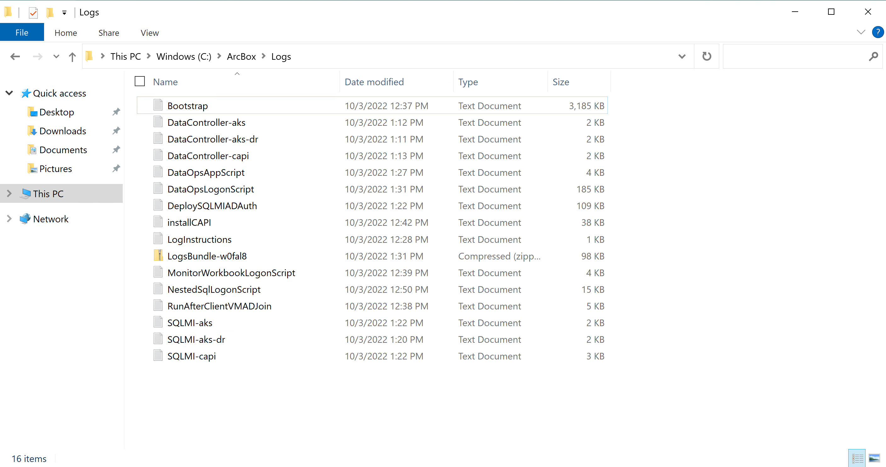

### Exploring installation logs from the Linux virtual machines

In the case of a failed deployment, pointing to a failure in the _ubuntuCAPIDeployment_ Azure deployment, an easy way to explore the deployment logs is available directly from the associated virtual machine.

- Connect using SSH to the associated virtual machine public IP:
  - _ubuntuCAPIDeployment_ - _ArcBox-CAPI-MGMT_ virtual machine.

    

    > **NOTE: Port 22 is not open by default in ArcBox deployments. You will need to [create an NSG rule](https://azurearcjumpstart.io/azure_jumpstart_arcbox/DataOps/#connecting-directly-with-rdp) to allow network access to port 22, or use Azure Bastion or JIT to connect to the VM.**

- As described in the message of the day (motd), depending on which virtual machine you logged into, the installation log can be found in the _jumpstart_logs_ folder. This installation logs can help determine the root cause for the failed deployment.
  - _ArcBox-CAPI-MGMT_ log path: _jumpstart_logs/installCAPI.log_

      

- From the screenshot below, looking at _ArcBox-CAPI-MGMT_ virtual machine CAPI installation log using the `cat jumpstart_logs/installCAPI.log` command, we can see the _az login_ command failed due to bad service principal credentials.

  

  

- You might randomly get a similar error in the _InstallCAPI.log_ to `Error from server (InternalError): error when creating "template.yaml": Internal error occurred: failed calling webhook "default.azuremachinetemplate.infrastructure.cluster.x-k8s.io": failed to call webhook: Post "https://capz-webhook-service.capz-system.svc:443/mutate-infrastructure-cluster-x-k8s-io-v1beta1-azuremachinetemplate?timeout=10s": EOF` - this is an issue we are currently investigating. To resolve please redeploy ArcBox.

If you are still having issues deploying ArcBox, please [submit an issue](https://github.com/microsoft/azure_arc/issues/new/choose) on GitHub and include a detailed description of your issue, the Azure region you are deploying to, the flavor of ArcBox you are trying to deploy. Inside the _C:\ArcBox\Logs_ folder you can also find instructions for uploading your logs to an Azure storage account for review by the Jumpstart team.
