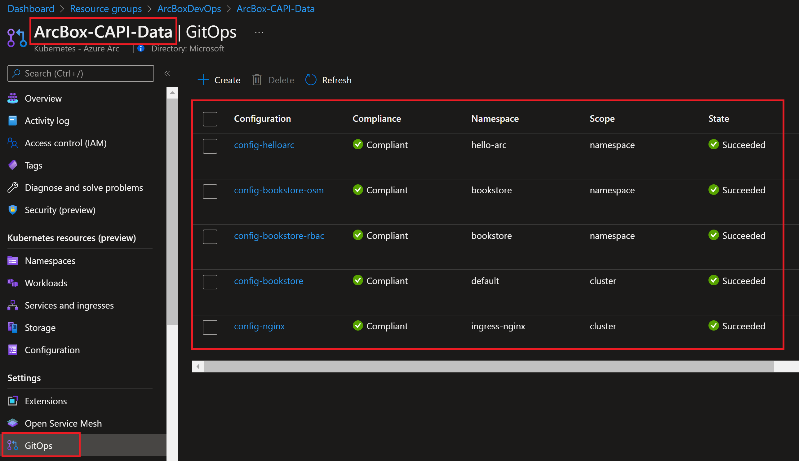
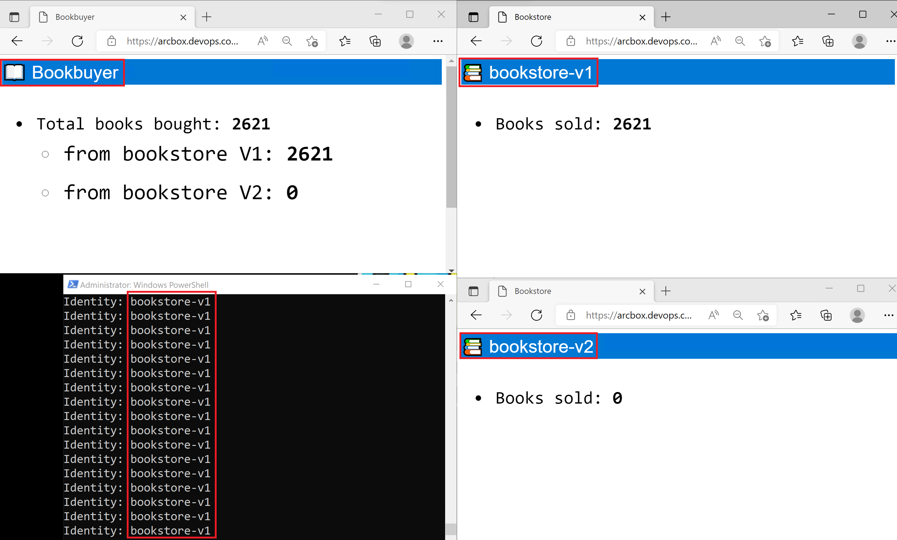
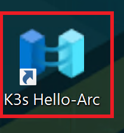
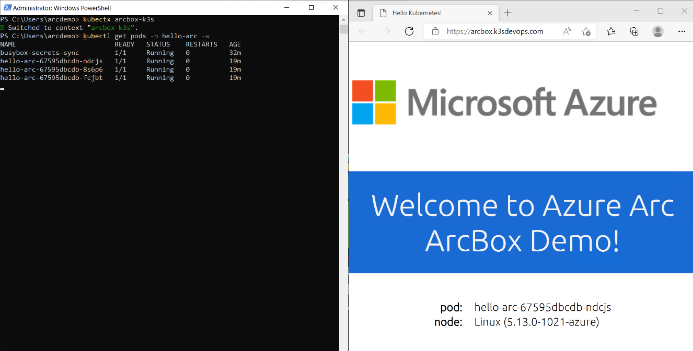
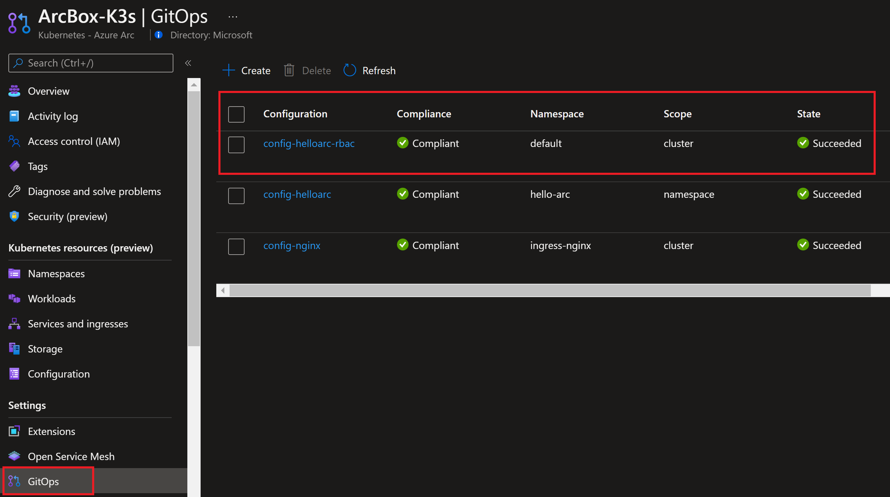

## Jumpstart ArcBox for DevOps
ArcBox for DevOps is a special "flavor" of ArcBox that is intended for users who want to experience Azure Arc-enabled Kubernetes capabilities in a sandbox environment.


### Use cases

- Sandbox environment for getting hands-on with Azure Arc technologies
- Accelerator for Proof-of-concepts or pilots
- Training tool for Azure Arc skills development
- Demo environment for customer presentations or events
- Rapid integration testing platform
- Infrastructure-as-code and automation template library for building hybrid cloud management solutions

## Azure Arc capabilities available in ArcBox for DevOps

### Azure Arc-enabled Kubernetes

ArcBox for DevOps deploys two Kubernetes clusters to give you multiple options for exploring Azure Arc-enabled Kubernetes capabilities.

- One single-node Rancher K3s cluster running on an Azure virtual machine. This cluster is then connected to Azure as an Azure Arc-enabled Kubernetes resource (_ArcBox-K3s_).
- ArcBox deploys one single-node Rancher K3s cluster (_ArcBox-CAPI-MGMT_), which is then transformed to a [Cluster API](https://cluster-api.sigs.k8s.io/user/concepts.html) management cluster using the Cluster API Provider Azure (CAPZ), and a workload cluster (_ArcBox-CAPI-Data_) is deployed onto the management cluster.

### Sample applications

ArcBox for DevOps deploys two sample applications on the _ArcBox-CAPI-Data_ cluster. The cluster has multiple GitOps configurations that deploy and configure the sample apps. You can use your own fork of the [sample applications GitHub repo](https://github.com/microsoft/azure-arc-jumpstart-apps) to experiment with GitOps configuration flows.

The sample applications included in ArcBox are:

- [Hello-arc](https://github.com/microsoft/azure-arc-jumpstart-apps/tree/main/hello-arc) - A simple web app. ArcBox will deploy 3 replicas of the hello-arc application in the hello-arc namespace onto the _ArcBox-CAPI-Data_ cluster.

- [Bookstore](https://release-v0-11.docs.openservicemesh.io/docs/getting_started/quickstart/manual_demo/) - A sample microservices application. ArcBox will deploy 5 different pods as part of the Bookstore app. These pods are:

  - _bookbuyer_ is an HTTP client making requests to bookstore.
  - _bookstore_ is a server, which responds to HTTP requests. It is also a client making requests to the bookwarehouse service.
  - _bookwarehouse_ is a server and should respond only to bookstore.
  - _mysql_ is a MySQL database only reachable by bookwarehouse.
  - _bookstore-v2_ - this is the same container as the first bookstore, but for Open Service Mesh traffic split scenario we will assume that it is a new version of the app we need to upgrade to.

The _bookbuyer_, _bookstore_, and _bookwarehouse_ pods will be in separate Kubernetes namespaces with the same names. _mysql_ will be in the _bookwarehouse_ namespace. _bookstore-v2_ will be in the _bookstore_ namespace.

### Open Service Mesh integration

ArcBox deploys Open Service Mesh by installing the [Open Service Mesh extension](https://aka.ms/arc-osm-doc) on the _ArcBox-CAPI-Data_ cluster. Bookstore application namespaces will be added to Open Service Mesh control plane. Each new Pod in the service mesh will be injected with an Envoy sidecar container.

[Open Service Mesh (OSM)](https://openservicemesh.io/) is a lightweight, extensible, cloud native service mesh that allows users to uniformly manage, secure, and get out-of-the-box observability features for highly dynamic microservice environments.

### GitOps

GitOps on Azure Arc-enabled Kubernetes uses [Flux](https://fluxcd.io/docs/). Flux is deployed by installing the [Flux extension](https://docs.microsoft.com/en-us/azure/azure-arc/kubernetes/conceptual-gitops-flux2#flux-cluster-extension) on the Kubernetes cluster. Flux is a tool for keeping Kubernetes clusters in sync with sources of configuration (like Git repositories) and automating updates to the configuration when there is new code to deploy. Flux provides support for common file sources (Git and Helm repositories, Buckets) and template types (YAML, Helm, and Kustomize).

ArcBox deploys five GitOps configurations on the ArcBox-CAPI-Data cluster:

- Cluster scope config to deploy [NGINX-ingress controller](https://kubernetes.github.io/ingress-nginx/).
- Cluster scope config to deploy the "Bookstore" application.
- Namespace scope config to deploy the "Bookstore" application RBAC.
- Namespace scope config to deploy the "Bookstore" application open service mesh traffic split policies.
- Namespace scope config to deploy the "Hello-Arc" web application.

### KeyVault integration

The Azure Key Vault Provider for Secrets Store CSI Driver allows for the integration of Azure Key Vault as a secrets store with a Kubernetes cluster via a [CSI volume](https://kubernetes-csi.github.io/docs/).

ArcBox deploys Azure Key Vault as part of the infrastructure provisioning. Also, it will hook the ArcBox-CAPI-Data cluster to Azure Key Vault by deploying the [Azure Key Vault Secrets Provider extension](https://docs.microsoft.com/en-us/azure/azure-arc/kubernetes/tutorial-akv-secrets-provider).  

A self signed certificate is synced from the Key Vault and configured as secret for Ingress of Bookstore and Hello-Arc application.

### Microsoft Defender for Cloud / k8s integration

ArcBox deploys several management and operations services that work with ArcBox's Azure Arc resources. One of these services is Microsoft Defender for Cloud that is deployed by installing the [Defender extension](https://docs.microsoft.com/azure/defender-for-cloud/defender-for-containers-enable?tabs=aks-deploy-portal%2Ck8s-deploy-cli%2Ck8s-verify-cli%2Ck8s-remove-arc%2Caks-removeprofile-api#protect-arc-enabled-kubernetes-clusters) on your Kubernetes cluster in order to start collecting security related logs and telemetry.  

### Hybrid Unified Operations

ArcBox deploys several management and operations services that work with ArcBox's Azure Arc resources. These resources include an an Azure Automation account, an Azure Log Analytics workspace with the Update Management solution, an Azure Monitor workbook, Azure Policy assignments for deploying Log Analytics agents on Windows and Linux Azure Arc-enabled servers, Azure Policy assignment for adding tags to resources, and a storage account used for staging resources needed for the deployment automation.

## ArcBox Azure Consumption Costs

ArcBox resources generate Azure consumption charges from the underlying Azure resources including core compute, storage, networking and auxiliary services. Note that Azure consumption costs vary depending the region where ArcBox is deployed. Be mindful of your ArcBox deployments and ensure that you disable or delete ArcBox resources when not in use to avoid unwanted charges. Users may review cost analysis of ArcBox by using [Azure Cost Analysis](https://docs.microsoft.com/en-us/azure/cost-management-billing/costs/quick-acm-cost-analysis).

## Deployment Options and Automation Flow

ArcBox provides multiple paths for deploying and configuring ArcBox resources. Deployment options include:

- Azure portal
- ARM template via Azure CLI
- Bicep
- Terraform


ArcBox uses an advanced automation flow to deploy and configure all necessary resources with minimal user interaction. The previous diagrams provide an overview of the deployment flow. A high-level summary of the deployment is:

- User deploys the primary ARM template (_azuredeploy.json_), Bicep file (_main.bicep_), or Terraform plan (_main.tf_). These objects contain several nested objects that will run simultaneously.
  - ClientVM ARM template/plan - deploys the Client Windows VM. This is a Windows Server VM that comes preconfigured with kubeconfig files to work with the two Kubernetes clusters, plus mulitple tools such as VSCode to make working with ArcBox simple and easy.
  - Storage account template/plan - used for staging files in automation scripts
  - Management artifacts template/plan - deploys Azure Log Analytics workspace and solutions and Azure Policy artifacts
- User remotes into Client Windows VM, which automatically kicks off multiple scripts that:
  - Deploys OSM Extension on the _ArcBox-CAPI-Data_ cluster, create application namespaces and add namespaces to OSM control plane.
  - Applies five GitOps configurations on the _ArcBox-CAPI-Data_ cluster to deploy nginx-ingress controller, Hello Arc web application, Bookstore application and Bookstore RBAC/OSM configurations.
  - Creates certificate with DNS name _arcbox.devops.com_ and imports to Azure Key Vault.
  - Deploys Azure Key Vault Secrets Provider extension on the _ArcBox-CAPI-Data_ cluster.
  - Configures Ingress for Hello-Arc and Bookstore application with a self-signed TLS certificate from the Key Vault.  
  - Deploy an Azure Monitor workbook that provides example reports and metrics for monitoring ArcBox components

## Prerequisites

- [Install or update Azure CLI to version 2.35.0 and above](https://docs.microsoft.com/en-us/cli/azure/install-azure-cli?view=azure-cli-latest). Use the below command to check your current installed version.

  ```shell
  az --version
  ```

- Login to AZ CLI using the ```az login``` command.

- Ensure that you have selected the correct subscription you want to deploy ArcBox to by using the ```az account list --query "[?isDefault]"``` command. If you need to adjust the active subscription used by Az CLI, follow [this guidance](https://docs.microsoft.com/en-us/cli/azure/manage-azure-subscriptions-azure-cli#change-the-active-subscription).

- ArcBox must be deployed to one of the following regions. **Deploying ArcBox outside of these regions may result in unexpected results or deployment errors.**

  - East US
  - East US 2
  - West US 2
  - North Europe
  - France Central
  - UK South
  - Southeast Asia

- **ArcBox DevOps requires 52 DSv4-series vCPUs** when deploying with default parameters such as VM series/size. Ensure you have sufficient vCPU quota available in your Azure subscription and the region where you plan to deploy ArcBox. You can use the below Az CLI command to check your vCPU utilization.

  ```shell
  az vm list-usage --location <your location> --output table
  ```

  

- Register necessary Azure resource providers by running the following commands.

  ```shell
  az provider register --namespace Microsoft.GuestConfiguration --wait
  az provider register --namespace Microsoft.Kubernetes --wait
  az provider register --namespace Microsoft.KubernetesConfiguration --wait
  az provider register --namespace Microsoft.ExtendedLocation --wait
  ```

- Create Azure service principal (SP). To deploy ArcBox, an Azure service principal assigned with multiple role-based access control (RBAC) roles is required:

  - "Contributor" - Required for provisioning Azure resources
  - "Security admin" - Required for installing Microsoft Defender for Cloud Azure-Arc enabled Kubernetes extension and dismiss alerts
  - "Security reader" - Required for being able to view Azure-Arc enabled Kubernetes Cloud Defender extension findings
  - "Monitoring Metrics Publisher" - Required for being Azure Arc-enabled data services billing, monitoring metrics, and logs management
  - **(optional)** "User Access Administrator" - Required for automatically onboarding the Azure Arc-enabled SQL Server resource

    To create it login to your Azure account run the below command (this can also be done in [Azure Cloud Shell](https://shell.azure.com/).

    ```shell
    az login
    az ad sp create-for-rbac -n "<Unique SP Name>" --role "Contributor"
    az ad sp create-for-rbac -n "<Unique SP Name>" --role "Security admin"
    az ad sp create-for-rbac -n "<Unique SP Name>" --role "Security reader"
    az ad sp create-for-rbac -n "<Unique SP Name>" --role "Monitoring Metrics Publisher"
    az ad sp create-for-rbac -n "<Unique SP Name>" --role "User Access Administrator"
    ```

    For example:

    ```shell
    az ad sp create-for-rbac -n "JumpstartArcBox" --role "Contributor"
    az ad sp create-for-rbac -n "JumpstartArcBox" --role "Security admin"
    az ad sp create-for-rbac -n "JumpstartArcBox" --role "Security reader"
    az ad sp create-for-rbac -n "JumpstartArcBox" --role "Monitoring Metrics Publisher"
    az ad sp create-for-rbac -n "JumpstartArcBox" --role "User Access Administrator"
    ```

    Output should look similar to this:

    ```json
    {
    "appId": "XXXXXXXXXXXXXXXXXXXXXXXXXXXX",
    "displayName": "AzureArcBox",
    "name": "http://AzureArcBox",
    "password": "XXXXXXXXXXXXXXXXXXXXXXXXXXXX",
    "tenant": "XXXXXXXXXXXXXXXXXXXXXXXXXXXX"
    }
    ```

    > **NOTE: The Jumpstart scenarios are designed with as much ease of use in-mind and adhering to security-related best practices whenever possible. It is optional but highly recommended to scope the service principal to a specific [Azure subscription and resource group](https://docs.microsoft.com/en-us/cli/azure/ad/sp?view=azure-cli-latest) as well considering using a [less privileged service principal account](https://docs.microsoft.com/en-us/azure/role-based-access-control/best-practices)**

- [Generate SSH Key](https://help.github.com/articles/generating-a-new-ssh-key-and-adding-it-to-the-ssh-agent/) (or use existing ssh key)

  ```shell
  ssh-keygen -t rsa -b 4096 -C "your_email@example.com"
  ```

## Deployment Option 1: Azure portal

- Click the <a href="https://portal.azure.com/#create/Microsoft.Template/uri/https%3A%2F%2Fraw.githubusercontent.com%2Fmicrosoft%2Fazure_arc%2Farcbox_devops%2Fazure_jumpstart_arcbox%2FARM%2Fazuredeploy.json" target="_blank"></a> button and enter values for the the ARM template parameters.

  

  

  

## Deployment Option 2: ARM template with Azure CLI

- Clone the Azure Arc Jumpstart repository

    ```shell
    git clone https://github.com/microsoft/azure_arc.git
    ```

- Edit the [azuredeploy.parameters.json](https://github.com/microsoft/azure_arc/blob/arcbox_devops/azure_jumpstart_arcbox/ARM/azuredeploy.parameters.json) ARM template parameters file and supply some values for your environment.
  - _`sshRSAPublicKey`_ - Your SSH public key
  - _`spnClientId`_ - Your Azure service principal id
  - _`spnClientSecret`_ - Your Azure service principal secret
  - _`spnTenantId`_ - Your Azure tenant id
  - _`windowsAdminUsername`_ - Client Windows VM Administrator name
  - _`windowsAdminPassword`_ - Client Windows VM Password. Password must have 3 of the following: 1 lower case character, 1 upper case character, 1 number, and 1 special character. The value must be between 12 and 123 characters long.
  - _`myIpAddress`_ - Your local IP address. This is used to allow remote RDP and SSH connections to the Client Windows VM and K3s Rancher VM.
  - _`logAnalyticsWorkspaceName`_ - Unique name for the ArcBox Log Analytics workspace
  - _`flavor`_ - Use the value "DevOps" to specify that you want to deploy the DevOps flavor of ArcBox

  

- Now you will deploy the ARM template. Navigate to the local cloned [deployment folder](https://github.com/microsoft/azure_arc/tree/arcbox_devops/azure_jumpstart_arcbox) and run the below command:

  ```shell
  az group create --name <Name of the Azure resource group> --location <Azure Region>
  az deployment group create \
  --resource-group <Name of the Azure resource group> \
  --template-file azuredeploy.json \
  --parameters azuredeploy.parameters.json 
  ```

  

  

## Deployment Option 3: Bicep deployment via Azure CLI

- Clone the Azure Arc Jumpstart repository

  ```shell
  git clone https://github.com/microsoft/azure_arc.git
  ```

- Upgrade to latest Bicep version

  ```shell
  az bicep upgrade
  ```

- Edit the [main.parameters.json](https://github.com/microsoft/azure_arc/blob/arcbox_devops/azure_jumpstart_arcbox/bicep/main.parameters.json) template parameters file and supply some values for your environment.
  - _`sshRSAPublicKey`_ - Your SSH public key
  - _`spnClientId`_ - Your Azure service principal id
  - _`spnClientSecret`_ - Your Azure service principal secret
  - _`spnTenantId`_ - Your Azure tenant id
  - _`windowsAdminUsername`_ - Client Windows VM Administrator name
  - _`windowsAdminPassword`_ - Client Windows VM Password. Password must have 3 of the following: 1 lower case character, 1 upper case character, 1 number, and 1 special character. The value must be between 12 and 123 characters long.
  - _`myIpAddress`_ - Your local IP address. This is used to allow remote RDP and SSH connections to the Client Windows VM and K3s Rancher VM.
  - _`logAnalyticsWorkspaceName`_ - Unique name for the ArcBox Log Analytics workspace
  - _`flavor`_ - Use the value "DevOps" to specify that you want to deploy the Devops flavor of ArcBox

  

- Now you will deploy the Bicep file. Navigate to the local cloned [deployment folder](https://github.com/microsoft/azure_arc/tree/arcbox_devops/azure_jumpstart_arcbox/bicep) and run the below command:

  ```shell
  az login
  az group create --name "<resource-group-name>"  --location "<preferred-location>"
  az deployment group create -g "<resource-group-name>" -f "main.bicep" -p "main.parameters.json"
  ```

## Deployment Option 4: Terraform Deployment

- Clone the Azure Arc Jumpstart repository

  ```shell
  git clone https://github.com/microsoft/azure_arc.git
  ```

- Download and install the latest version of Terraform [here](https://www.terraform.io/downloads.html)

  > **NOTE: Terraform 1.x or higher is supported for this deployment. Tested with Terraform v1.011.**

- Create a `terraform.tfvars` file in the root of the terraform folder and supply some values for your environment.

  ```HCL
  azure_location    = "westus2"
  spn_client_id     = "1414133c-9786-53a4-b231-f87c143ebdb1"
  spn_client_secret = "fakeSecretValue123458125712ahjeacjh"
  spn_tenant_id     = "33572583-d294-5b56-c4e6-dcf9a297ec17"
  user_ip_address   = "99.88.99.88"
  client_admin_ssh  = "C:/Temp/rsa.pub"
  deployment_flavor = "Full"
  ```

- Variable Reference:
  - **_`azure_location`_** - Azure location code (e.g. 'eastus', 'westus2', etc.)
  - **_`resource_group_name`_** - Resource group which will contain all of the ArcBox artifacts
  - **_`spn_client_id`_** - Your Azure service principal id
  - **_`spn_client_secret`_** - Your Azure service principal secret
  - **_`spn_tenant_id`_** - Your Azure tenant id
  - **_`user_ip_address`_** - Your local IP address. This is used to allow remote RDP and SSH connections to the Client Windows VM and K3s Rancher VM. If you don't know your public IP, you can find it [here](https://www.whatismyip.com/)
  - **_`client_admin_ssh`_** - SSH public key path, used for Linux VMs
  - **_`deployment_flavor`_** - Use the value "DevOps" to specify that you want to deploy the DevOps flavor of ArcBox
  - _`client_admin_username`_ - Admin username for Windows & Linux VMs
  - _`client_admin_password`_ - Admin password for Windows VMs. Password must have 3 of the following: 1 lower case character, 1 upper case character, 1 number, and 1 special character. The value must be between 12 and 123 characters long.
  - **_`workspace_name`_** - Unique name for the ArcBox Log Analytics workspace

  > **NOTE: Any variables in bold are required. If any optional parameters are not provided, defaults will be used.**

- Now you will deploy the Terraform file. Navigate to the local cloned [deployment folder](https://github.com/microsoft/azure_arc/tree/main/azure_jumpstart_arcbox/bicep) and run the commands below:

  ```shell
  terraform init
  terraform plan -out=infra.out
  terraform apply "infra.out"
  ```
  
- Example output from `terraform init`:

  

- Example output from `terraform plan -out=infra.out`:

  

- Example output from `terraform apply "infra.out"`:

  

## Start post-deployment automation

- After deployment, you should see the ArcBox resources inside your resource group.

  

  > **NOTE: If you followed the steps in [prerequisites](#prerequisites) to allow the SQL Server to be automatically onboarded, there will be one additional resource in your ArcBox resource group (48 total)**

- Open a remote desktop connection into _ArcBox-Client_. Upon logging in, multiple automated scripts will open and start running. These scripts usually take 10-20 minutes to finish and once completed the script windows will close. At this point, the deployment is complete.

  

  

## Using ArcBox

After deployment is complete, its time to start exploring ArcBox. Most interactions with ArcBox will take place either from Azure itself (Azure portal, CLI or similar) or from inside the _ArcBox-Client_ virtual machine. When remoted into the client VM, here are some things to try:

### Microsoft Defender for Cloud

After you have finished the deployment of ArcBox, you can verify that Microsoft Defender for Cloud is working properly and alerting on security threats by running the below command to simulate an alert on the _ArcBox-CAPI-Data_ workload cluster:

  ```bash
  kubectl get pods --namespace=asc-alerttest-662jfi039n --kubeconfig arcbox-capi-data.kubeconfig
  ```

Within 30 minutes Microsoft Defender for Cloud will detect this event and trigger a security alert that you will see in the Azure Portal under Microsoft Defender for Cloud's security alerts and also on the security tab of your Azure Arc-enabled cluster.


### Key Vault integration

 ArcBox uses Azure Key Vault to store the TLS certificate used by the sample hello-arc and OSM applications. Here are some things to try to explore this integration with Key Vault further:

- Open the extension tab section of the _ArcBox-CAPI-Data_ cluster resource in Azure portal. You can now see that Azure Key Vault Secrets Provider, Flux (GitOps) and Open Service Mesh extensions are enabled.

  

- Click on the _DevOps Hello-Arc_ icon on the desktop to open Hello-Arc application and validate the Ingress certificate _arcbox.devops.com_ used from the Key Vault.

  

  

- Optionally, validate the certificate details.

  

### GitOps configurations

ArcBox deploys multiple GitOps configurations on the _ArcBox-CAPI-Data_ workload cluster. Click on the GitOps tab of the cluster to explore these configurations:

- You can now see the five GitOps configurations on the _ArcBox-CAPI-Data_ cluster.

  - config-nginx to deploy NGINX-ingress controller.
  - config-bookstore to deploy the "Bookstore" application.
  - config-bookstore-rbac to deploy the "Bookstore" application RBAC.
  - config-bookstore-osm to deploy the "Bookstore" application open service mesh traffic split policy.
  - config-helloarc to deploy the "Hello Arc" web application.

  

- To show the GitOps flow for Hello-Arc application open 2 side-by-side browser windows.

  - Browse to the Hello-Arc application _`https://arcbox.devops.com/`_  
  - Shell running the command _`kubectl get pods -n hello-arc -w`_ command.
  - End result should look like that:

    

  - In your fork of the “Azure Arc Jumpstart Apps” repository, open the hello_arc.yaml file (/hello-arc/yaml/hello_arc.yaml). Change the text under the “MESSAGE” section and commit the change.
  
    
  
  - Upon committing the changes, notice how the Kubernetes Pod rolling upgrade will start. Once the Pod is up & running, refresh the browser, the new “Hello Arc” application version window will show the new message, showing the rolling upgrade is completed and the GitOps flow is successful.
  
    

### RBAC configurations

ArcBox deploys Kubernetes RBAC configuration on the bookstore application to limit access to deployed Kubernetes resources. You can explore this configuration by following these steps:

- Show Kubernetes RBAC Role and Role binding applied using GitOps Configuration.

  - Review the [RBAC configuration](https://github.com/microsoft/azure-arc-jumpstart-apps/blob/main/k8s-rbac-sample/namespace/namespacerole.yaml) applied to the _ArcBox-CAPI-Data_ cluster.  
  
  - Show the bookstore Namespace Role and Role Binding.
  
  ```shell
  kubectl --namespace bookstore get role
  kubectl --namespace bookstore get rolebindings.rbac.authorization.k8s.io
  ```

  

  - Validate the RBAC role to get the pods as user Jane.

  ```shell
  kubectl --namespace bookstore get pods --as=jane
  ```

  

  - Test the RBAC role assignment, if user Jane can delete the pods. The operation fails, as the user, Jane is assigned to the role of pod-reader. The pod-reader role only allows get, watch and list permissions in the bookstore namespace.

  ```shell
  $pod=kubectl --namespace bookstore get pods --selector=app=bookstore --output="jsonpath={.items..metadata.name}"
  kubectl --namespace bookstore delete pods $pod --as=jane
  ```

   

  - Optionally, you can test the access using [auth can-i](https://kubernetes.io/docs/reference/access-authn-authz/authorization/#checking-api-access) command to validate RBAC access.
  
  ```shell
  kubectl --namespace bookstore auth can-i get pods --as=jane
  kubectl --namespace bookstore auth can-i delete pods --as=jane
  ```
  
  

### OSM Traffic Split

ArcBox uses a GitOps configuration on the OSM bookstore application to split traffic to the bookstore APIs using weighted load balancing. Follow these steps to explore this capability further:

- Review the [OSM Traffic Split Policy](https://github.com/microsoft/azure-arc-jumpstart-apps/blob/main/bookstore/osm-sample/traffic-split.yaml) applied to the _ArcBox-CAPI-Data_ cluster  

- To show OSM traffic split, open four browser windows.

  - Browse to the bookbuyer application _`https://arcbox.devops.com/bookbuyer`_
  - Browse to the bookstore application _`https://arcbox.devops.com/bookstore`_
  - Browse to the bookstore-v2 application _`https://arcbox.devops.com/bookstore-v2`_  
  - Shell running the below commands to show the bookbuyer pod logs.
  
    ```shell
    $pod=kubectl --namespace bookbuyer get pods --selector=app=bookbuyer --output="jsonpath={.items..metadata.name}"
    kubectl --namespace bookbuyer logs $pod bookbuyer -f | Select-String Identity:
    ```

  - End result should look like this. The count for the books sold from the bookstore-v2 browser window should remain at 0. This is because the current traffic split policy is currently weighted 100 for bookstore in addition to the fact that bookbuyer is sending traffic to the bookstore service and no application is sending requests to the bookstore-v2 service.

    

- In your fork of the “Azure Arc Jumpstart Apps” repository, open the traffic-split.yaml file (/bookstore/osm-sample/traffic-split.yaml). Update the bookstore weight to "75" and bookstore-v2 weight to "25" and commit the change.

  

- Wait for the changes to propagate and observe the counters increment for bookstore and bookstore-v2 as well. We have updated the SMI Traffic Split policy to direct 75 percent of the traffic sent to the root bookstore service to the bookstore service and 25 perfect to bookstore-v2 service by modifying the weight fields for bookstore-v2 backend. Also, observe the changes on the bookbuyer pod logs in shell.

  

- You can verify the traffic split policy by running the following and viewing the Backends properties.

  ```shell
  kubectl describe trafficsplit bookstore-split -n bookstore
  ```

  

- In your fork of the “Azure Arc Jumpstart Apps” repository, open the traffic-split.yaml file (/bookstore/osm-sample/traffic-split.yaml). Update the bookstore weight to "0" and bookstore weight to "100" and commit the change.

  

- Wait for the changes to propagate and observe the counters increment for bookstore-v2 and freeze for bookstore. Also, observe pod logs to validate bookbuyer is sending all the traffic to bookstore-v2.

  

### Additional Scenarios on _ArcBox-k3s_ cluster

Optionally, you can explore additional GitOps and RBAC scenarios in a manual fashion using the _ArcBox-K3s_ cluster. When remoted into the _ArcBox-Client_ virtual machine, here are some things to try:

- Browse to the Azure Portal and notice how currently there is no GitOps configuration and Flux extension on _ArcBox-K3s_ cluster.
  
  

  

- Deploy multiple GitOps configurations on the _ArcBox-k3s_ cluster.

  - Browse to the _K3sGitOps.ps1_ script placed under _C:\ArcBox\GitOps_. The script will:
    - Log in to your Azure subscription using the SPN credentials
    - Connect to _ArcBox-k3s_ cluster
    - Create the GitOps configurations to deploy the Flux extension, NGINX ingress controller and the “Hello Arc” application
    - Create certificate with _arcbox.k3sdevops.com_ dns name and import to the Key Vault
    - Deploy the Azure Key Vault k8s extension instance
    - Create SecretProviderClass to fetch the secrets from Key Vault
    - Deploy an Ingress Resource referencing the Secret created by the CSI driver
    - Create an icon for the Hello-Arc application on the desktop
  
  - Optionally, you can open the script with VSCode to review.
  
    
  
  - Right click _K3sGitOps.ps1_ script and select Run with PowerShell to execute the script.
  
    

  - You can verify that Azure Key Vault Secrets Provider and Flux (GitOps) extensions are now enabled in the extension tab section of the _ArcBox-k3s_ cluster resource in Azure.

    

  - You can verify below GitOps configurations applied on the _ArcBox-k3s_ cluster.
  
    - config-nginx to deploy NGINX-ingress controller
    - config-helloarc to deploy the "Hello Arc" web application
  
    

  - Click on the _K3s Hello-Arc_ icon on the desktop to open Hello-Arc application and validate the Ingress certificate _arcbox.k3sdevops.com_ used from Key Vault.
  
    

    
  
  - To show the GitOps flow for Hello-Arc application open 2 side-by-side browser windows.
  
    - Browse to the Hello-Arc application _`https://arcbox.k3sdevops.com/`_.
    - Shell running the commands.
  
        ```shell
        kubectx arcbox-k3s
        kubectl get pods -n hello-arc -w
        ```

    - End result should look like that:
  
      
  
    - In your fork of the “Azure Arc Jumpstart Apps” repository, open the hello_arc.yaml file (/hello-arc/yaml/hello_arc.yaml). Change the replica to 2 and text under the “MESSAGE” section and commit the change.

      

    - Upon committing the changes, notice how the Kubernetes Pod rolling upgrade will start. Once the Pod is up & running, refresh the browser, the new “Hello Arc” application version window will show the new message, showing the rolling upgrade is completed and the GitOps flow is successful.

      

- Deploy Kubernetes RBAC configuration on the hello-arc application to limit access to deployed Kubernetes resources.

  - Browse to the _K3sRBAC.ps1_ script placed under _C:\ArcBox\GitOps_. The script will:
    - Log in to your Azure subscription using the SPN credentials
    - Connect to _ArcBox-k3s_ cluster
    - Create the GitOps configurations to deploy the Namespace and Cluster scope RBAC configurations

  - Right click _K3sGitOps.ps1_ script and select Run with PowerShell to execute the script.
  
    

  - You can can verify below GitOps configurations applied on the _ArcBox-k3s_ cluster.
  
    - config-helloarc-rbac to deploy the "Hello-Arc" namespace RBAC.
  
      

  - Show the hello-arc Namespace Role and Role Binding.
  
    ```shell
    kubectx arcbox-k3s
    kubectl --namespace hello-arc get role
    kubectl --namespace hello-arc get rolebindings.rbac.authorization.k8s.io
    ```

    

  - Validate the namespace RBAC role to get the pods as user Jane.

    ```shell
    kubectl --namespace hello-arc get pods --as=jane
    ```

    

  - Test the RBAC role assignment, if user Jane can delete the pods. The operation fails, as the user, Jane is assigned to the role of pod-reader. The pod-reader role only allows get, watch and list permissions in the hello-arc namespace.

    ```shell
    $pod=kubectl --namespace hello-arc get pods --selector=app=hello-arc --output="jsonpath={.items..metadata.name}"
    kubectl --namespace hello-arc delete pods $pod --as=jane
    ```

    

  - Show the Cluster Role and Role Binding.
  
    ```shell
    kubectl get clusterrole | Select-String secret-reader
    kubectl get clusterrolebinding | Select-String read-secrets-global
    ```

    

  - Validate the cluster role to get the secrets as user Dave.

    ```shell
    kubectl get secrets --as=dave
    ```

    

  - Test the RBAC role assignment, if Dave can create the secrets. The operation fails, as the user, Dave is assigned to the role of secret-reader. The secret-reader role only allows get, watch and list permissions.

    ```shell
    kubectl create secret generic arcbox-secret --from-literal=username=arcdemo --as=dave
    ```

    

### ArcBox Azure Monitor workbook

Open the [ArcBox Azure Monitor workbook](https://azurearcjumpstart.io/azure_jumpstart_arcbox/workbook/flavors/DevOps) and explore the visualizations and reports of hybrid cloud resources. A [dedicated README](https://azurearcjumpstart.io/azure_jumpstart_arcbox/workbook/flavors/DevOps) is available with more detail on usage of the workbook.

  

### Included tools

The following tools are including on the _ArcBox-Client_ VM.

- kubectl, kubectx, helm
- Chocolatey
- Visual Studio Code
- Putty
- 7zip
- Terraform
- Git

### Next steps
  
ArcBox is a sandbox that can be used for a large variety of use cases, such as an environment for testing and training or a kickstarter for proof of concept projects. Ultimately, you are free to do whatever you wish with ArcBox. Some suggested next steps for you to try in your ArcBox are:

- Use the included kubectx to switch contexts between the two Kubernetes clusters
- Deploy new GitOps configurations with Azure Arc-enabled Kubernetes
- Build policy initiatives that apply to your Azure Arc-enabled resources
- Write and test custom policies that apply to your Azure Arc-enabled resources
- Incorporate your own tooling and automation into the existing automation framework
- Build a certificate/secret/key management strategy with your Azure Arc resources

Do you have an interesting use case to share? [Submit an issue](https://github.com/microsoft/azure_arc/issues/new/choose) on GitHub with your idea and we will consider it for future releases!

## Clean up the deployment

To clean up your deployment, simply delete the resource group using Azure CLI or Azure portal.

```shell
az group delete -n <name of your resource group>
```


## Basic Troubleshooting

Occasionally deployments of ArcBox may fail at various stages. Common reasons for failed deployments include:

- Invalid service principal id, service principal secret or service principal Azure tenant ID provided in _azuredeploy.parameters.json_ file.
- Invalid SSH public key provided in _azuredeploy.parameters.json_ file.
  - An example SSH public key is shown here. Note that the public key includes "ssh-rsa" at the beginning. The entire value should be included in your _azuredeploy.parameters.json_ file.

      

- Not enough vCPU quota available in your target Azure region - check vCPU quota and ensure you have at least XXXX available. See the [prerequisites](#prerequisites) section for more details.
- Target Azure region does not support all required Azure services - ensure you are running ArcBox in one of the supported regions listed in the above section "ArcBox Azure Region Compatibility".

### Exploring logs from the _ArcBox-Client_ virtual machine

Occasionally, you may need to review log output from scripts that run on the _ArcBox-Client_, _ArcBox-CAPI-MGMT_ or _ArcBox-K3s_ virtual machines in case of deployment failures. To make troubleshooting easier, the ArcBox deployment scripts collect all relevant logs in the _C:\ArcBox\Logs_ folder on _ArcBox-Client_. A short description of the logs and their purpose can be seen in the list below:

| Logfile | Description |
| ------- | ----------- |
| _C:\ArcBox\Logs\Bootstrap.log_ | Output from the initial bootstrapping script that runs on _ArcBox-Client_. |
| _C:\ArcBox\Logs\DevOpsLogonScript.log_ | Output of _DevOpsLogonScript.ps1_ which configures the Hyper-V host and guests and onboards the guests as Azure Arc-enabled servers. |
| _C:\ArcBox\Logs\installCAPI.log_ | Output from the custom script extension which runs on _ArcBox-CAPI-MGMT_ and configures the Cluster API for Azure cluster and onboards it as an Azure Arc-enabled Kubernetes cluster. If you encounter ARM deployment issues with _ubuntuCapi.json_ then review this log. |
| _C:\ArcBox\Logs\installK3s.log_ | Output from the custom script extension which runs on _ArcBox-K3s_ and configures the Rancher cluster and onboards it as an Azure Arc-enabled Kubernetes cluster. If you encounter ARM deployment issues with _ubuntuRancher.json_ then review this log. |
| _C:\ArcBox\Logs\MonitorWorkbookLogonScript.log_ | Output from _MonitorWorkbookLogonScript.ps1_ which deploys the Azure Monitor workbook. |

  

### Exploring installation logs from the Linux virtual machines

In the case of a failed deployment, pointing to a failure in either the _ubuntuRancherDeployment_ or the _ubuntuCAPIDeployment_ Azure deployments, an easy way to explore the deployment logs is available directly from the associated virtual machines.

- Depending on which deployment failed, connect using SSH to the associated virtual machine public IP:
  - _ubuntuCAPIDeployment_ - _ArcBox-CAPI-MGMT_ virtual machine.
  - _ubuntuRancherDeployment_ - _ArcBox-K3s_ virtual machine.

    Since you are logging in using the provided SSH public key, all you need is the _arcdemo_ username.

      

      

- As described in the message of the day (motd), depending on which virtual machine you logged into, the installation log can be found in the *jumpstart_logs* folder. This installation logs can help determine the root cause for the failed deployment.
  - _ArcBox-CAPI-MGMT_ log path: *jumpstart_logs/installCAPI.log*
  - _ArcBox-K3s_ log path: *jumpstart_logs/installK3s.log*

      

- From the screenshot below, looking at _ArcBox-CAPI-MGMT_ virtual machine CAPI installation log using the `cat jumpstart_logs/installCAPI.log` command, we can see the _az login_ command failed due to bad service principal credentials.

  

  

If you are still having issues deploying ArcBox, please [submit an issue](https://github.com/microsoft/azure_arc/issues/new/choose) on GitHub and include a detailed description of your issue, the Azure region you are deploying to, the flavor of ArcBox you are trying to deploy. Inside the _C:\ArcBox\Logs_ folder you can also find instructions for uploading your logs to an Azure storage account for review by the Jumpstart team.

## Known issues

- None at this time
