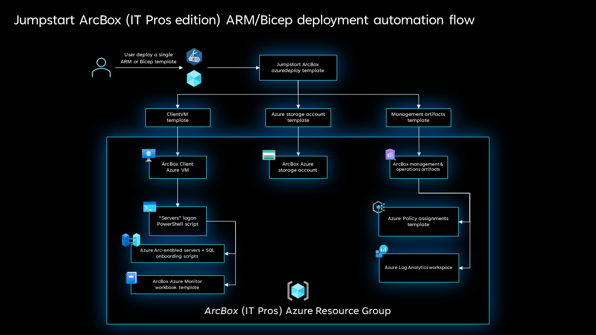
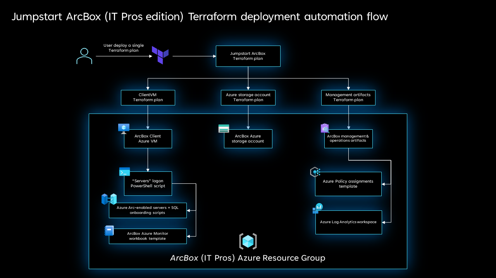
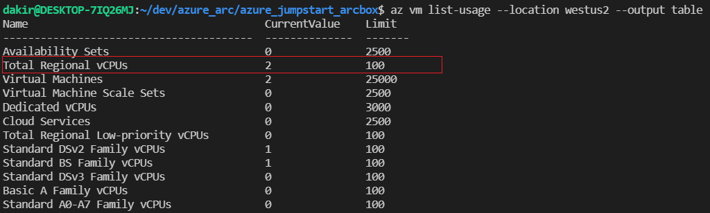
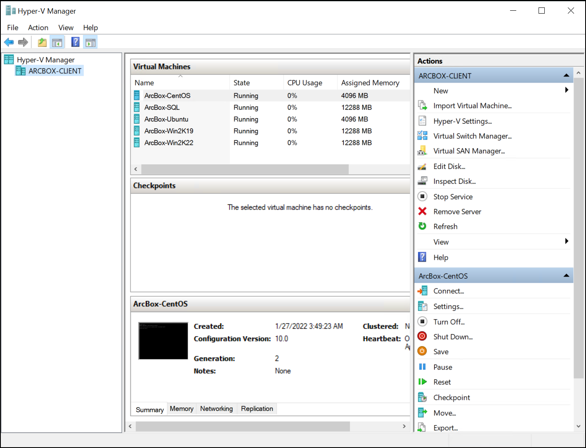

> **ADVISORY: An known issue affecting Azure CLI Kubernetes extensions is causing problems with automation in Jumpstart Kubernetes scenarios, data and app services scenarios, and ArcBox where the Azure CLI Kubernetes extensions are used. This issue will result result in incomplete or failed deployments. Thank you for your patience as the teams work to address the issue.**

## Jumpstart ArcBox for IT Pros

ArcBox for IT Pros is a special "flavor" of ArcBox that is intended for users who want to experience Azure Arc-enabled servers capabilities in a sandbox environment.


### Use cases

- Sandbox environment for getting hands-on with Azure Arc technologies
- Accelerator for Proof-of-concepts or pilots
- Training tool for Azure Arc skills development
- Demo environment for customer presentations or events
- Rapid integration testing platform
- Infrastructure-as-code and automation template library for building hybrid cloud management solutions

## Azure Arc capabilities available in ArcBox for IT Pros

### Azure Arc-enabled servers


ArcBox includes three Azure Arc-enabled server resources that are hosted using nested virtualization in Azure. As part of the deployment, a Hyper-V host (_ArcBox-Client_) is deployed with three guest virtual machines. These machines, _ArcBoxWin_, _ArcBoxUbuntu_, and _ArcBoxSQL_ are connected as Azure Arc-enabled servers via the ArcBox automation.

### Hybrid Unified Operations

ArcBox deploys several management and operations services that work with ArcBox's Azure Arc resources. These resources include an an Azure Automation account, an Azure Log Analytics workspace with the Update Management solution, an Azure Monitor workbook, Azure Policy assignments for deploying Log Analytics agents on Windows and Linux Azure Arc-enabled servers, Azure Policy assignment for adding tags to resources, and a storage account used for staging resources needed for the deployment automation.


## ArcBox Azure Consumption Costs

ArcBox resources generate Azure Consumption charges from the underlying Azure resources including core compute, storage, networking and auxillary services. Note that Azure consumption costs vary depending the region where ArcBox is deployed. Be mindful of your ArcBox deployments and ensure that you disable or delete ArcBox resources when not in use to avoid unwanted charges. Users may review cost analysis of ArcBox by using [Azure Cost Analysis](https://docs.microsoft.com/en-us/azure/cost-management-billing/costs/quick-acm-cost-analysis).

## Deployment Options and Automation Flow

ArcBox provides multiple paths for deploying and configuring ArcBox resources. Deployment options include:

- Azure portal
- ARM template via Azure CLI
- Bicep
- Terraform





ArcBox uses an advanced automation flow to deploy and configure all necessary resources with minimal user interaction. The previous diagrams provide an overview of the deployment flow. A high-level summary of the deployment is:

- User deploys the primary ARM template (azuredeploy.json), Bicep file (main.bicep), or Terraform plan (main.tf). These objects contain several nested objects that will run simultaneously.
  - ClientVM ARM template/plan - deploys the Client Windows VM. This is the Hyper-V host VM where all user interactions with the environment are made from.
  - Storage account template/plan - used for staging files in automation scripts
  - Management artifacts template/plan - deploys Azure Log Analytics workspace and solutions and Azure Policy artifacts
- User remotes into Client Windows VM, which automatically kicks off multiple scripts that:
  - Deploy and configure five (5) nested virtual machines in Hyper-V
    - Windows Server 2022 VM - onboarded as Azure Arc-enabled server
    - Windows Server 2019 VM - onboarded as Azure Arc-enabled server
    - Windows VM running SQL Server - onboarded as Azure Arc-enabled SQL Server (as well as Azure Arc-enabled server)
    - Ubuntu VM - onboarded as Azure Arc-enabled server
    - CentOS VM - onboarded as Azure Arc-enabled server
  - Deploy an Azure Monitor workbook that provides example reports and metrics for monitoring ArcBox components

## Prerequisites

- [Install or update Azure CLI to version 2.15.0 and above](https://docs.microsoft.com/en-us/cli/azure/install-azure-cli?view=azure-cli-latest). Use the below command to check your current installed version.

  ```shell
  az --version
  ```

- Login to AZ CLI using the ```az login``` command.

- Ensure that you have selected the correct subscription you want to deploy ArcBox to by using the ```az account list --query "[?isDefault]"``` command. If you need to adjust the active subscription used by Az CLI, follow [this guidance](https://docs.microsoft.com/en-us/cli/azure/manage-azure-subscriptions-azure-cli#change-the-active-subscription).

- ArcBox must be deployed to one of the following regions. **Deploying ArcBox outside of these regions may result in unexpected results or deployment errors.**

  - East US
  - East US 2
  - West US 2
  - North Europe
  - France Central
  - UK South
  - Southeast Asia

- **ArcBox for IT Pros requires 16 DSv4-series vCPUs** when deploying with default parameters such as VM series/size. Ensure you have sufficient vCPU quota available in your Azure subscription and the region where you plan to deploy ArcBox. You can use the below Az CLI command to check your vCPU utilization.

  ```shell
  az vm list-usage --location <your location> --output table
  ```

  

- Register necessary Azure resource providers by running the following commands.

  ```shell
  az provider register --namespace Microsoft.HybridCompute --wait
  az provider register --namespace Microsoft.GuestConfiguration --wait
  az provider register --namespace Microsoft.AzureArcData --wait
  ```

- Create Azure service principal (SP). To deploy ArcBox, an Azure service principal assigned with multiple role-based access controls (RBAC) roles is required:

  - "Contributor" - Required for provisioning Azure resources
  - **(optional)** "User Access Administrator" - Required for automatically onboarding the Azure Arc-enabled SQL Server resource

    > **NOTE: In the event a Service Principal with Owner cannot be created, the SQL Server can be onboarded to Azure Arc post deployment by following the [Azure Arc-enabled SQL Server onboarding](#azure-arc-enabled-sql-server-onboarding) steps below.**

    To create it login to your Azure account run the below command (this can also be done in [Azure Cloud Shell](https://shell.azure.com/).

    ```shell
    az login
    az ad sp create-for-rbac -n "<Unique SP Name>" --role "Contributor"
    az ad sp create-for-rbac -n "<Unique SP Name>" --role "Security admin"
    az ad sp create-for-rbac -n "<Unique SP Name>" --role "Security reader"
    az ad sp create-for-rbac -n "<Unique SP Name>" --role "Monitoring Metrics Publisher"
    az ad sp create-for-rbac -n "<Unique SP Name>" --role "User Access Administrator"
    ```

    For example:

    ```shell
    az ad sp create-for-rbac -n "JumpstartArcBox" --role "Contributor"
    az ad sp create-for-rbac -n "JumpstartArcBox" --role "Security admin"
    az ad sp create-for-rbac -n "JumpstartArcBox" --role "Security reader"
    az ad sp create-for-rbac -n "JumpstartArcBox" --role "Monitoring Metrics Publisher"
    az ad sp create-for-rbac -n "JumpstartArcBox" --role "User Access Administrator"
    ```

    Output should look like this:

    ```json
    {
    "appId": "XXXXXXXXXXXXXXXXXXXXXXXXXXXX",
    "displayName": "AzureArcBox",
    "name": "http://AzureArcBox",
    "password": "XXXXXXXXXXXXXXXXXXXXXXXXXXXX",
    "tenant": "XXXXXXXXXXXXXXXXXXXXXXXXXXXX"
    }
    ```

    > **NOTE: The Jumpstart scenarios are designed with as much ease of use in-mind and adhering to security-related best practices whenever possible. It is optional but highly recommended to scope the service principal to a specific [Azure subscription and resource group](https://docs.microsoft.com/en-us/cli/azure/ad/sp?view=azure-cli-latest) as well considering using a [less privileged service principal account](https://docs.microsoft.com/en-us/azure/role-based-access-control/best-practices)**

- [Generate SSH Key](https://help.github.com/articles/generating-a-new-ssh-key-and-adding-it-to-the-ssh-agent/) (or use existing ssh key)

  ```shell
  ssh-keygen -t rsa -b 4096 -C "your_email@example.com"
  ```

## ArcBox Azure Region Compatibility

ArcBox must be deployed to one of the following regions. **Deploying ArcBox outside of these regions may result in unexpected results or deployment errors.**

- East US
- East US 2
- West US 2
- North Europe
- France Central
- UK South
- Southeast Asia

## Deployment Option 1: Azure portal

- Click the <a href="https://portal.azure.com/#create/Microsoft.Template/uri/https%3A%2F%2Fraw.githubusercontent.com%2Fmicrosoft%2Fazure_arc%2Fmain%2Fazure_jumpstart_arcbox%2FARM%2Fazuredeploy.json" target="_blank"></a> button and enter values for the the ARM template parameters.

  

  

  

## Deployment Option 2: ARM template with Azure CLI

- Clone the Azure Arc Jumpstart repository

  ```shell
  git clone https://github.com/microsoft/azure_arc.git
  ```

- Edit the [azuredeploy.parameters.json](https://github.com/microsoft/azure_arc/blob/main/azure_jumpstart_arcbox/ARM/azuredeploy.parameters.json) ARM template parameters file and supply some values for your environment.
  - _`sshRSAPublicKey`_ - Your SSH public key
  - _`spnClientId`_ - Your Azure service principal id
  - _`spnClientSecret`_ - Your Azure service principal secret
  - _`spnTenantId`_ - Your Azure tenant id
  - _`windowsAdminUsername`_ - Client Windows VM Administrator name
  - _`windowsAdminPassword`_ - Client Windows VM Password. Password must have 3 of the following: 1 lower case character, 1 upper case character, 1 number, and 1 special character. The value must be between 12 and 123 characters long.
  - _`myIpAddress`_ - Your local IP address. This is used to allow remote RDP connections to the Client Windows VM.
  - _`logAnalyticsWorkspaceName`_ - Unique name for the ArcBox Log Analytics workspace
  - _`flavor`_ - Use the value "ITPro" to specify that you want to deploy ArcBox for IT Pros

  

- Now you will deploy the ARM template. Navigate to the local cloned [deployment folder](https://github.com/microsoft/azure_arc/tree/main/azure_jumpstart_arcbox/ARM) and run the below command:

  ```shell
  az group create --name <Name of the Azure resource group> --location <Azure Region>
  az deployment group create \
  --resource-group <Name of the Azure resource group> \
  --template-file azuredeploy.json \
  --parameters azuredeploy.parameters.json 
  ```

  

  

## Deployment Option 3: Bicep deployment via Azure CLI

- Clone the Azure Arc Jumpstart repository

  ```shell
  git clone https://github.com/microsoft/azure_arc.git
  ```

- Upgrade to latest Bicep version

  ```shell
  az bicep upgrade
  ```

- Edit the [main.parameters.json](https://github.com/microsoft/azure_arc/blob/main/azure_jumpstart_arcbox/bicep/main.parameters.json) template parameters file and supply some values for your environment.
  - _`sshRSAPublicKey`_ - Your SSH public key
  - _`spnClientId`_ - Your Azure service principal id
  - _`spnClientSecret`_ - Your Azure service principal secret
  - _`spnTenantId`_ - Your Azure tenant id
  - _`windowsAdminUsername`_ - Client Windows VM Administrator name
  - _`windowsAdminPassword`_ - Client Windows VM Password. Password must have 3 of the following: 1 lower case character, 1 upper case character, 1 number, and 1 special character. The value must be between 12 and 123 characters long.
  - _`myIpAddress`_ - Your local IP address. This is used to allow remote RDP connections to the Client Windows VM.
  - _`logAnalyticsWorkspaceName`_ - Unique name for the ArcBox Log Analytics workspace
  - _`flavor`_ - Use the value "ITPro" to specify that you want to deploy ArcBox for IT Pros

  

- Now you will deploy the Bicep file. Navigate to the local cloned [deployment folder](https://github.com/microsoft/azure_arc/tree/main/azure_jumpstart_arcbox/bicep) and run the below command:

  ```shell
  az login
  az group create --name "<resource-group-name>" --location "<preferred-location>"
  az deployment group create -g "<resource-group-name>" -f "main.bicep" -p "main.parameters.json"
  ```

## Deployment Option 4: Terraform Deployment

- Clone the Azure Arc Jumpstart repository

  ```shell
  git clone https://github.com/microsoft/azure_arc.git
  ```

- Download and install the latest version of Terraform [here](https://www.terraform.io/downloads.html)

  > **NOTE: Terraform 1.x or higher is supported for this deployment. Tested with Terraform v1.011.**

- Create a `terraform.tfvars` file in the root of the terraform folder and supply some values for your environment.

  ```HCL
  azure_location    = "westus2"
  spn_client_id     = "1414133c-9786-53a4-b231-f87c143ebdb1"
  spn_client_secret = "fakeSecretValue123458125712ahjeacjh"
  spn_tenant_id     = "33572583-d294-5b56-c4e6-dcf9a297ec17"
  user_ip_address   = "99.88.99.88"
  client_admin_ssh  = "C:/Temp/rsa.pub"
  deployment_flavor = "ITPro"
  ```

- Variable Reference:
  - **_`azure_location`_** - Azure location code (e.g. 'eastus', 'westus2', etc.)
  - **_`resource_group_name`_** - Resource group which will contain all of the ArcBox artifacts
  - **_`spn_client_id`_** - Your Azure service principal id
  - **_`spn_client_secret`_** - Your Azure service principal secret
  - **_`spn_tenant_id`_** - Your Azure tenant id
  - **_`user_ip_address`_** - Your local IP address. This is used to allow remote RDP connections to the Client Windows VM. If you don't know your public IP, you can find it [here](https://www.whatismyip.com/)
  - **_`client_admin_ssh`_** - SSH public key path, used for Linux VMs
  - **_`deployment_flavor`_** - Use the value "ITPro" to specify that you want to deploy ArcBox for IT Pros
  - _`client_admin_username`_ - Admin username for Windows & Linux VMs
  - _`client_admin_password`_ - Admin password for Windows VMs. Password must have 3 of the following: 1 lower case character, 1 upper case character, 1 number, and 1 special character. The value must be between 12 and 123 characters long.
  - **_`workspace_name`_** - Unique name for the ArcBox Log Analytics workspace

  > **NOTE: Any variables in bold are required. If any optional parameters are not provided, defaults will be used.**

- Now you will deploy the Terraform file. Navigate to the local cloned [deployment folder](https://github.com/microsoft/azure_arc/tree/main/azure_jumpstart_arcbox/bicep) and run the commands below:

  ```shell
  terraform init
  terraform plan -out=infra.out
  terraform apply "infra.out"
  ```
  
- Example output from `terraform init`:

  

- Example output from `terraform plan -out=infra.out`:

  

- Example output from `terraform apply "infra.out"`:

  

## Start post-deployment automation

- After deployment, you should see the ArcBox resources inside your resource group.

  

  > **NOTE: If you followed the steps in [prerequisites](#prerequisites) to allow the SQL Server to be automatically onboarded, there will be one additional resource in your ArcBox resource group (14 total)**

- Open a remote desktop connection into _ArcBox-Client_. Upon logging in, multiple automated scripts will open and start running. These scripts usually take 10-20 minutes to finish and once completed the script windows will close. At this point, the deployment is complete.

  

  

## Azure Arc-enabled SQL Server onboarding

- During deployment, a check is performed to determine whether or not the Service Principal being used has permissions of _'Microsoft.Authorization/roleAssignments/write'_ on the target resource group. This permission can be found in the Azure built-in roles of Owner, User Access Administrator, or you may have a custom RBAC role which provides this permission. If the Service Principal has been granted the rights to change the role assignments on the resource group, the Azure Arc-enabled SQL Server can be automatically onboarded as part of the port-deployment automation.

- In the event that the Service Principal does *not* have _'Microsoft.Authorization/roleAssignments/write'_ on the target resource group, and icon will created on the _ArcBox-Client_ desktop, which will allow you to onboard the Azure Arc-enabled SQL Server after the post-deployment automation is complete. To start the onboarding process in this scenario, simply click the _'Onboard SQL Server'_ icon on the desktop. This process should take around 10-15 minutes to complete.

  

- A pop-up box will walk you through the target SQL Server which will be onboarded to Azure Arc, as well as provide details around the flow of the onboarding automation and how to complete the Azure authentication process when prompted.

  

- The automation uses the PowerShell SDK to onboard the Azure Arc-enabled SQL Server on your behalf. To accomplish this, it will login to Azure with the _-UseDeviceAuthentication_ flag. The device code will be copied to the clipboard on your behalf, so you can simply paste the value into box when prompted.

  

- You'll then need to provide your Azure credentials to complete the authentication process. The user you login as will need _'Microsoft.Authorization/roleAssignments/write'_ permissions on the ArcBox resource group to complete the onboarding process.

  

- The output of each step of the onboarding process will be displayed in the PowerShell script window, so you'll be able to see where the script currently is in the process at all times.

  

- Once complete, you'll receive a pop-up notification informing you that the onboarding process is complete, and to check the Azure Arc blade in the Azure portal in the next few minutes.

  

- From the Azure portal, the SQL Server should now be visible as an Azure Arc-enabled SQL Server.

  

## Using ArcBox for IT Pros

After deployment is complete, its time to start exploring ArcBox. Most interactions with ArcBox will take place either from Azure itself (Azure portal, CLI or similar) or from inside the _ArcBox-Client_ virtual machine. When remoted into the client VM, here are some things to try:

- Open Hyper-V and access the Azure Arc-enabled servers
  - **Username: arcdemo**
  - **Password: ArcDemo123!!**

  

### ArcBox Azure Monitor workbook

Open the [ArcBox Azure Monitor workbook](https://azurearcjumpstart.io/azure_jumpstart_arcbox/workbook/flavors/ITPro/) and explore the visualizations and reports of hybrid cloud resources. A [dedicated README](https://azurearcjumpstart.io/azure_jumpstart_arcbox/workbook/flavors/ITPro/) is available with more detail on usage of the workbook.

  

### Included tools

The following tools are including on the _ArcBox-Client_ VM.

- Chocolatey
- Visual Studio Code
- Putty
- 7zip
- Terraform
- Git

### Next steps
  
ArcBox is a sandbox that can be used for a large variety of use cases, such as an environment for testing and training or a kickstarter for proof of concept projects. Ultimately, you are free to do whatever you wish with ArcBox. Some suggested next steps for you to try in your ArcBox are:

- Build policy initiatives that apply to your Azure Arc-enabled resources
- Write and test custom policies that apply to your Azure Arc-enabled resources
- Incorporate your own tooling and automation into the existing automation framework
- Build a certificate/secret/key management strategy with your Azure Arc resources

Do you have an interesting use case to share? [Submit an issue](https://github.com/microsoft/azure_arc/issues/new/choose) on GitHub with your idea and we will consider it for future releases!

## Clean up the deployment

To clean up your deployment, simply delete the resource group using Azure CLI or Azure portal.

```shell
az group delete -n <name of your resource group>
```


## Basic Troubleshooting

Occasionally deployments of ArcBox may fail at various stages. Common reasons for failed deployments include:

- Invalid service principal id, service principal secret or service principal Azure tenant ID provided in _azuredeploy.parameters.json_ file.
- Invalid SSH public key provided in _azuredeploy.parameters.json_ file.
  - An example SSH public key is shown here. Note that the public key includes "ssh-rsa" at the beginning. The entire value should be included in your _azuredeploy.parameters.json_ file.


- Not enough vCPU quota available in your target Azure region - check vCPU quota and ensure you have at least 16 available. See the [prerequisites](#prerequisites) section for more details.
- Target Azure region does not support all required Azure services - ensure you are running ArcBox in one of the supported regions listed in the above section "ArcBox Azure Region Compatibility".
- "BadRequest" error message when deploying - this error returns occasionally when the Log Analytics solutions in the ARM templates are deployed. Typically, waiting a few minutes and re-running the same deployment resolves the issue. Alternatively, you can try deploying to a different Azure region.

  

  

### Exploring logs from the _ArcBox-Client_ virtual machine

Occasionally, you may need to review log output from scripts that run on the _ArcBox-Client_ virtual machine in case of deployment failures. To make troubleshooting easier, the ArcBox deployment scripts collect all relevant logs in the _C:\ArcBox\Logs_ folder on _ArcBox-Client_. A short description of the logs and their purpose can be seen in the list below:

| Logfile | Description |
| ------- | ----------- |
| _C:\ArcBox\Logs\Bootstrap.log_ | Output from the initial bootstrapping script that runs on _ArcBox-Client_. |
| _C:\ArcBox\Logs\ArcServersLogonScript.log_ | Output of ArcServersLogonScript.ps1 which configures the Hyper-V host and guests and onboards the guests as Azure Arc-enabled servers. |
| _C:\ArcBox\Logs\MonitorWorkbookLogonScript.log_ | Output from MonitorWorkbookLogonScript.ps1 which deploys the Azure Monitor workbook. |

  

If you are still having issues deploying ArcBox, please [submit an issue](https://github.com/microsoft/azure_arc/issues/new/choose) on GitHub and include a detailed description of your issue, the Azure region you are deploying to, and the flavor of ArcBox you are trying to deploy. Inside the _C:\ArcBox\Logs_ folder you can also find instructions for uploading your logs to an Azure storage account for review by the Jumpstart team.

## Known issues

- Azure Arc-enabled SQL Server assessment report not always visible in Azure portal
