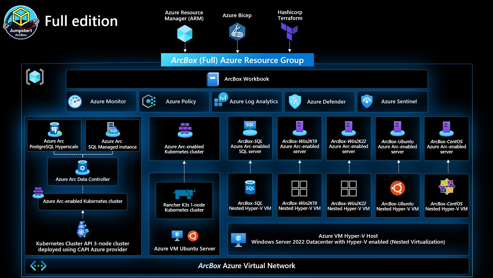
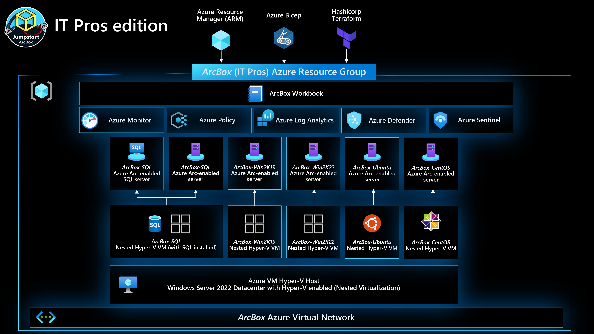
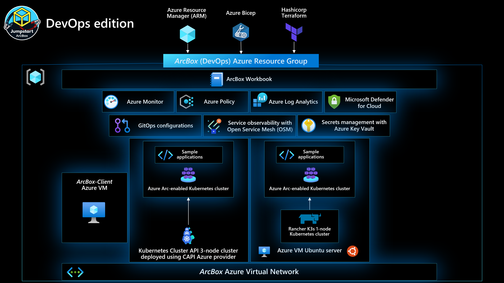

## Jumpstart ArcBox - Overview

ArcBox is a solution that provides an easy to deploy sandbox for all things Azure Arc. ArcBox is designed to be completely self-contained within a single Azure subscription and resource group, which will make it easy for a user to get hands-on with all available Azure Arc technology with nothing more than an available Azure subscription.

### Use cases

- Sandbox environment for getting hands-on with Azure Arc
- Accelerator for Proof-of-concepts or pilots
- Training tool for Azure Arc skills development
- Demo environment for customer presentations or events
- Rapid integration testing platform

### ArcBox "Flavors"

ArcBox comes in multiple "flavors", or configurations, which can be selected to best suit your needs. Currently, the available flavors are:

- [ArcBox "Full"](https://azurearcjumpstart.io/azure_jumpstart_arcbox/Full)
    As the name implies, this flavor includes all ArcBox features including Azure Arc-enabled servers, Azure Arc-enabled Kubernetes basic functionality, and Azure Arc-enabled data services. Use this flavor if you want to experience everything ArcBox has to offer.

    

- [ArcBox for IT Pros](https://azurearcjumpstart.io/azure_jumpstart_arcbox/ITPro)
    ArcBox for IT Pros focuses specifically on Azure Arc-enabled servers and Azure Arc-enabled SQL Server functionality. This flavor omits anything related to Azure Arc-enabled Kubernetes or Azure Arc-enabled data services.

    

- [ArcBox for DevOps](https://azurearcjumpstart.io/azure_jumpstart_arcbox/DevOps)
    ArcBox for DevOps focuses specifically on Azure Arc-enabled Kubernetes advanced functionality. This flavor omits anything related to Azure Arc-enabled servers or Azure Arc-enabled data services.

    

To get started with one of the flavors of ArcBox, click the relevant links above to view the detailed README for each flavor.
