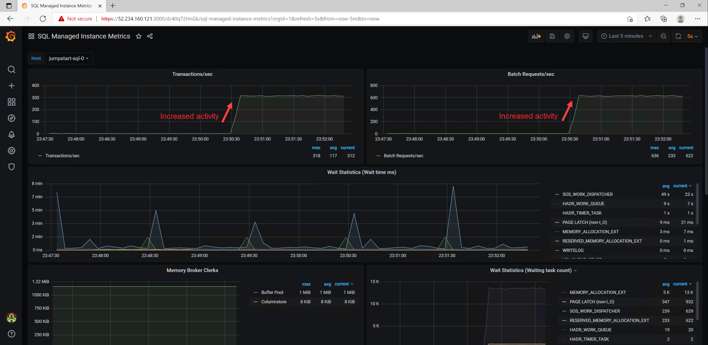

## Jumpstart ArcBox - Overview

ArcBox is a project that provides an easy to deploy sandbox for all things Azure Arc. ArcBox is designed to be completely self-contained within a single Azure subscription and resource group, which will make it easy for a user to get hands-on with all available Azure Arc technology with nothing more than an available Azure subscription.


### Use cases

* Sandbox environment for getting hands-on with Azure Arc technologies
* Accelerator for Proof-of-concepts or pilots
* Training tool for Azure Arc skills development
* Demo environment for customer presentations or events
* Rapid integration testing platform

## Azure Arc capabilities available in ArcBox

### Azure Arc-enabled servers


ArcBox includes three Azure Arc-enabled server resources that are hosted using nested virtualization in Azure. As part of the deployment, a Hyper-V host (ArcBox-Client) is deployed with three guest virtual machines. These machines, _ArcBoxWin_, _ArcBoxUbuntu_, and _ArcBoxSQL_ are connected as Azure Arc-enabled servers via the ArcBox automation.

### Azure Arc-enabled Kubernetes


ArcBox deploys one single-node Rancher K3s cluster running on an Azure virtual machine. This cluster is then connected to Azure as an Azure Arc-enabled Kubernetes resource (_ArcBox-K3s_).

### Azure Arc-enabled data services

ArcBox deploys one single-node Rancher K3s cluster (_ArcBox-CAPI-MGMT_), which is then transformed to a [Cluster API](https://cluster-api.sigs.k8s.io/user/concepts.html) management cluster with the Azure CAPZ provider, and a workload cluster is deployed onto the management cluster. The Azure Arc-enabled data services and data controller are deployed onto this workload cluster via a PowerShell script that runs when first logging into ArcBox-Client virtual machine.


### Hybrid Unified Operations

ArcBox deploys several management and operations services that work with ArcBox's Azure Arc resources. These resources include an an Azure Automation account, an Azure Log Analytics workspace with the Update Management solution, an Azure Monitor workbook, Azure Policy assignments for deploying Log Analytics agents on Windows and Linux Azure Arc-enabled servers, Azure Policy assignment for adding tags to resources, and a storage account used for staging resources needed for the deployment automation.


## ArcBox Azure Consumption Costs

ArcBox resources generate Azure Consumption charges from the underlying Azure resources including core compute, storage, networking and auxilliary services. These services generate approximately $20-30 USD per day. Note that Azure consumption costs vary depending the region where ArcBox is deployed. Be mindful of your ArcBox deployments and ensure that you disable or delete ArcBox resources when not in use to avoid unwanted charges. Users may review cost analysis of ArcBox by using [Azure Cost Analysis](https://docs.microsoft.com/en-us/azure/cost-management-billing/costs/quick-acm-cost-analysis).

## Automation flow


ArcBox uses an advanced automation flow to deploy and configure all necessary resources with minimal user interaction. The above diagram provides a high-level overview of the deployment flow. A high-level summary of the deployment is:

* User deploys the primary ARM template (azuredeploy.json). This template contains several nested templates that will run simultaneously.
  * ClientVM ARM template - deploys the Client Windows VM. This is the Hyper-V host VM where all user interactions with the environment are made from.
  * CAPI ARM template - deploys an Ubuntu Linux VM which will have Rancher (K3s) installed and transformed into a Cluster API management cluster via the Azure CAPZ provider.
  * Rancher K3s template - deploys an Ubuntu Linux VM which will have Rancher (K3s) installed on it and connected as an Azure Arc-enabled Kubernetes cluster
  * Storage account template - used for staging files in automation scripts
  * Management artifacts template - deploys Azure Log Analytics workspace and solutions and Azure Policy artifacts
* User remotes into Client Windows VM, which automatically kicks off multiple scripts that:
  * Deploy and configure three (3) nested virtual machines in Hyper-V
    * Windows VM - onboarded as Azure Arc-enabled Server
    * Ubuntu VM - onboarded as Azure Arc-enabled Server
    * Windows VM running SQL Server - onboarded as Azure Arc-enabled SQL Server (as well as Azure Arc-enabled Server)
  * Deploy and configure Azure Arc-enabled data services on the CAPI workload cluster including a data controller, a SQL MI instance, and a PostgreSQL Hyperscale cluster. After deployment, Azure Data Studio opens automatically with connection entries for each database instance. Note that the SQI MI instance and the PostgreSQL Hyperscale instance are exposed by the load balancer on non-standard ports (SQLMI/11433 and PostgreSQL/15432) Data services deployed by the script are:
    * Data controller
    * SQL MI instance
    * Postgres instance
  * Deploy an Azure Monitor workbook that provides example reports and metrics for monitoring ArcBox components

## Prerequisites

* ArcBox requires 52 vCPUs when deploying with default parameters such as VM series/size. Ensure you have sufficient vCPU quota available in your Azure subscription and the region where you plan to deploy ArcBox. You can use the below Az CLI command to check your vCPU utilization.

  ```shell
  az vm list-usage --location <your location> --output table
  ```

  

* [Install or update Azure CLI to version 2.25.0 and above](https://docs.microsoft.com/en-us/cli/azure/install-azure-cli?view=azure-cli-latest). Use the below command to check your current installed version.

  ```shell
  az --version
  ```

* Login to AZ CLI using the ```az login``` command.

* Register necessary Azure resource providers by running the following commands.

  ```shell
  az provider register --namespace Microsoft.Kubernetes --wait
  az provider register --namespace Microsoft.KubernetesConfiguration --wait
  az provider register --namespace Microsoft.ExtendedLocation --wait
  az provider register --namespace Microsoft.AzureArcData --wait
  ```

* Create Azure service principal (SP)

    To deploy ArcBox an Azure service principal assigned with the "Contributor" role is required. To create it login to your Azure account run the below command (this can also be done in [Azure Cloud Shell](https://shell.azure.com/)).

    ```shell
    az login
    az ad sp create-for-rbac -n "<Unique SP Name>" --role contributor
    ```

    For example:

    ```shell
    az ad sp create-for-rbac -n "http://AzureArcBox" --role contributor
    ```

    Output should look like this:

    ```json
    {
    "appId": "XXXXXXXXXXXXXXXXXXXXXXXXXXXX",
    "displayName": "AzureArcBox",
    "name": "http://AzureArcBox",
    "password": "XXXXXXXXXXXXXXXXXXXXXXXXXXXX",
    "tenant": "XXXXXXXXXXXXXXXXXXXXXXXXXXXX"
    }
    ```

    > **Note: The Jumpstart scenarios are designed with as much ease of use in-mind and adhering to security-related best practices whenever possible. It is optional but highly recommended to scope the service principal to a specific [Azure subscription and resource group](https://docs.microsoft.com/en-us/cli/azure/ad/sp?view=azure-cli-latest) as well considering using a [less privileged service principal account](https://docs.microsoft.com/en-us/azure/role-based-access-control/best-practices)**

* [Generate SSH Key](https://help.github.com/articles/generating-a-new-ssh-key-and-adding-it-to-the-ssh-agent/) (or use existing ssh key)

  ```shell
  ssh-keygen -t rsa -b 4096 -C "your_email@example.com"
  ```

## ArcBox Azure Region Compatibility

ArcBox must be deployed to one of the following regions. Deploying ArcBox outside of these regions may result in unexpected results or deployment errors.

* East US
* East US 2
* West US 2
* North Europe
* France Central
* UK South
* Southeast Asia
* Australia East

## Deployment Option 1: Azure Portal

* Click the <a href="https://portal.azure.com/#create/Microsoft.Template/uri/https%3A%2F%2Fraw.githubusercontent.com%2Fmicrosoft%2Fazure_arc%2Fmain%2Fazure_jumpstart_arcbox%2Fazuredeploy.json" target="_blank"></a> button and enter values for the the ARM template parameters.

  

  

  

## Deployment Option 2: Azure CLI

* Clone the Azure Arc Jumpstart repository

    ```shell
    git clone https://github.com/microsoft/azure_arc.git
    ```

* Edit the [azuredeploy.parameters.json](https://github.com/microsoft/azure_arc/blob/main/azure_jumpstart_arcbox/azuredeploy.parameters.json) ARM template parameters file and supply some values for your environment.

  * *sshRSAPublicKey* - Your SSH public key
  * *spnClientId* - Your Azure service principal id
  * *spnClientSecret* - Your Azure service principal secret
  * *spnTenantId* - Your Azure tenant id
  * *windowsAdminUsername* - Client Windows VM Administrator name
  * *windowsAdminPassword* - Client Windows VM Password. Password must have 3 of the following: 1 lower case character, 1 upper case character, 1 number, and 1 special character. The value must be between 12 and 123 characters long.
  * *myIpAddress* - Your local IP address. This is used to allow remote RDP and SSH connections to the Client Windows VM and K3s Rancher VM.
  * *logAnalyticsWorkspaceName* - Unique name for the ArcBox log analytics workspace

    

* Now you will deploy the ARM template. Navigate to the local cloned [deployment folder](https://github.com/microsoft/azure_arc/tree/main/azure_jumpstart_arcbox) and run the below command:

  ```shell
  az group create --name <Name of the Azure resource group> --location <Azure Region>
  az deployment group create \
  --resource-group <Name of the Azure resource group> \
  --template-file azuredeploy.json \
  --parameters azuredeploy.parameters.json 
  ```

  

  

* After deployment, you should see the ArcBox resources inside your resource group.

  

## Start post-deployment automation

* Open a remote desktop connection into _ArcBox-Client_. Upon logging in, multiple automated scripts will open and start running. These scripts usually take 10-20 minutes to finish and once completed the script windows will close. At this point, the deployment is complete.

  

  

## Using ArcBox

After deployment is complete, its time to start exploring ArcBox. Most interactions with ArcBox will take place either from Azure itself (Azure Portal, CLI or similar) or from inside the ArcBox-Client virtual machine. When remoted into the client VM, here are some things to try:

* Open Hyper-V and access the Azure Arc-enabled servers
  * Username: arcdemo
  * Password: ArcDemo123!!

  

* Use the included [kubectx](https://github.com/ahmetb/kubectx) tool to switch Kubernetes contexts between the Rancher K3s and AKS clusters.

  ```shell
  kubectx
  kubectx arcbox-capi
  kubectl get nodes
  kubectl get pods -n arc
  kubectx arcbox-k3s
  kubectl get nodes
  ```

  

* Open Azure Data Studio and explore the SQL MI and PostgreSQL Hyperscale instances.

  

### ArcBox Azure Monitor workbook

Open the [ArcBox Azure Monitor workbook](https://azurearcjumpstart.io/azure_jumpstart_arcbox/workbook/) and explore the visualizations and reports of hybrid cloud resources. A [dedicated README](https://azurearcjumpstart.io/azure_jumpstart_arcbox/workbook/) is available with more detail on usage of the workbook.

  

### Azure Arc-enabled data services operations

Open the [data services operations page](https://azurearcjumpstart.io/azure_jumpstart_arcbox/data_ops/) and explore various ways you can perform operations against the Azure Arc-enabled data services deployed with ArcBox.

  

### Included tools

The following tools are including on the ArcBox-Client VM.

* Azure Data Studio with Arc and PostgreSQL extensions
* kubectl, kubectx, helm
* Chocolatey
* Visual Studio Code
* Putty
* 7zip
* Terraform
* Git
* SqlQueryStress

### Next steps
  
ArcBox is a sandbox that can be used for a large variety of use cases, such as an environment for testing and training or kickstarter for proof of concept projects. Ultimately, you are free to do whatever you wish with ArcBox. Some suggested next steps for you to try in your ArcBox are:

* Deploy sample databases to the PostgreSQL Hyperscale instance or to the SQL Managed Instance
* Use the included kubectx to switch contexts between the two Kubernetes clusters
* Deploy GitOps configurations with Azure Arc-enabled Kubernetes
* Build policy initiatives that apply to your Azure Arc-enabled resources
* Write and test custom policies that apply to your Azure Arc-enabled resources
* Incorporate your own tooling and automation into the existing automation framework
* Build a certificate/secret/key management strategy with your Azure Arc resources

Do you have an interesting use case to share? Submit an issue on GitHub with your idea and we will consider it for future releases!

## Clean up the deployment

To clean up your deployment, simply delete the resource group using Azure CLI or Azure Portal.

```shell
az group delete -n <name of your resource group>
```


## Basic Troubleshooting

Occasionally deployments of ArcBox may fail at various stages. Common reasons for failed deployments include:

* Invalid service principal id or service principal secret provided in _azuredeploy.parameters.json_ file.
* Not enough vCPU quota available in your target Azure region - check vCPU quota and ensure you have at least 52 available.
* Target Azure region does not support all required Azure services - ensure you are running ArcBox in one of the supported regions listed in the above section "ArcBox Azure Region Compatibility".

## Known issues

* Azure Arc-enabled SQL Server assessment report not always visible in Azure Portal
