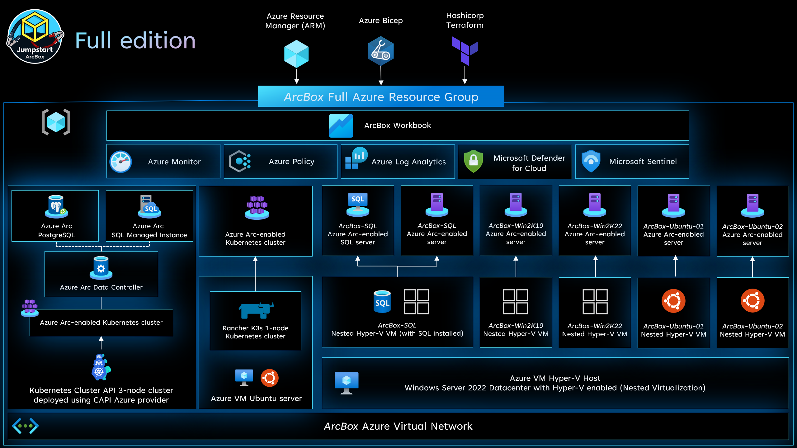
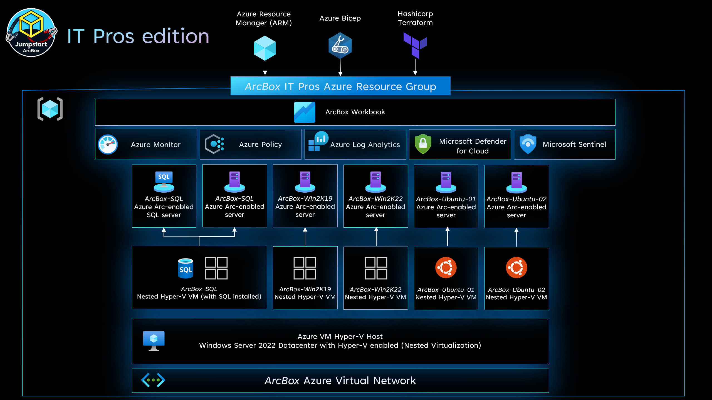

## Jumpstart ArcBox - Overview

ArcBox is a solution that provides an easy to deploy sandbox for all things Azure Arc. ArcBox is designed to be completely self-contained within a single Azure subscription and resource group, which will make it easy for a user to get hands-on with all available Azure Arc technology with nothing more than an available Azure subscription.

### Use cases

- Sandbox environment for getting hands-on with Azure Arc
- Accelerator for Proof-of-concepts or pilots
- Training tool for Azure Arc skills development
- Demo environment for customer presentations or events
- Rapid integration testing platform

### ArcBox "Flavors"

ArcBox comes in multiple "flavors", or configurations, which can be selected to best suit your needs. Currently, the available flavors are:

- [ArcBox "Full"](https://azurearcjumpstart.io/azure_jumpstart_arcbox/Full)
    The core ArcBox experience with Azure Arc-enabled servers, Kubernetes, and data services capabilities.

    

- [ArcBox for IT Pros](https://azurearcjumpstart.io/azure_jumpstart_arcbox/ITPro)
    This essential Azure Arc-enabled servers sandbox includes a mix of Microsoft Windows and Linux servers managed using the included capabilities such Azure Monitor, Microsoft Defender for Cloud, Azure Policy, Update Management and more.

    

- [ArcBox for DevOps](https://azurearcjumpstart.io/azure_jumpstart_arcbox/DevOps)
    This essential Azure Arc-enabled Kubernetes sandbox with the included capabilities such as GitOps, Open Service Mesh (OSM), secrets management, monitoring, and more.

    

- [ArcBox for DataOps](https://azurearcjumpstart.io/azure_jumpstart_arcbox/DataOps)
    This essential Azure Arc-enabled SQL Managed Instance sandbox with the included capabilities such as Active Directory authentication, point-in-time restore, high availability, disaster recovery, and more.

    

To get started with one of the flavors of ArcBox, click the relevant links above to view the detailed README for each flavor. For additional questions, please review the [Jumpstart FAQ](https://aka.ms/Jumpstart-FAQ).
