## Jumpstart ArcBox - Workbook

ArcBox is a project that provides an easy to deploy sandbox for all things Azure Arc. Jumpstart ArcBox deploys a set of Azure Arc resources along with several management and operations services. These services include an an Azure Automation account, an Azure Log Analytics workspace with the Update Management solution and Azure Policy assignments.

As part of ArcBox a workbook is also provided as a single pane of glass for unified operations. Using Azure's management and operations tools in hybrid, multicloud and edge deployments provides consistency in the set of tools and processes needed to  manage each environment through a common set of governance and operations management practices. The workbook acts as a flexible canvas for data analysis and visualization in the Azure portal, gathering information from several data sources from across Azure and combining them into an integrated interactive experience.

## Access the ArcBox workbook

The Jumpstart ArcBox workbook is automatically deployed for you as part of ArcBox's advanced automation. To access the Jumpstart ArcBox workbook use the Azure Portal to follow the next steps.

* Navigate to your ArcBox resource group and search for your Log Analytics workspace, you can do so by using the filter "Type" and searching for "Log Analytics workspace".

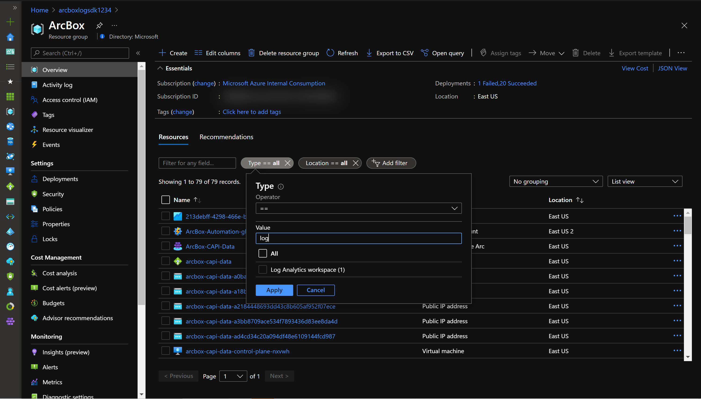

* After you apply the filter in the ArcBox resource group you will get the Log Analytics workspace resource.

* Access the Log Analytics workspace by clicking on its name and under "General" select "Workbooks".

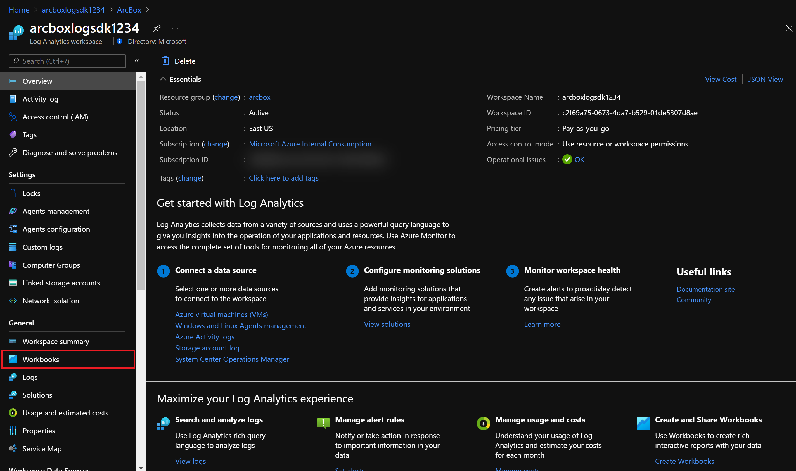

* In the Workbooks Gallery select the "ArcBox Workbook".

* The Jumpstart ArcBox Workbook will be displayed.

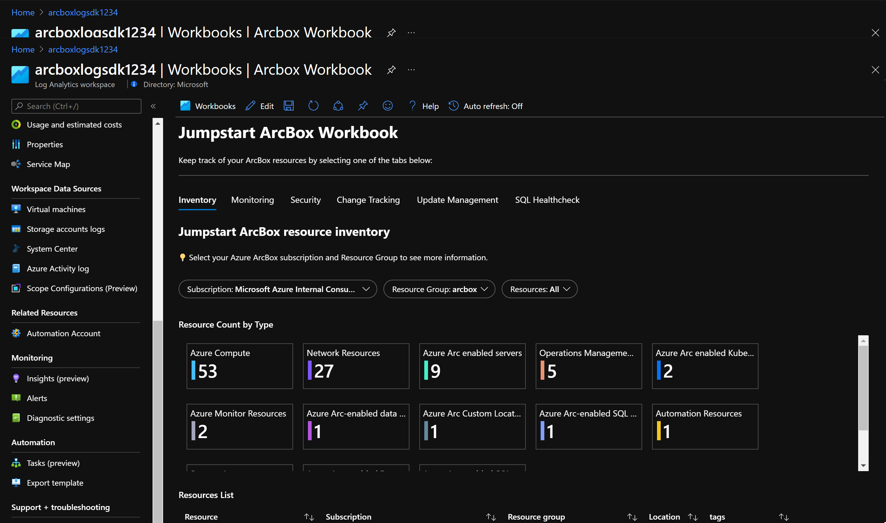

## Jumpstart ArcBox Workbook capabilities

The ArcBox Workbook is a single report that combines data from diferent sources and services, providing composite views or joins across resources, enabling richer data and insights for unified operations.

The Workbook is organized into several tabs that provide easier navigation and separation of concerns.

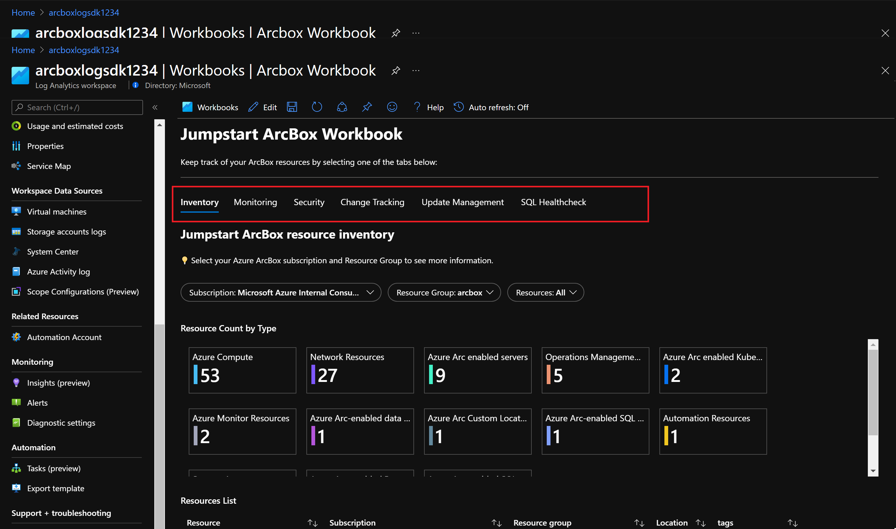

### Inventory

By using Azure Arc, your on-premises and multi-cloud resources become part of Azure Resource Manager and therefore you can use tools such as Azure Resource Graph as a way to explore your inventory at scale. Your Azure Resource Graph queries can now include Azure Arc-enabled resources with filtering, using tags, or tracking changes.

The "Inventory" tab in the ArcBox Workbook has three sections:

* *parameters* - use the drop down menu to select your subscription and resource group, you also get the option to filter the report by resource type.

   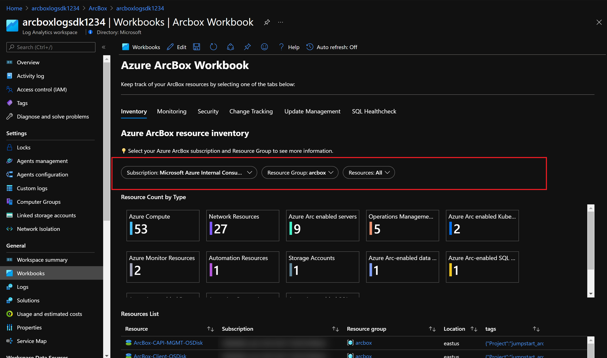

* *Resource Count by Type* - this visualization shows the number of resources by type within a resource group, these grouping will be automatically refreshed if the parameters section is changed.

   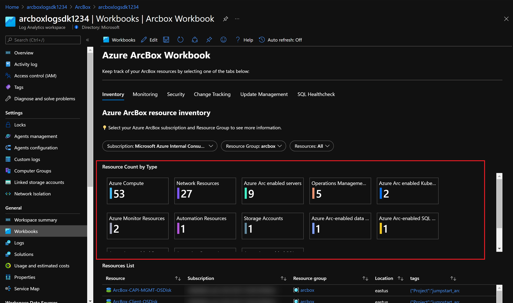

* *Resource List* - this table shows a list of resources in the resource group provided in the parameters section. This is an interactive list, therefore you can click on any resource or tag for additional information.

   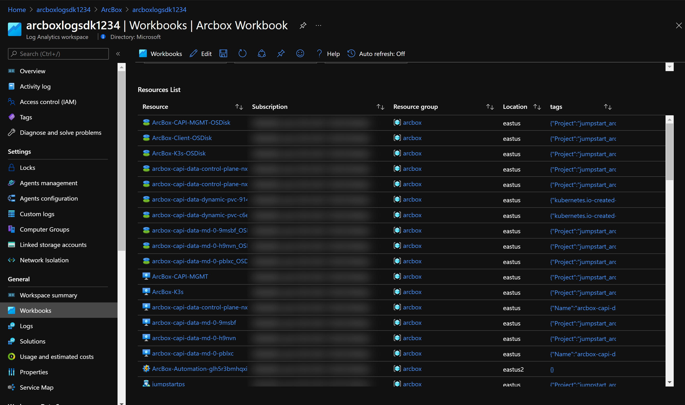

### Monitoring

By enabling a resource in Azure Arc it gives you the ability to perform configuration management and monitoring tasks on those services as if they were first-class citizens in Azure. You are able to monitor your connected machine guest operating system performance and your Kubernetes clusters at the scope of the resource with VM and container Insights. In ArcBox the Azure Arc enabled servers and Azure Arc enabled Kubernetes clusters have been onboarded onto Azure Monitor.

The "Monitoring" tab of the Jumpstart Workbook shows metrics and alerts for ArcBox resources organized in three sections:

* *Alert Summary* - Shows an overview of alerts organized by severity and status. You can use the drop down menus to apply filters to the report. The following filters are available:
  * Subscription: select one or multiple subscriptions in your environment to show available alerts.
  * Resource Group: select one or more resource groups in your environment to show available alerts.
  * Resource Type: select one or multiple resources types to show its alerts.
  * Resources: select individual resources by name to visualize its alerts.
  * Time Range: provide a time range in which the alert has been created.
  * State: choose the alert type between New, Acknowledged or Closed.

   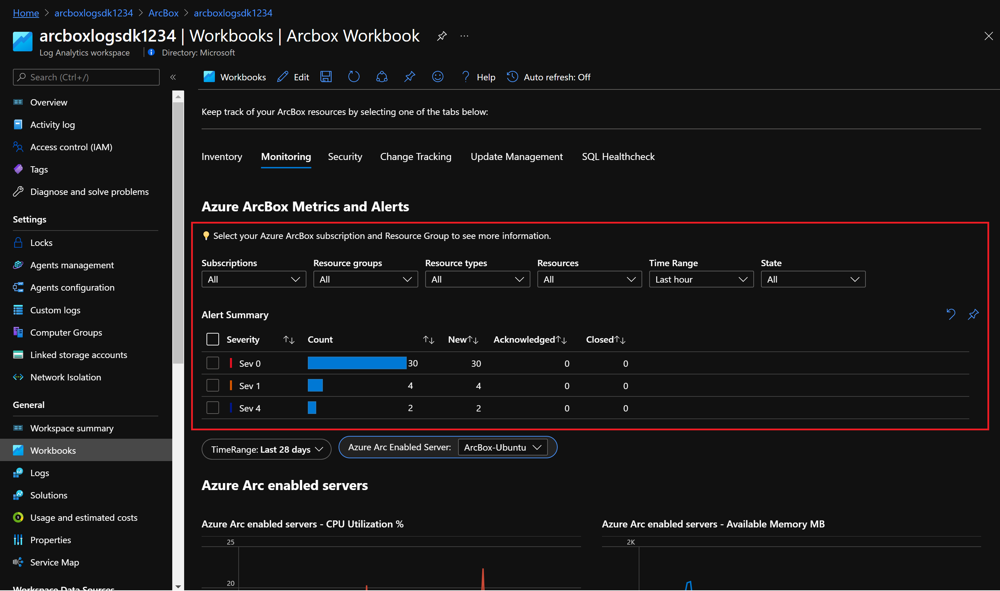

* *Azure Arc Enabled Servers* - Shows metrics for CPU and memory usage on the Azure Arc enabled servers. Use the parameters section to select the select the Azure Arc enabled server as well as a time range to visualize the data.

   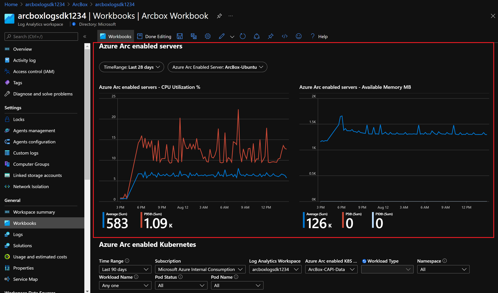

* *Azure Arc enabled Kubernetes* - Shows information and metrics from ArcBox's Azure Arc enabled Kubernetes clusters. Use the parameters section to filter data:
  * Time Range: provide a time range for the metrics and logs to be displayed.
  * Subscription: select your subscription where ArcBox is deployed.
  * Log Analytics Workspace: select ArcBox's Log Analytics workspace.
  * Azure Arcenabled K8s cluster: choose one of ArcBox's Azure Arc enabled Kubernetes clusters.
  * Workload Type: choose one or multiple kubernetes deployment types.
  * Namespace: choose one or multiple namespaces in the Kubernetes cluster.
  * Workload Name: choose one of the deployments in your cluster.
  * Pod Status: filter by Pod status like Pending/Running/Failed etc.
  * Pod Name: filter by pod name in the namespace and workloadname selected.

  With this report you will get several visualizations:

  * Pod and Container restart trend graphs.

     

  * Pod count and status chart.

     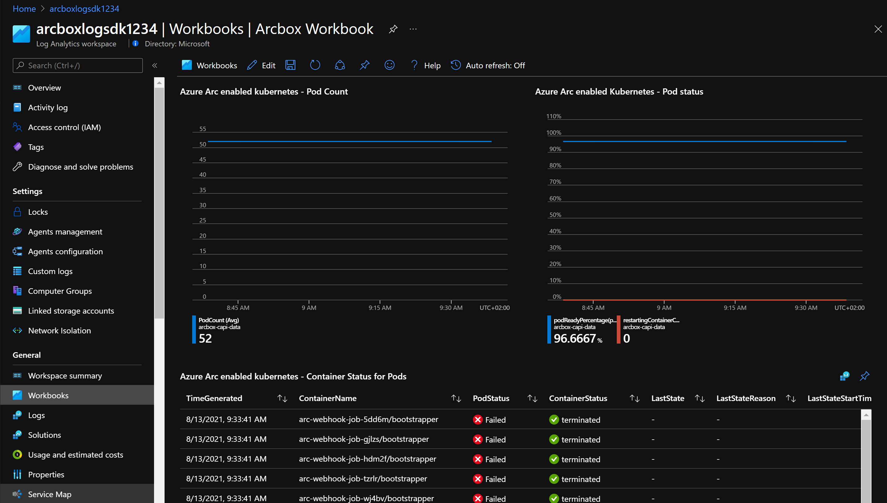

  * A list of the container status for pods.

     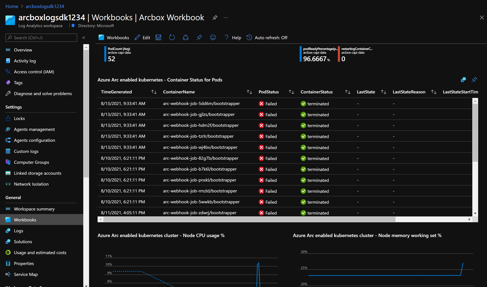

  * The kubernetes cluster's nodes CPU and memory working set percentage.

     

### Security

### Change Tracking

### Update Management

### SQL Healthcheck

### Next steps
  
ArcBox is a sandbox that can be used for a large variety of use cases, such as an environment for testing and training or kickstarter for proof of concept projects. Ultimately, you are free to do whatever you wish with ArcBox. Some suggested next steps for you to try in your ArcBox are:

