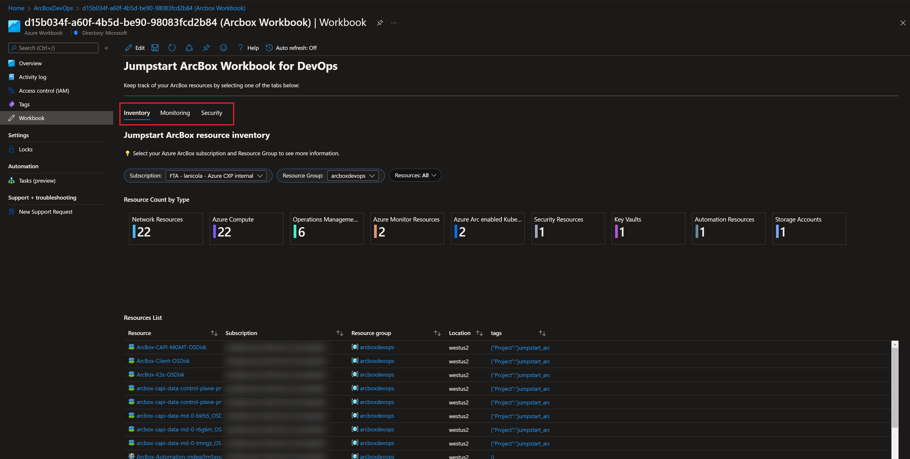
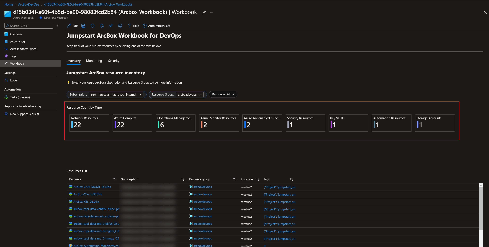
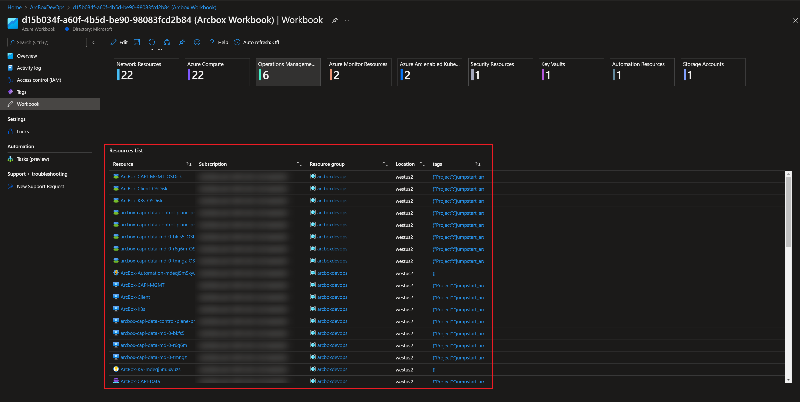
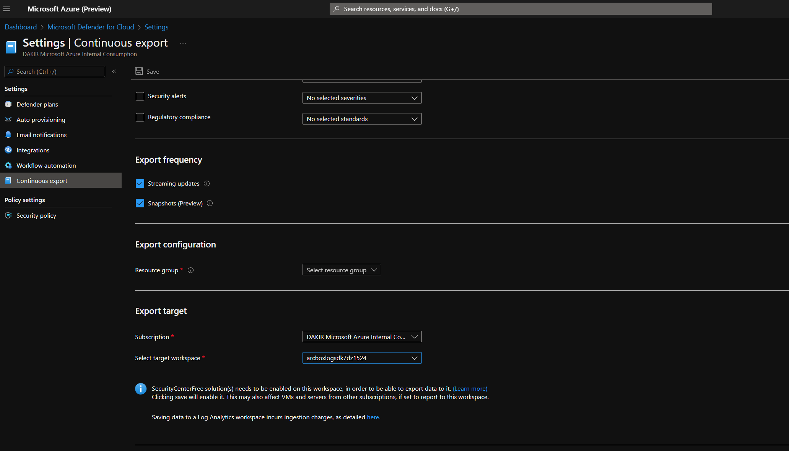
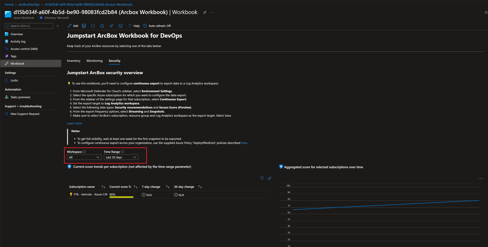
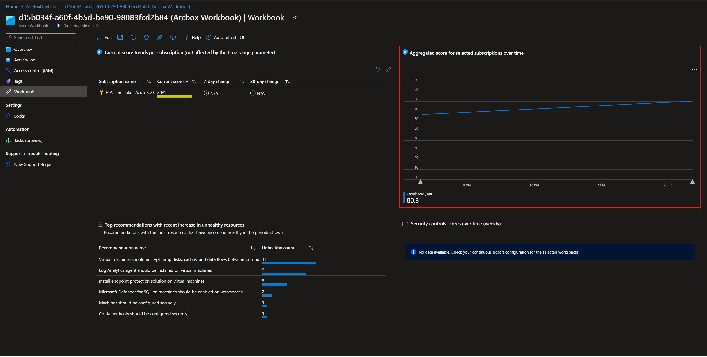

# Jumpstart ArcBox for DevOps - Azure Monitor Workbook

ArcBox for DevOps is a special "flavor" of ArcBox that is intended for users who want to experience Azure Arc-enabled Kubernetes capabilities in a sandbox environment. This document provides specific guidance on the included ArcBox [Azure Monitor Workbook](https://docs.microsoft.com/en-us/azure/azure-monitor/visualize/workbooks-overview). Please refer to the main [ArcBox documentation](https://azurearcjumpstart.io/azure_jumpstart_arcbox/) for information on deploying and using ArcBox.

As part of ArcBox for DevOps, an Azure Monitor workbook is deployed to provide a single pane of glass for monitoring and reporting on ArcBox resources. Using Azure's management and operations tools in hybrid, multi-cloud and edge deployments provides the consistency needed to manage each environment through a common set of governance and operations management practices. The Azure Monitor workbook acts as a flexible canvas for data analysis and visualization in the Azure portal, gathering information from several data sources from across ArcBox and combining them into an integrated interactive experience.

   > **NOTE: Due to the number of Azure resources included in a single ArcBox deployment and the data ingestion and analysis required, it is expected that metrics and telemetry for the workbook can take several hours to be fully available.**

## Access the ArcBox for DevOps workbook

The Jumpstart ArcBox workbook is automatically deployed for you as part of ArcBox's advanced automation. To access the Jumpstart ArcBox workbook use the Azure portal to follow the next steps.

- From the ArcBox resource group, select the Azure Workbook, then click "Open Workbook"

- The Jumpstart ArcBox Workbook will be displayed.

## ArcBox Workbook for DevOps capabilities

The ArcBox Workbook is a single report that combines data from different sources and services, providing a unified view across resources, enabling richer data and insights for unified operations.

The Workbook is organized into several tabs that provide easier navigation and separation of concerns.

### Inventory

By using Azure Arc, your on-premises and multi-cloud resources become visible through Azure Resource Manager. Therefore, you can use tools such as Azure Resource Graph as a way to explore your inventory at scale. Your Azure Resource Graph queries can now include Azure Arc-enabled resources with filtering, using tags, or tracking changes.

The "Inventory" tab in the ArcBox Workbook has three sections:

- _parameters_ - use the drop-down menu to select your subscription and resource group, you also get the option to filter the report by resource type.

   

- _Resource Count by Type_ - this visualization shows the number of resources by type within a resource group, these grouping will be automatically refreshed if the parameters section is changed.

   

- _Resource List_ - this table shows a list of resources in the resource group provided in the parameters section. This is an interactive list, therefore you can click on any resource or tag for additional information.

   

### Monitoring

Enabling a resource in Azure Arc gives you the ability to perform configuration management and monitoring tasks on those services as if they were first-class citizens in Azure. You are able to monitor your Kubernetes clusters at the scope of the resource with container Insights. In ArcBox for DevOps the Azure Arc-enabled Kubernetes clusters have been onboarded onto Azure Monitor.

The "Monitoring" tab of the Jumpstart Workbook shows metrics and alerts for ArcBox resources organized in three sections:

- _Alert Summary_ - Shows an overview of alerts organized by severity and status. You can use the drop-down menus to apply filters to the report. The following filters are available:
  - Subscription: select one or multiple subscriptions in your environment to show available alerts.
  - Resource Group: select one or more resource groups in your environment to show available alerts.
  - Resource Type: select one or multiple resource types to show its alerts.
  - Resources: select individual resources by name to visualize their alerts.
  - Time Range: provide a time range in which the alert has been created.
  - State: choose the alert type between New, Acknowledged, or Closed.

   

- _Azure Arc-enabled Kubernetes_ - Shows information and metrics from ArcBox's Azure Arc-enabled Kubernetes clusters. Use the parameters section to filter data:
  - Time Range: provide a time range for the metrics and logs to be displayed.
  - Subscription: select your subscription where ArcBox is deployed.
  - Log Analytics Workspace: select ArcBox's Log Analytics workspace.
  - Azure Arcenabled K8s cluster: choose one of ArcBox's Azure Arc-enabled Kubernetes clusters.
  - Workload Type: choose one or multiple kubernetes deployment types.
  - Namespace: choose one or multiple namespaces in the Kubernetes cluster.
  - Workload Name: choose one of the deployments in your cluster.
  - Pod Status: filter by Pod status like Pending/Running/Failed etc.
  - Pod Name: filter by pod name in the namespace and workload name selected.

  With this report you will get several visualizations:

  - _Pod and Container restart trend graphs._

     

  - _Pod count and status chart._

     

  - _A list of the container status for pods._

     

  - _The Kubernetes cluster's nodes CPU and memory working set percentage._

     

### Security

Microsoft Defender for Cloud can monitor the security posture of your hybrid and multi-cloud deployments that have been onboarded onto Azure Arc. Once those deployments are registered in Azure, you can take care of the security baseline and audit, apply, or automate requirements from recommended security controls as well as identify and provide mitigation guidance for security-related business risks.

The "Security" tab of the Jumpstart Workbook shows insights from Microsoft Defender for Cloud assessments. To be able to use this report, you will need to configure "continuous export" capability to export Microsoft Defender for Cloud's data to ArcBox's Log Analytics workspace:

- From Microsoft Defender for Cloud's sidebar, select Environment Settings.

   

- Select the specific subscription for which you want to configure the data export.

   

- From the sidebar of the settings page for that subscription, select Continuous Export, set the export target to the Log Analytics workspace, and set the data types to Security recommendations and Secure Score (Preview) and leave the export frequency at the default values.

   

- Make sure to select ArcBox's subscription, resource group, and Log Analytics workspace as the export target. Select Save.

   

Once configured, the report will provide an overview of the secure score, you can filter information by using the parameters section:

- _Workspace_ -  Select one or multiple Log Analytics workspaces.

- _Time Range_ -  Filter the data of the report to one of the predefined time ranges.

   

  With this report you will get several visualizations:

  - _Current score trends per subscription_

     

  - _Aggregated score for selected subscriptions over time_

     

  - _Top recommendations with the recent increase in unhealthy resources_
  
     

  - _Security controls scores over time (weekly)_

     

  - _Resources changed over time_ - To view changes over time on a specific recommendation, please select any from the list above.

     

     
