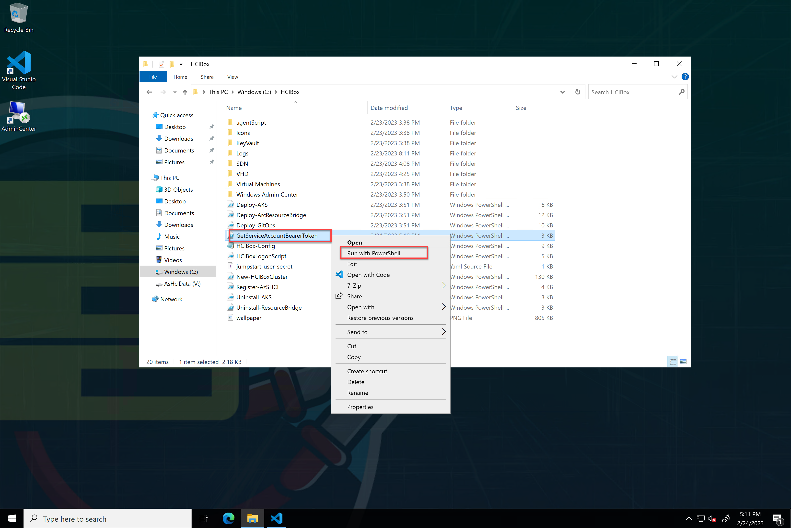
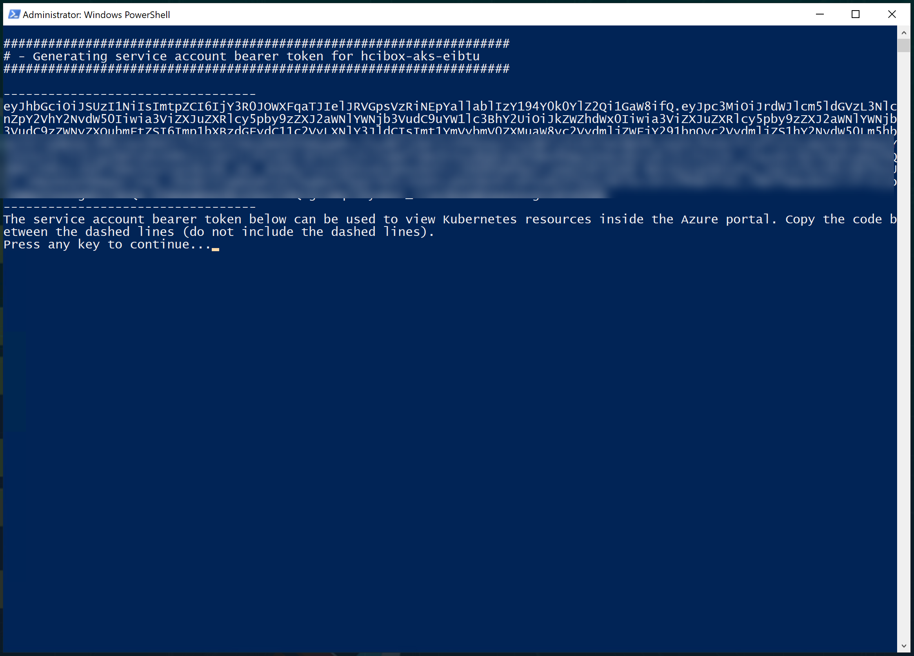
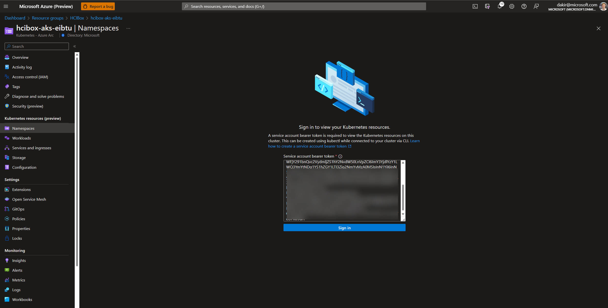
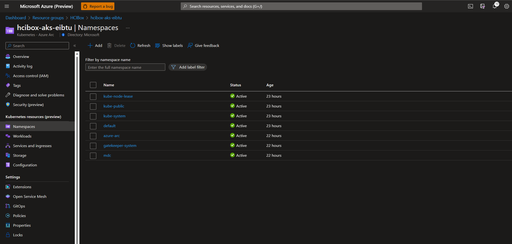
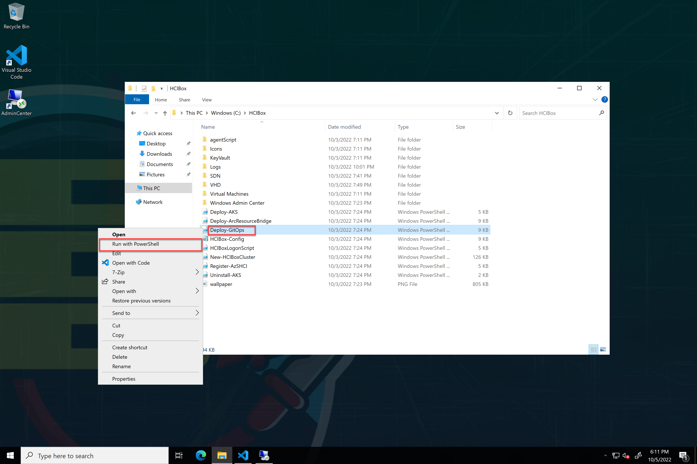

# Jumpstart HCIBox - Azure Kubernetes Service

## Azure Kubernetes Service on Azure Stack HCI

Azure Stack HCI can provide host infrastructure for [Azure Kubernetes Service clusters](https://learn.microsoft.com/azure-stack/aks-hci/). HCIBox comes pre-configured with Azure Kubernetes Service on HCI (AKS-HCI). To see this in action, navigate to the resource group where you deployed HCIBox and follow these steps.

- Open the resource group and group by type to see the Kubernetes clusters deployed with HCIBox. We can see two clusters here. The first cluster with the long _guid_ for a name is the [management cluster](https://learn.microsoft.com/azure-stack/aks-hci/kubernetes-concepts#the-management-cluster). This is a cluster used by AKS-HCI to manage AKS-HCI [workload clusters](https://learn.microsoft.com/azure-stack/aks-hci/kubernetes-concepts#the-workload-cluster). The second cluster with the name prefix _hcibox-aks_ is a workload cluster.

  

- Click on the workload cluster resource to drill into it. We can see this cluster was onboarded as an [Arc-enabled Kubernetes cluster](https://learn.microsoft.com/azure/azure-arc/kubernetes/overview).

  

- We can also view Kubernetes resources on the cluster from Azure portal. To do this you will need a service account bearer token. You can create one by opening the C:\HCIBox folder and running the GetServiceAccountBearerToken.ps1 script by right clicking on it and selecting "Run with PowerShell".

  

- After the script completes it will pause to allow you to copy the token. Highlight the token and right click to copy it.

  

- Navigate to the workload cluster in Azure portal and select Namespaces under Kubernetes resources (preview). After signing in with the token your Kubernetes resources will be available to view from Azure portal.

  

  

- We can deploy configurations for this workload cluster automatically from source using [GitOps](https://learn.microsoft.com/azure/azure-arc/kubernetes/tutorial-use-gitops-connected-cluster). HCIBox includes a script that will automatically configure a simple "Hello Arc" application and ingress controller on the AKS cluster.

- Open up Windows Explorer on the _HCIBox-Client_ and navigate to the _C:\HCIBox_ folder. From here, right click on the "_Deploy-GitOps.ps1_" file and run with PowerShell.

  

  

- Once this script completes you will have a "Hello-Arc" icon on desktop of AdminCenter computer. Open this link to see the Hello Arc application deployed on your cluster.

  

  

## Next steps

Azure Kubernetes Service on Azure Stack HCI provides many more capabilities not directly covered here. Review the documentation to continue your journey with [AKS on HCI](https://learn.microsoft.com/azure-stack/aks-hci/).
