# Jumpstart HCIBox - Virtual machine provisioning with Azure Arc

Azure Stack HCI supports [VM provisioning the Azure portal](https://learn.microsoft.com/azure-stack/hci/manage/azure-arc-enabled-virtual-machines). HCIBox is pre-configured with [Arc resource bridge](https://learn.microsoft.com/azure-stack/hci/manage/azure-arc-enabled-virtual-machines#what-is-azure-arc-resource-bridge) to support this capability.

  > **NOTE: Resource bridge only supports deploying a guest VM with DHCP IP assignment. HCIBox runs a simple DHCP server that provides IP addresses to VMs created with resource bridge. The DHCP range is 192.168.200.210 - 192.168.200.249. Static assignment of IP from the Azure portal is not supported at this time.**

## Deploy a new Linux virtual machine

HCIBox includes a pre-configured Linux virtual machine image that you can use to deploy new guest virtual machines on the HCI cluster. Follow these steps to deploy one in your HCIBox.

- Navigate to the Azure Stack HCI cluster resource in your HCIBox resource group.

  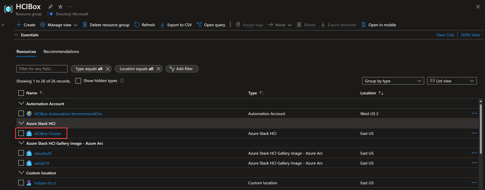

- Click on "Virtual Machines" in the navigation menu, then click "Create VM"

  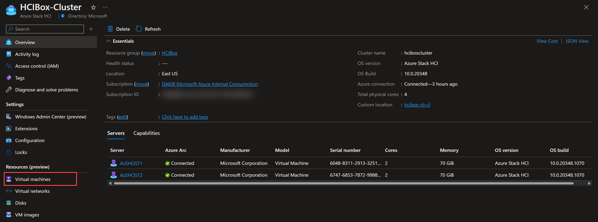

  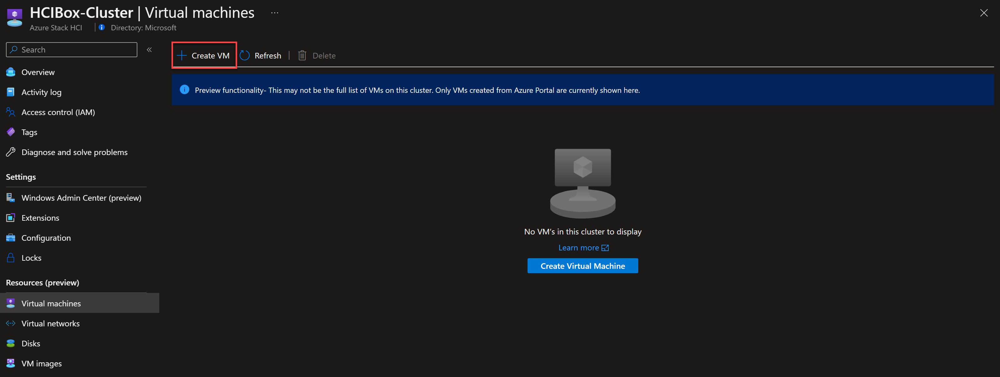

- Provide a name for the VM, select the _ubuntu20_ image, and set the virtual processor count to 1 and the memory count to 2.

  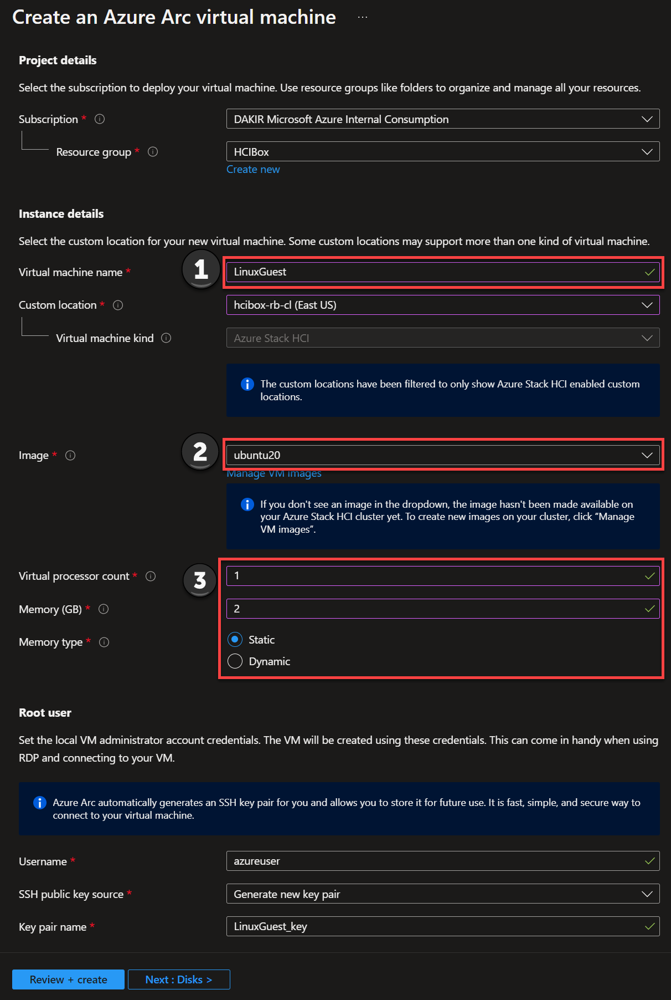

- Click the Networking tab of the create wizard, then click Add network interface.

  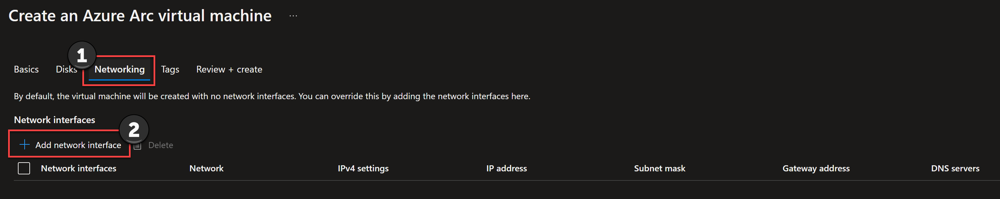

- Give the new network interface a name and select _sdnswitch_ in the Network dropdown, then click Add.

  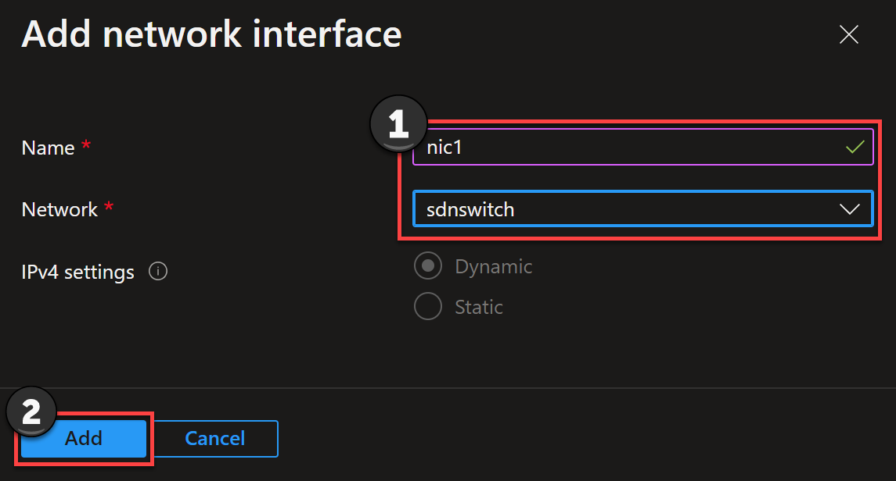

  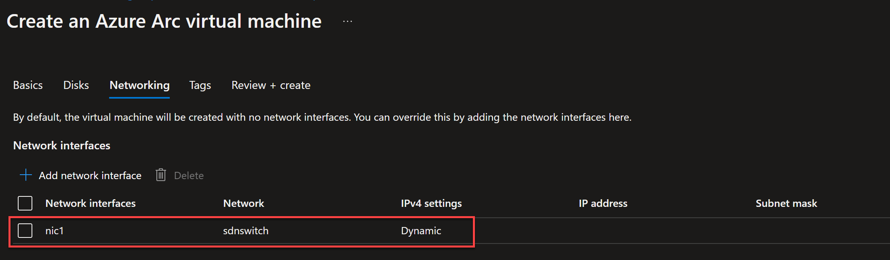

- Click the Review + Create tab and then click Create.

  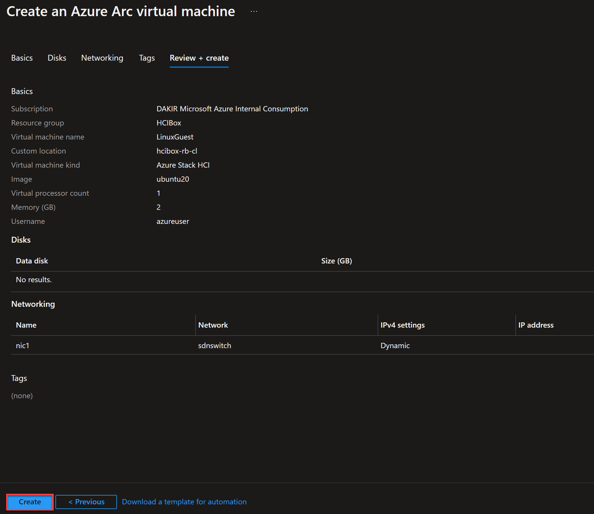

- Download the private key and save it to your local computer.

  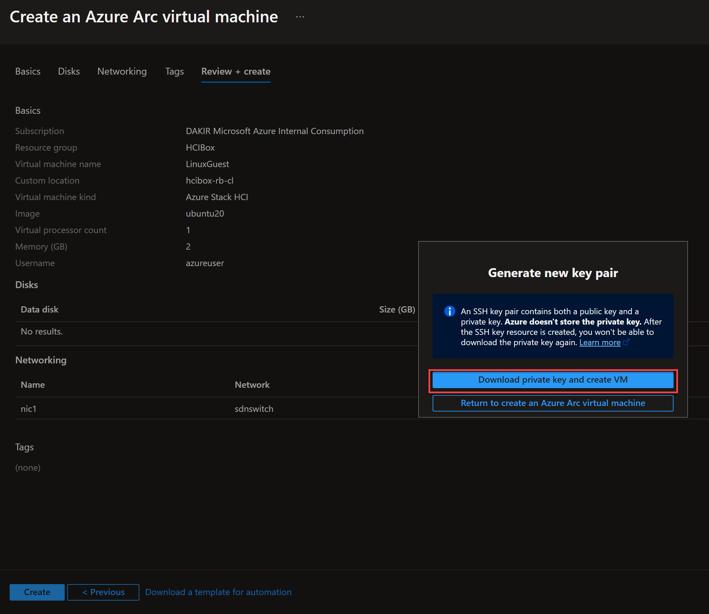

- Wait for the deployment to complete.

  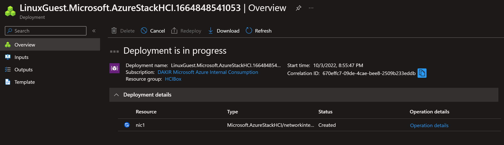

  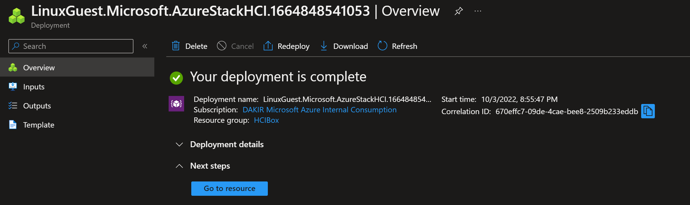

- Navigate back to the HCI cluster Virtual machines tab to view your created VM.

  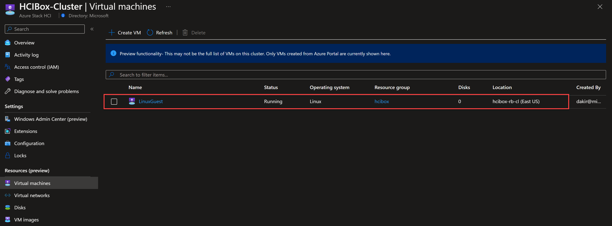

- Click on the VM to drill into the Azure Arc-enabled HCI machine detail.

  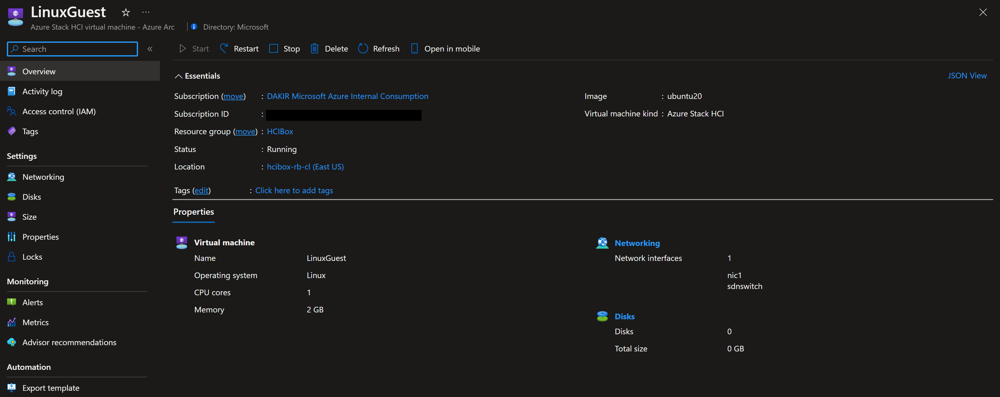

### Next steps

Review the [Arc resource bridge](https://learn.microsoft.com/azure-stack/hci/manage/azure-arc-enabled-virtual-machines#what-is-azure-arc-resource-bridge) documentation for additional information.
