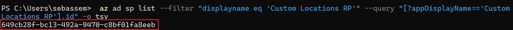
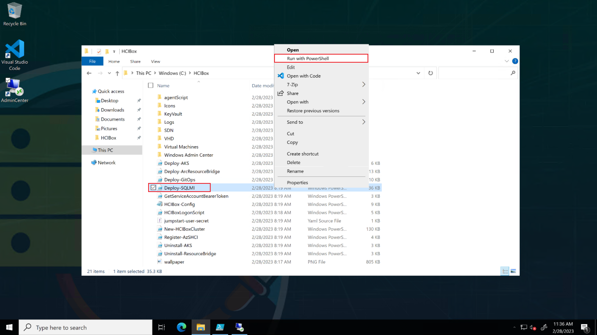
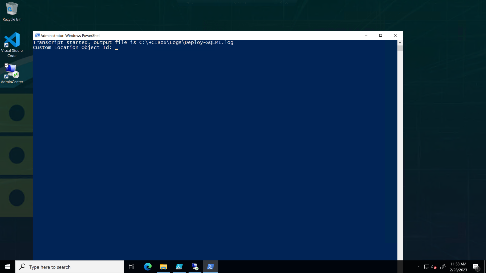
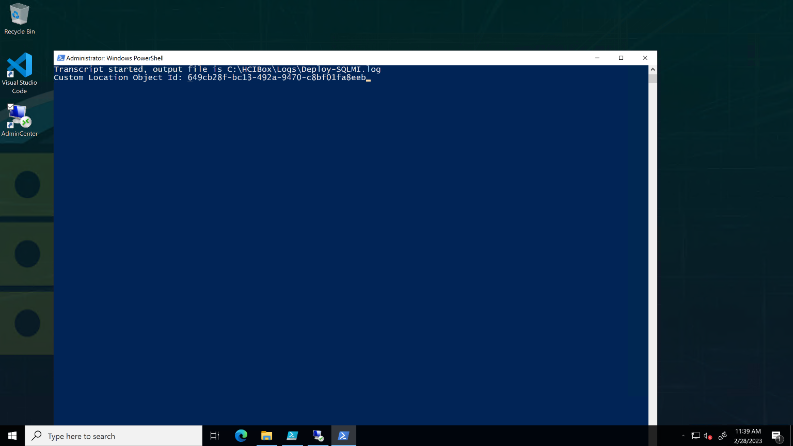
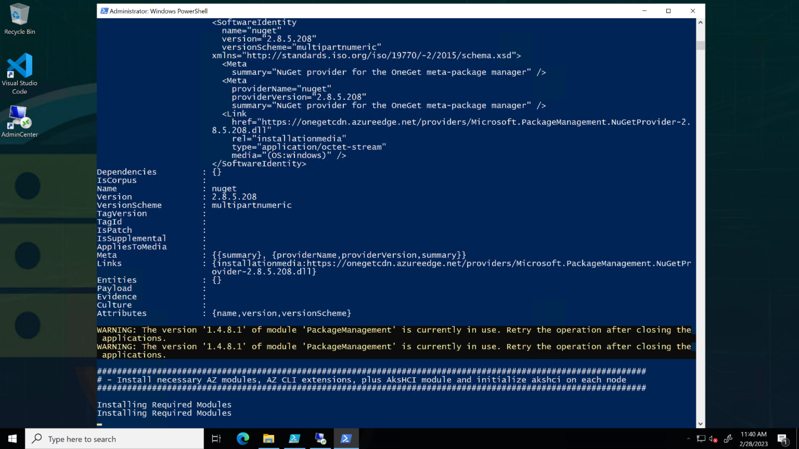

# Jumpstart HCIBox - Azure Arc-enabled SQL Managed Instance

## Azure Arc-enabled SQL Managed Instance on Azure Stack HCI

Azure Stack HCI can provide host infrastructure for [Azure Kubernetes Service clusters](https://learn.microsoft.com/azure-stack/aks-hci/) which can be used to deploy Azure Arc-enabled SQL Managed Instance. HCIBox comes pre-configured with Azure Kubernetes Service on HCI (AKS-HCI) and an Azure Arc-enabled SQL Managed Instance. To see this in action, navigate to the resource group where you deployed HCIBox and follow these steps.

- You will first need to get the Azure Custom Location Resource Provider (RP) Object ID (OID). This is required to enable [Custom Location](https://learn.microsoft.com/azure/azure-arc/platform/conceptual-custom-locations) on your Arc-enabled Kubernetes cluster.

- Sign in to Azure CLI using your user account. Fetch the objectId of the Azure AD application used by Azure Arc service.

  ```bash
  az ad sp list --filter "displayname eq 'Custom Locations RP'" --query "[?appDisplayName=='Custom Locations RP'].id" -o tsv
  ```

  

- Open up Windows Explorer on the HCIBox-Client and navigate to the C:\HCIBox folder. From here, right click on the "Deploy-SQLMI.ps1" file and run with PowerShell.

  

- Enter the Azure Custom Location Resource Provider (RP) Object ID (OID) as generated by the previous step.

  

  

  

- Once this script completes, open the resource group and group by type to see the Azure Arc-enabled SQL Managed Instance deployed with HCIBox.

  

## Connect to the Azure Arc-enabled SQL Managed Instance using Azure Data Studio

Azure Data Studio is installed and pre-configured on the AdminCenter computer to allow you to connect and manage your Arc-enabled SQL Managed Instance.

- To start, click on the Azure Data Studio shortcut on the desktop of the AdminCenter computer.

  

- Connect to the pre-configured connection, and click _Enable Trust server certificate_

  

- Once connected, you can now browse to the sample AdventureWorks database.

  

## Azure Arc-enabled SQL Managed Instance stress simulation

HCIBox includes a dedicated SQL stress simulation tool named SqlQueryStress automatically installed for you on the Client VM. SqlQueryStress will allow you to generate load on the Azure Arc-enabled SQL Managed Instance that can be done used to showcase how the SQL database and services are performing as well as the HCI cluster.

- To start with, open the SqlQueryStress desktop shortcut and connect to the Arc-enabled SQL Managed Instance primary endpoint Ip address. This can be found in the _SQLMI Endpoints_ text file desktop shortcut that was created for you. Or you can get the primary endpoint from the Azure portal.

  

  

  

- To connect, use "Integrated Authentication" and select the deployed sample AdventureWorks database (you can use the "Test" button to check the connection).

  

- To generate some load, we will be running a simple stored procedure. Copy the below procedure and change the number of iterations you want it to run as well as the number of threads to generate even more load on the database. In addition, change the delay between queries to 1ms for allowing the stored procedure to run for a while. Click on Go to start generating load.

    ```sql
    exec [dbo].[uspGetEmployeeManagers] @BusinessEntityID = 8
    ```

- As you can see from the example below, the configuration settings are 100,000 iterations, five threads per iteration, and a 1ms delay between queries. These configurations should allow you to have the stress test running for a while.

  

  

- To monitor the performance of the HCI cluster, click on the Insights workbook and explore logs from your cluster.

    

- You can also navigate to the Overview blade of the Windows Admin Center and explore the CPU and Memory utilization.

    

    

## Next steps

Azure Arc-enabled SQL Managed Instance provides many more capabilities not directly covered here. Review the documentation to continue your journey with [Azure Arc-enabled SQL Managed Instance](https://learn.microsoft.com/azure/azure-arc/data/managed-instance-overview).
