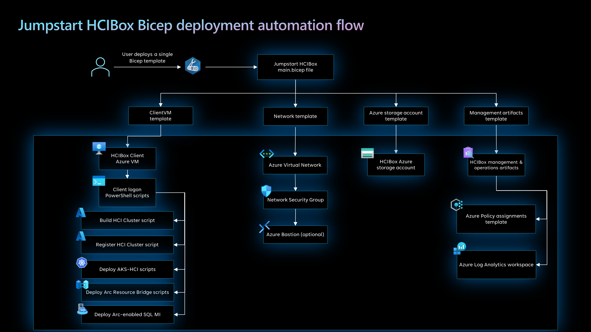
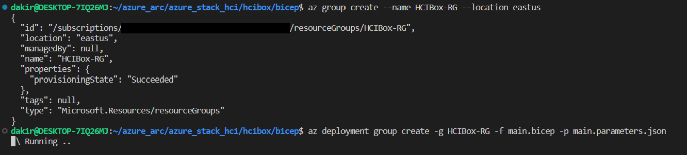
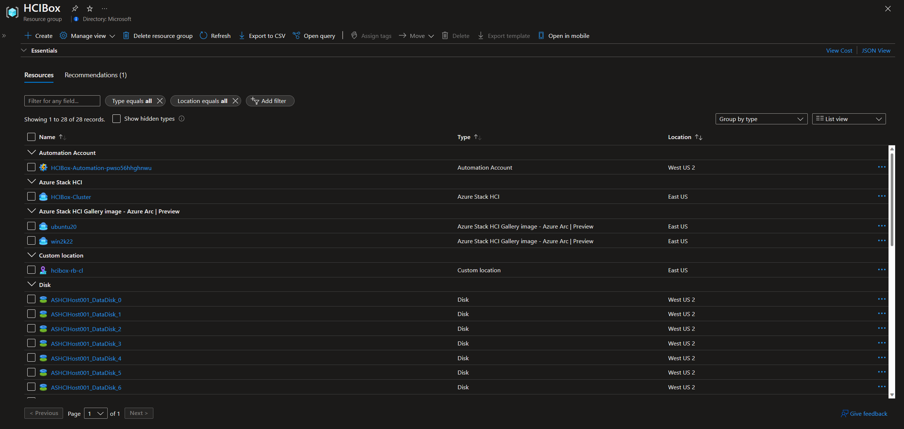
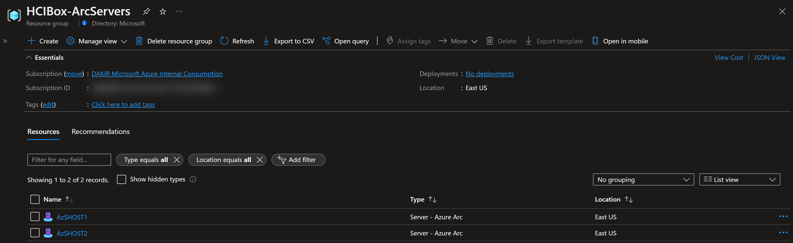
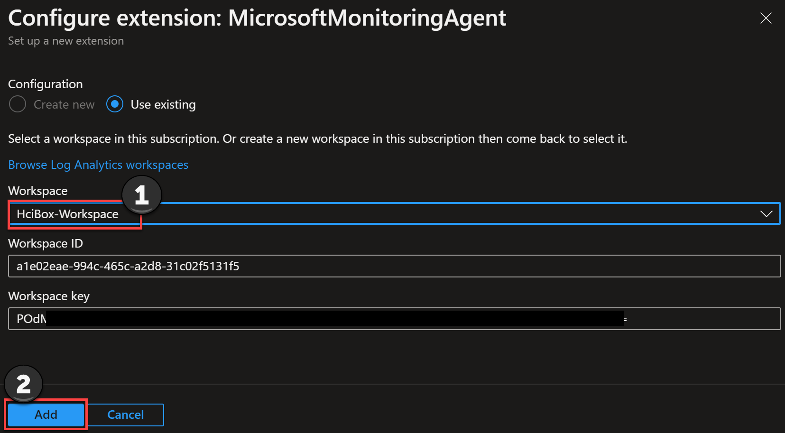

## Jumpstart HCIBox - Overview

HCIBox is a turnkey solution that provides a complete sandbox for exploring [Azure Stack HCI](https://learn.microsoft.com/azure-stack/hci/overview) capabilities and hybrid cloud integration in a virtualized environment. HCIBox is designed to be completely self-contained within a single Azure subscription and resource group, which will make it easy for a user to get hands-on with Azure Stack HCI and [Azure Arc](https://learn.microsoft.com/azure/azure-arc/overview) technology without the need for physical hardware.


### Use cases

- Sandbox environment for getting hands-on with Azure Stack HCI and Azure Arc technologies
- Accelerator for Proof-of-concepts or pilots
- Training tool for skills development
- Demo environment for customer presentations or events
- Rapid integration testing platform
- Infrastructure-as-code and automation template library for building hybrid cloud management solutions

## Azure Stack HCI capabilities available in HCIBox

### 2-node Azure Stack HCI cluster

HCIBox automatically provisions and configures a two-node Azure Stack HCI cluster. HCIBox simulates physical hardware by using nested virtualization with Hyper-V running on an Azure Virtual Machine. This Hyper-V host provisions three guest virtual machines: two Azure Stack HCI nodes (_AzSHost1_, _AzSHost2_), and one nested Hyper-V host (_AzSMGMT_). _AzSMGMT_ itself hosts three guest VMs: a [Windows Admin Center](https://learn.microsoft.com/windows-server/manage/windows-admin-center/overview) gateway server, an [Active Directory domain controller](https://learn.microsoft.com/windows-server/identity/ad-ds/get-started/virtual-dc/active-directory-domain-services-overview), and a [Routing and Remote Access Server](https://learn.microsoft.com/windows-server/remote/remote-access/remote-access) acting as a BGP router.


### Azure Arc Resource Bridge

HCIBox installs and configures [Azure Arc Resource Bridge](https://learn.microsoft.com/azure/azure-arc/resource-bridge/overview). This allows full virtual machine lifecycle management from Azure portal or CLI. As part of this configuration, HCIBox also configures a [custom location](https://learn.microsoft.com/azure-stack/hci/manage/deploy-arc-resource-bridge-using-command-line?tabs=for-static-ip-address#create-a-custom-location-by-installing-azure-arc-resource-bridge) and deploys two [gallery images](https://learn.microsoft.com/azure-stack/hci/manage/deploy-arc-resource-bridge-using-command-line?tabs=for-static-ip-address#create-virtual-network-and-gallery-image) (Windows Server 2019 and Ubuntu). These gallery images can be used to create virtual machines through the Azure portal.


### Azure Kubernetes Service on Azure Stack HCI

HCIBox includes [Azure Kubernetes Services on Azure Stack HCI (AKS-HCI)](https://learn.microsoft.com/azure-stack/aks-hci/). As part of the deployment automation, HCIBox configures AKS-HCI infrastructure including a management cluster. It then creates a [target](https://learn.microsoft.com/azure-stack/aks-hci/kubernetes-concepts), or "workload", cluster (_HCIBox-AKS-$randomguid_). As an optional capability, HCIBox also includes a PowerShell script that can be used to configure a sample application on the target cluster using [GitOps](https://learn.microsoft.com/azure/azure-arc/kubernetes/tutorial-use-gitops-flux2).


### Azure Arc-enabled SQL Managed Instance on Azure Stack HCI

HCIBox includes [Azure Arc-enabled SQL Managed Instance on Azure Stack HCI](https://learn.microsoft.com/azure/azure-arc/data/managed-instance-overview). As part of the deployment automation, HCIBox configures AKS-HCI infrastructure including a management cluster. It then creates a [target](https://learn.microsoft.com/azure-stack/aks-hci/kubernetes-concepts), or "workload", cluster (_HCIBox-AKS-$randomguid_) and deploys an Azure Arc-enabled SQL Managed Instance.


### Hybrid unified operations

HCIBox includes capabilities to support managing, monitoring and governing the cluster. The deployment automation configures [Azure Stack HCI Insights](https://learn.microsoft.com/azure-stack/hci/manage/monitor-hci-multi) along with [Azure Monitor](https://learn.microsoft.com/azure/azure-monitor/overview) and a [Log Analytics workspace](https://learn.microsoft.com/azure/azure-monitor/logs/log-query-overview). Additionally, [Azure Policy](https://learn.microsoft.com/azure/governance/policy/overview) can be configured to support automation configuration and remediation of resources.


## HCIBox Azure Consumption Costs

HCIBox resources generate Azure Consumption charges from the underlying Azure resources including core compute, storage, networking and auxiliary services. Note that Azure consumption costs may vary depending the region where HCIBox is deployed. Be mindful of your HCIBox deployments and ensure that you disable or delete HCIBox resources when not in use to avoid unwanted charges. Please see the [Jumpstart FAQ](https://aka.ms/Jumpstart-FAQ) for more information on consumption costs.

## Deployment Options and Automation Flow

HCIBox provides two methods for deploying and configuring the necessary resources in Azure.

- A [Bicep](https://learn.microsoft.com/azure/azure-resource-manager/bicep/overview?tabs=bicep) template that can be deployed manually via Azure CLI.

- An [Azure Developer CLI](https://learn.microsoft.com/azure/developer/azure-developer-cli/overview) template that can be used to for a more streamlined experience.



HCIBox uses an advanced automation flow to deploy and configure all necessary resources with minimal user interaction. The previous diagram provides an overview of the deployment flow. A high-level summary of the deployment is:

- User deploys the primary Bicep file (_main.bicep_). This file contains several nested objects that will run simultaneously.
  - Host template - deploys the _HCIBox-Client_ VM. This is the Hyper-V host VM that uses nested virtualization to host the complete HCIBox infrastructure. Once the Bicep template finishes deploying, the user remotes into this client using RDP to start the second step of the deployment.
  - Network template - deploys the network artifacts required for the solution
  - Storage account template - used for staging files in automation scripts and as the cloud witness for the HCI cluster
  - Management artifacts template - deploys Azure Log Analytics workspace and solutions and Azure Policy artifacts
- User remotes into _HCIBox-Client_ VM, which automatically kicks off a PowerShell script that:
  - Deploys and configure three (3) nested virtual machines in Hyper-V
    - Two (2) Azure Stack HCI virtual nodes
    - One (1) Windows Server 2019 virtual machine
  - Configures the necessary virtualization and networking infrastructure on the Hyper-V host to support the HCI cluster.
  - Deploys an Active Directory domain controller, a Windows Admin Center server in gateway mode, and a Remote Access Server acting as a BGP router
  - Registers the HCI Cluster with Azure
  - Deploys AKS-HCI and a target AKS cluster
  - Deploys Arc Resource Bridge and gallery VM images
  - Deploys an Azure Arc-enabled SQL Managed Instance on top of the AKS cluster

## Prerequisites

The following prerequisites must be completed in order to deploy HCIBox using the manual Bicep template option. If you elect to use Azure Developer CLI instead, then many of these prerequisites are configured for you as part of the AZD experience and can be skipped.

### Required for both manual and Azure Developer CLI deployment

- Clone the Azure Arc Jumpstart repository

  ```shell
  git clone https://github.com/microsoft/azure_arc.git
  ```

- [Install or update Azure CLI to version 2.49.0 and above](https://docs.microsoft.com/cli/azure/install-azure-cli?view=azure-cli-latest). Use the below command to check your current installed version.

  ```shell
  az --version
  ```

- Login to AZ CLI using the ```az login``` command.

### Required for manual deployment only (skip this section if using Azure Developer CLI)

- Ensure that you have selected the correct subscription you want to deploy HCIBox to by using the ```az account list --query "[?isDefault]"``` command. If you need to adjust the active subscription used by Az CLI, follow [this guidance](https://docs.microsoft.com/cli/azure/manage-azure-subscriptions-azure-cli#change-the-active-subscription).

- HCIBox must be deployed to one of the following regions. **Deploying HCIBox outside of these regions may result in unexpected results or deployment errors.**

  - East US
  - East US 2
  - West US 2
  - North Europe

  > __NOTE: Some HCIBox resources will be created in regions other than the one you initially specify. This is due to limited regional availability of the various services included in HCIBox.__

- __HCIBox requires 32 ESv5-series vCPUs__ when deploying with default parameters such as VM series/size. Ensure you have sufficient vCPU quota available in your Azure subscription and the region where you plan to deploy HCIBox. You can use the below Az CLI command to check your vCPU utilization.

  > __NOTE: If using Azure Developer CLI the preprovision step will check your subscription for available capacity.__

  ```shell
  az vm list-usage --location <your location> --output table
  ```

  

- Register necessary Azure resource providers by running the following commands.

  ```shell
  az provider register --namespace Microsoft.HybridCompute --wait
  az provider register --namespace Microsoft.GuestConfiguration --wait
  az provider register --namespace Microsoft.Kubernetes --wait
  az provider register --namespace Microsoft.KubernetesConfiguration --wait
  az provider register --namespace Microsoft.ExtendedLocation --wait
  az provider register --namespace Microsoft.AzureArcData --wait
  az provider register --namespace Microsoft.OperationsManagement --wait
  az provider register --namespace Microsoft.AzureStackHCI --wait
  az provider register --namespace Microsoft.ResourceConnector --wait
  az provider register --namespace Microsoft.OperationalInsights --wait
  ```

- Create Azure service principal (SP). To deploy HCIBox, an Azure service principal assigned with the _Owner_ Role-based access control (RBAC) role is required. You can use Azure Cloud Shell (or other Bash shell), or PowerShell to create the service principal.

  - (Option 1) Create service principal using [Azure Cloud Shell](https://shell.azure.com/) or Bash shell with Azure CLI:

    ```shell
    az login
    subscriptionId=$(az account show --query id --output tsv)
    az ad sp create-for-rbac -n "<Unique SP Name>" --role "Owner" --scopes /subscriptions/$subscriptionId
    ```

    For example:

    ```shell
    az login
    subscriptionId=$(az account show --query id --output tsv)
    az ad sp create-for-rbac -n "JumpstartHCIBox" --role "Owner" --scopes /subscriptions/$subscriptionId
    ```

    Output should look similar to this:

    ```json
    {
    "appId": "XXXXXXXXXXXXXXXXXXXXXXXXXXXX",
    "displayName": "JumpstartHCIBox",
    "password": "XXXXXXXXXXXXXXXXXXXXXXXXXXXX",
    "tenant": "XXXXXXXXXXXXXXXXXXXXXXXXXXXX"
    }
    ```
  
  - (Option 2) Create service principal using PowerShell. If necessary, follow [this documentation](https://learn.microsoft.com/powershell/azure/install-az-ps?view=azps-8.3.0) to install Azure PowerShell modules.

    ```PowerShell
    $account = Connect-AzAccount
    $spn = New-AzADServicePrincipal -DisplayName "<Unique SPN name>" -Role "Owner" -Scope "/subscriptions/$($account.Context.Subscription.Id)"
    echo "SPN App id: $($spn.AppId)"
    echo "SPN secret: $($spn.PasswordCredentials.SecretText)"
    ```

    For example:

    ```PowerShell
    $account = Connect-AzAccount
    $spn = New-AzADServicePrincipal -DisplayName "HCIBoxSPN" -Role "Owner" -Scope "/subscriptions/$($account.Context.Subscription.Id)"
    echo "SPN App id: $($spn.AppId)"
    echo "SPN secret: $($spn.PasswordCredentials.SecretText)"
    ```

    Output should look similar to this:

    

    > __NOTE: If you create multiple subsequent role assignments on the same service principal, your client secret (password) will be destroyed and recreated each time. Therefore, make sure you grab the correct password.__

    > __NOTE: The Jumpstart scenarios are designed with as much ease of use in-mind and adhering to security-related best practices whenever possible. It is optional but highly recommended to scope the service principal to a specific [Azure subscription and resource group](https://docs.microsoft.com/cli/azure/ad/sp?view=azure-cli-latest) as well considering using a [less privileged service principal account](https://docs.microsoft.com/azure/role-based-access-control/best-practices)__

## Azure Developer CLI deployment

- Follow to install guide for the [Azure Developer CLI](https://learn.microsoft.com/azure/developer/azure-developer-cli/install-azd?tabs=winget-windows%2Cbrew-mac%2Cscript-linux&pivots=os-linux) for your environment.

  > __NOTE: PowerShell is required for using azd with HCIBox. If you are running in a Linux environment be sure that you have [PowerShell for Linux](https://learn.microsoft.com/powershell/scripting/install/installing-powershell-on-linux?view=powershell-7.3) installed.__

- Login with azd using ```azd auth login``` which will open a browser for interactive login.

  

- Run the ```azd init``` command from your cloned repo _*azure_jumpstart_hcibox*_ folder.
  
  

- Run the ```azd up``` command to deploy the environment. Azd will prompt you to enter the target subscription, region and all required parameters.

  

- Once complete, continue on in the section [Start post-deployment automation](https://azurearcjumpstart.io/azure_jumpstart_hcibox/#start-post-deployment-automation)

## Bicep deployment via Azure CLI

- Upgrade to latest Bicep version

  ```shell
  az bicep upgrade
  ```

- Edit the [main.parameters.json](https://github.com/microsoft/azure_arc/blob/main/azure_jumpstart_hcibox/bicep/main.parameters.json) template parameters file and supply some values for your environment.
  - _`spnClientId`_ - Your Azure service principal id
  - _`spnClientSecret`_ - Your Azure service principal secret
  - _`spnTenantId`_ - Your Azure tenant id
  - _`windowsAdminUsername`_ - Client Windows VM Administrator name
  - _`windowsAdminPassword`_ - Client Windows VM Password. Password must have 3 of the following: 1 lower case character, 1 upper case character, 1 number, and 1 special character. The value must be between 12 and 123 characters long.
  - _`logAnalyticsWorkspaceName`_ - Unique name for the HCIBox Log Analytics workspace
  - _`deployBastion`_ - Option to deploy Azure Bastion which used to connect to the _HCIBox-Client_ VM instead of normal RDP.
  - _`registerCluster`_ - Option to automatically register the cluster; set to true by default
  - _`deployAKSHCI`_ - Option to automatically deploy and configure AKS on HCI; set to true by default
  - _`deployResourceBridge`_ - Option to automatically deploy and configure Arc Resource Bridge; set to true by default

  

- Now you will deploy the Bicep file. Navigate to the local cloned [deployment folder](https://github.com/microsoft/azure_arc/tree/main/azure_jumpstart_hcibox/bicep) and run the below command:

  ```shell
  az group create --name "<resource-group-name>"  --location "<preferred-location>"
  az deployment group create -g "<resource-group-name>" -f "main.bicep" -p "main.parameters.json"
  ```

  

## Start post-deployment automation

Once your deployment is complete, you can open the Azure portal and see the initial HCIBox resources inside your resource group. You will be using both Azure portal the _HCIBox-Client_ Azure virtual machine to interact with the HCIBox resources.

  

   > __NOTE: For enhanced HCIBox security posture, RDP (3389) and SSH (22) ports are not open by default in HCIBox deployments. You will need to create a network security group (NSG) rule to allow network access to port 3389, or use [Azure Bastion](https://docs.microsoft.com/azure/bastion/bastion-overview) or [Just-in-Time (JIT)](https://docs.microsoft.com/azure/defender-for-cloud/just-in-time-access-usage?tabs=jit-config-asc%2Cjit-request-asc) access to connect to the VM.__

### Connecting to the HCIBox Client virtual machine

Various options are available to connect to _HCIBox-Client_ VM, depending on the parameters you supplied during deployment.

- [RDP](https://azurearcjumpstart.io/azure_jumpstart_hcibox/#connecting-directly-with-rdp) - available after configuring access to port 3389 on the _HCIBox-NSG_, or by enabling [Just-in-Time access (JIT)](https://azurearcjumpstart.io/azure_jumpstart_hcibox/#connect-using-just-in-time-accessjit).
- [Azure Bastion](https://azurearcjumpstart.io/azure_jumpstart_hcibox/#connect-using-azure-bastion) - available if ```true``` was the value of your _`deployBastion`_ parameter during deployment.

#### Connecting directly with RDP

By design, HCIBox does not open port 3389 on the network security group. Therefore, you must create an NSG rule to allow inbound 3389.

  > __NOTE: If you deployed with Azure Developer CLI then this step is automatically done for you as part of the automation.__

- Open the _HCIBox-NSG_ resource in Azure portal and click "Add" to add a new rule.

  

  

- Specify the IP address that you will be connecting from and select RDP as the service with "Allow" set as the action. You can retrieve your public IP address by accessing [https://icanhazip.com](https://icanhazip.com) or [https://whatismyip.com](https://whatismyip.com).

  

  

  

#### Connect using Azure Bastion

- If you have chosen to deploy Azure Bastion in your deployment, use it to connect to the VM.

  

  > __NOTE: When using Azure Bastion, the desktop background image is not visible. Therefore some screenshots in this guide may not exactly match your experience if you are connecting to _HCIBox-Client_ with Azure Bastion.__

#### Connect using just-in-time access (JIT)

If you already have [Microsoft Defender for Cloud](https://docs.microsoft.com/azure/defender-for-cloud/just-in-time-access-usage?tabs=jit-config-asc%2Cjit-request-asc) enabled on your subscription and would like to use JIT to access the Client VM, use the following steps:

- In the Client VM configuration pane, enable just-in-time. This will enable the default settings.

  

  

  

#### The Logon scripts

- Once you log into the _HCIBox-Client_ VM, a PowerShell script will open and start running. __This script will take between 3-4 hours to finish__, and once completed, the script window will close automatically. At this point, the deployment is complete and you can start exploring all that HCIBox has to offer.

  

  > __NOTE: The automation will take 3-4 hours to fully complete. Do not close the PowerShell window during this time. When automation is completed successfully, the desktop background will be changed to the HCIBox wallpaper.__

- Deployment is complete! Let's begin exploring the features of HCIBox!

  

  

  > __NOTE: The _Register-AzStackHCI_ PowerShell command registers the cluster to the East US region. This region is hardcoded into the script. If you have regional limitations in your Azure subscription that prevent resource creation in East US the registration will fail.__

  

## Using HCIBox

HCIBox has many features that can be explored through the Azure portal or from inside the _HCIBox-Client_ virtual machine. To help you navigate all the features included, read through the following sections to understand the general architecture and how to use various features.

### Nested virtualization

HCIBox simulates a 2-node physical deployment of Azure Stack HCI by using [nested virtualization on Hyper-V](https://learn.microsoft.com/virtualization/hyper-v-on-windows/user-guide/nested-virtualization). To ensure you have the best experience with HCIBox, take a moment to review the details below to help you understand the various nested VMs that make up the solution.

  

| Computer Name    | Role                                | Domain Joined | Parent Host     | OS                  |
| ---------------- | ----------------------------------- | ------------- | --------------- | ------------------- |
| _HCIBox-Client_  | Primary host                        | No            | Azure           | Windows Server 2022 |
| _AzSHOST1_       | HCI node                            | Yes           | _HCIBox-Client_ | Azure Stack HCI     |
| _AzSHOST2_       | HCI node                            | Yes           | _HCIBox-Client_ | Azure Stack HCI     |
| _AzSMGMT_        | Nested hypervisor                   | No            | _HCIBox-Client_ | Windows Server 2022 |
| _JumpstartDC_    | Domain controller                   | Yes (DC)      | _AzSMGMT_       | Windows Server 2022 |
| _AdminCenter_    | Windows Admin Center gateway server | Yes           | _AzSMGMT_       | Windows Server 2022 |
| _Bgp-Tor-Router_ | Remote Access Server                | No            | _AzSMGMT_       | Windows Server 2022 |

### Active Directory domain user credentials

Once you are logged into the _HCIBox-Client_ VM using the local admin credentials you supplied in your template parameters during deployment you will need to switch to using a domain account to access most other functions, such as logging into the HCI nodes or accessing Windows Admin Center. This domain account is automatically configured for you using the same username and password you supplied at deployment. The default domain name is _jumpstart.local_, so if the username supplied at deployment is "_arcdemo_", your domain account in UPN format would be __arcdemo@jumpstart.local__.

  > __NOTE: The password for this account is set as the same password you supplied during deployment for the local account. Many HCIBox operations will use the domain account wherever credentials are required.__

### Monitoring Azure Stack HCI

Azure Stack HCI integrates with [Azure Monitor](https://learn.microsoft.com/azure-stack/hci/manage/monitor-hci-single) to support monitoring HCI clusters through the Azure portal. Follow these steps to configure monitoring on your HCIBox cluster.

- From the Overview blade of the _HCIBox-Cluster_ resource, select the "Capabilities" tab, then click on "Not configured" on the "Logs" box.

  

- On the dialog box, select the HCIBox-Workspace log analytics workspace in the dropdown, then click "Add". This will begin the process of installing the Log Analytics extensions on the host nodes and will take a few minutes. When complete, the Logs box will show as "Configured" on the Capabilities tab.

  

- On the "Capabilities" tab, click on "Not configured" on the "Insights" box.

- On the dialog box, click "Turn on". After a few seconds, the Insights box should show as "Configured" on the Capabilities tab.

  

- It will take time for logs data to flow through to Log Analytics. Once data is available, click on the Insights blade of the _HCIBox-Cluster_ resource to view the Insights workbook and explore logs from your cluster.

  

### VM provisioning through Azure portal with Arc Resource Bridge

Azure Stack HCI supports [VM provisioning through the Azure portal](https://learn.microsoft.com/azure-stack/hci/manage/azure-arc-enabled-virtual-machines). Open the [HCIBox VM provisioning documentation](https://azurearcjumpstart.io/azure_jumpstart_hcibox/RB/) to get started.


### Windows Admin Center

HCIBox includes a deployment of a Windows Admin Center (WAC) gateway server. Windows Admin Center can also be used from the Azure portal. Open the [HCIBox Windows Admin Center documentation](https://azurearcjumpstart.io/azure_jumpstart_hcibox/WAC/) to get started.


  > __NOTE: [Registering Windows Admin Center with Azure](https://learn.microsoft.com/azure-stack/hci/manage/register-windows-admin-center) is not supported in HCIBox.__

### Azure Kubernetes Service

HCIBox comes pre-configured with [Azure Kubernetes Service on Azure Stack HCI](https://learn.microsoft.com/azure-stack/aks-hci/). Open the [HCIBox AKS-HCI documentation](https://azurearcjumpstart.io/azure_jumpstart_hcibox/AKS/) to get started with AKS-HCI in HCIBox.


### Azure Arc-enabled SQL Managed Instance

HCIBox supports deploying [Azure Arc-enabled SQL Managed Instance](https://learn.microsoft.com/azure/azure-arc/data/managed-instance-overview) on an AKS HCI cluster. Open the [HCIBox SQLMI documentation](https://azurearcjumpstart.io/azure_jumpstart_hcibox/SQLMI/) to get started with Azure Arc-enabled SQL Managed Instance in HCIBox.


### Advanced Configurations

HCIBox provides a full Azure Stack HCI sandbox experience with minimal configuration required by the user. Some users may be interested in changing HCIBox's default configuration. Many advanced settings can be configured by modifying the values in the [_HCIBox-Config.psd1_](https://raw.githubusercontent.com/microsoft/azure_arc/main/azure_jumpstart_hcibox/artifacts/HCIBox-Config.psd1) PowerShell file. If you wish to make changes to this file, you must fork the Jumpstart repo and make the changes in your fork, then set the optional _githubAccount_ and _githubBranch_ deployment template parameters to point to your fork.

  > __NOTE: Advanced configuration deployments are not supported by the Jumpstart team. Changes made to the _HCIBox-Config.psd1_ file may result in failures at any point in HCIBox deployment. Make changes to this file only if you understand the implications of the change.__


### Next steps
  
HCIBox is a sandbox that can be used for a large variety of use cases, such as an environment for testing and training or a to jumpstart a proof of concept projects. Ultimately, you are free to do whatever you wish with HCIBox. Some suggested next steps for you to try in your HCIBox are:

- Explore Windows Admin Center from either Azure portal or from the WAC gateway server
- Deploy GitOps configurations with Azure Arc-enabled Kubernetes
- Build policy initiatives that apply to your Azure Arc-enabled resources
- Write and test custom policies that apply to your Azure Arc-enabled resources
- Reuse automation for external solutions or proof-of-concepts

## Clean up the deployment

To clean up your deployment, simply delete the resource groups using Azure CLI, Azure Developer CLI, or Azure portal. Be sure to delete the ArcServers resource group first as seen in the example below.

- Clean up Using Azure CLI

  ```shell
  az group delete -n <name of your resource group>-ArcServers
  az group delete -n <name of your resource group>
  ```

  

- Clean up using Azure Developer CLI

  ```shell
  azd down
  ```

  

## Basic Troubleshooting

Occasionally deployments of HCIBox may fail at various stages. Common reasons for failed deployments include:

- Invalid service principal id, service principal secret or service principal Azure tenant ID provided in _main.parameters.json_ file. This can cause failures when running automation that requires logging into Azure, such as the scripts that register the HCI cluster, deploy AKS-HCI, or configure Arc resource bridge.
- Not enough vCPU quota available in your target Azure region - check vCPU quota and ensure you have at least 48 available. See the [prerequisites](#prerequisites) section for more details.
- Target Azure region does not support all required Azure services - ensure you are running HCIBox in one of the supported regions. See the [prerequisites](#prerequisites) section for more details.
- Authentication issues - Most HCIBox operations require the use of the domain credentials configured during deployment. These credentials take the UPN format of _<username>@jumpstart.local_. If you have issues accessing services such as Windows Admin Center make sure you are using the correct credential.
- Script failures due to upstream dependencies - This can happen due to network issues or failures in upstream services that HCIBox depends on (such as package repositories) - in most cases deleting the deployment and redeploying is the simplest resolution.

If you have issues that you cannot resolve when deploying HCIBox please submit an issue on the [Github repo](https://github.com/microsoft/azure_arc/issues)

### Exploring logs from the _HCIBox-Client_ virtual machine

Occasionally, you may need to review log output from scripts that run on the _HCIBox-Client_ virtual machines in case of deployment failures. To make troubleshooting easier, the HCIBox deployment scripts collect all relevant logs in the _C:\HCIBox\Logs_ folder on _HCIBox-Client_. A short description of the logs and their purpose can be seen in the list below:

| Log file                                      | Description                                                                                                                               |
| --------------------------------------------- | ----------------------------------------------------------------------------------------------------------------------------------------- |
| _C:\HCIBox\Logs\Bootstrap.log_                | Output from the initial bootstrapping script that runs on _HCIBox-Client_.                                                                |
| _C:\HCIBox\Logs\New-HCIBoxCluster.log_        | Output of _New-HCIBoxCluster.ps1_ which configures the Hyper-V host and builds the HCI cluster, management VMs, and other configurations. |
| _C:\HCIBox\Logs\Register-AzSHCI.log_          | Output of _Register-AzSHCI.ps1_ which registers the cluster with Azure.                                                                   |
| _C:\HCIBox\Logs\Deploy-AKS.log_               | Output of _Deploy-AKS.ps1_ which deploys and configures AKS on HCI.                                                                       |
| _C:\HCIBox\Logs\Deploy-ArcResourceBridge.log_ | Output of _Deploy-ArcResourceBridge.ps1_ which deploys and configures Arc resource bridge and builds gallery images.                      |
| _C:\HCIBox\Logs\Deploy-SQLMI.log_ | Output of _Deploy-SQLMI.ps1_ which deploys and configures Arc-enabled SQL Managed Instance.                      |

  

If you are still having issues deploying HCIBox, please [submit an issue](https://github.com/microsoft/azure_arc/issues/new/choose) on GitHub and include a detailed description of your issue and the Azure region you are deploying to. Inside the _C:\HCIBox\Logs_ folder you can also find instructions for uploading your logs to an Azure storage account for review by the Jumpstart team.
