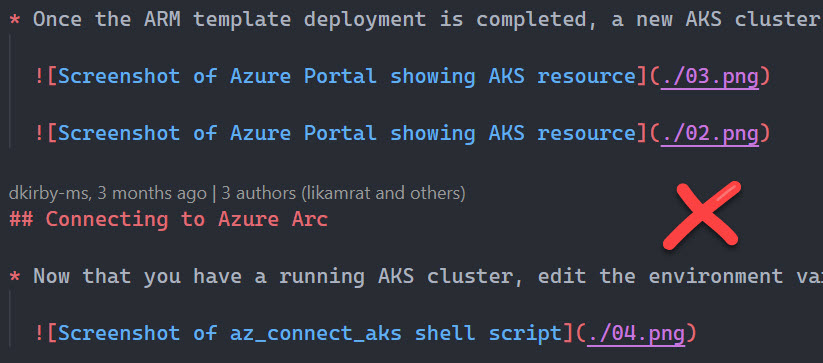
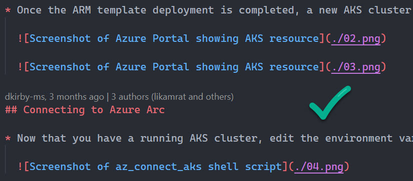
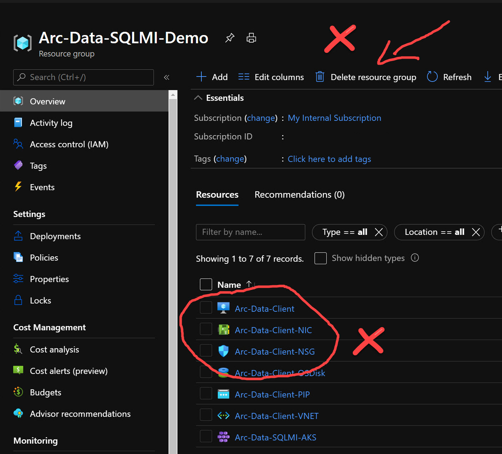
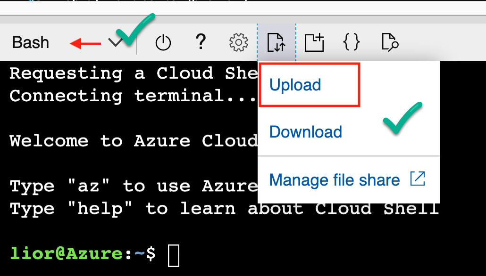
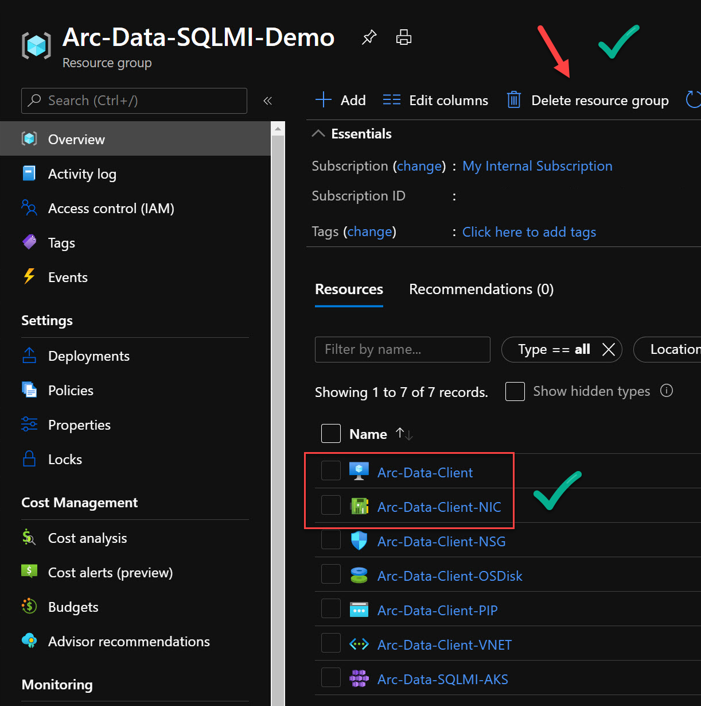
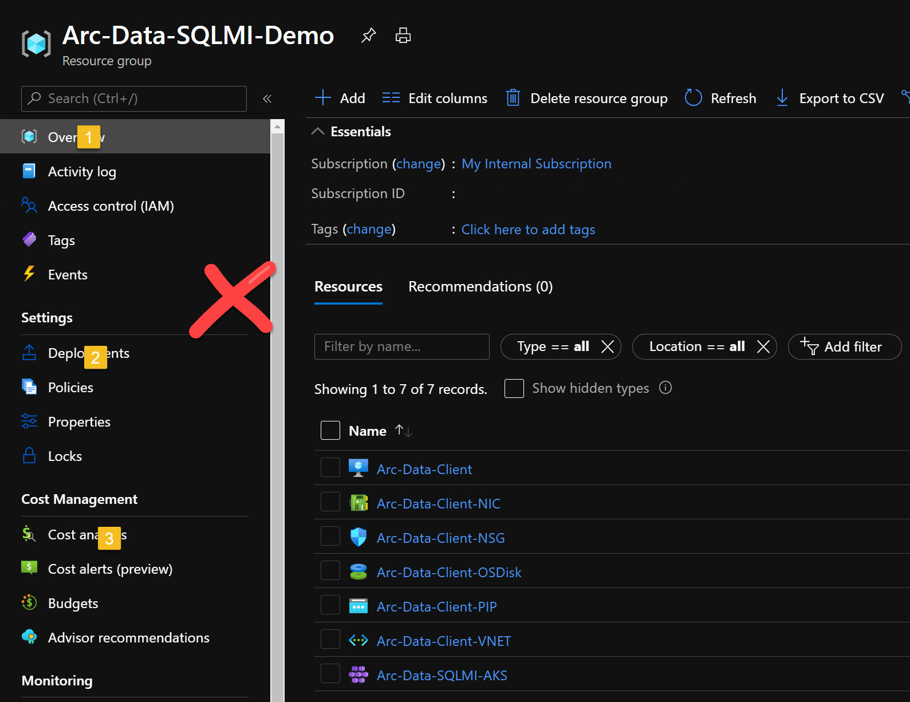
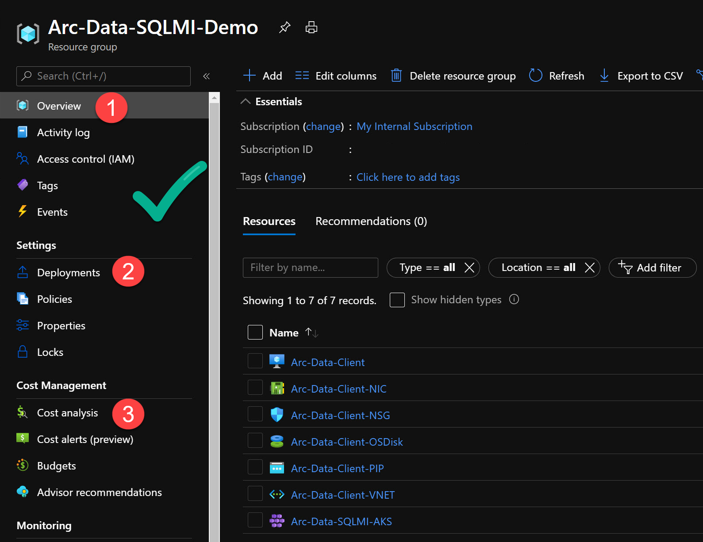

# Something

## Screenshots

Quality, accurate and clean screenshots are critical when it comes to providing a great Jumpstart scenario user experience. In this section, you will find examples and guidelines on screenshots standards.

### Format, location and positioning

* Screenshots should be saved in either a _png_ or _jpg_ format.

* As you are adding screenshots to your scenario, keep them in a serial order right order as this helps PR reviewer.

    

    

* Image files must be located alongside the scenario _index.md_ file.

    

### Boxes, arrows and steps number

* Either highlighting boxes and/or arrows should be created in a non-freeform fashion. Choose color and line width that make sense so it will be embedded nicely in the screenshot.

    

    

    

* When creating step numbers, make sure these are positioned correctly and visible.

    

    

## Markdown linting and style

## Clean code

### Code blocks

## Pull Requests

1 per scenario

## Links

## Notes & Disclaimers

## Positioning & Alignments

## Naming convention & Brand names