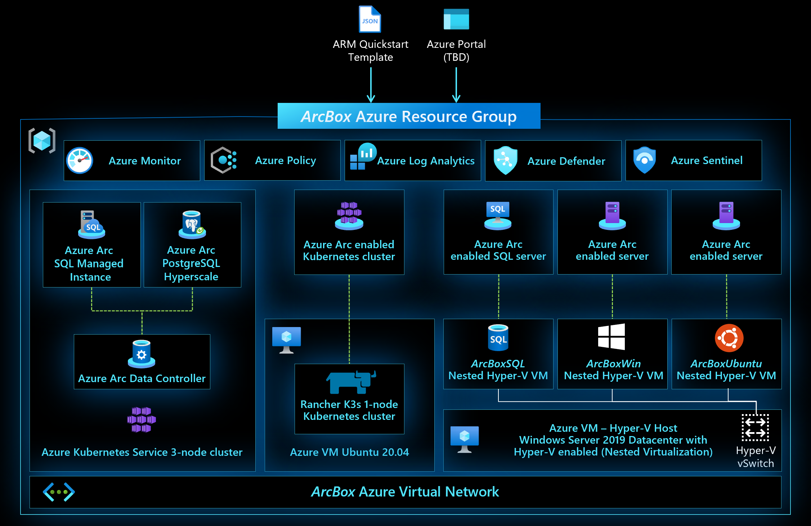
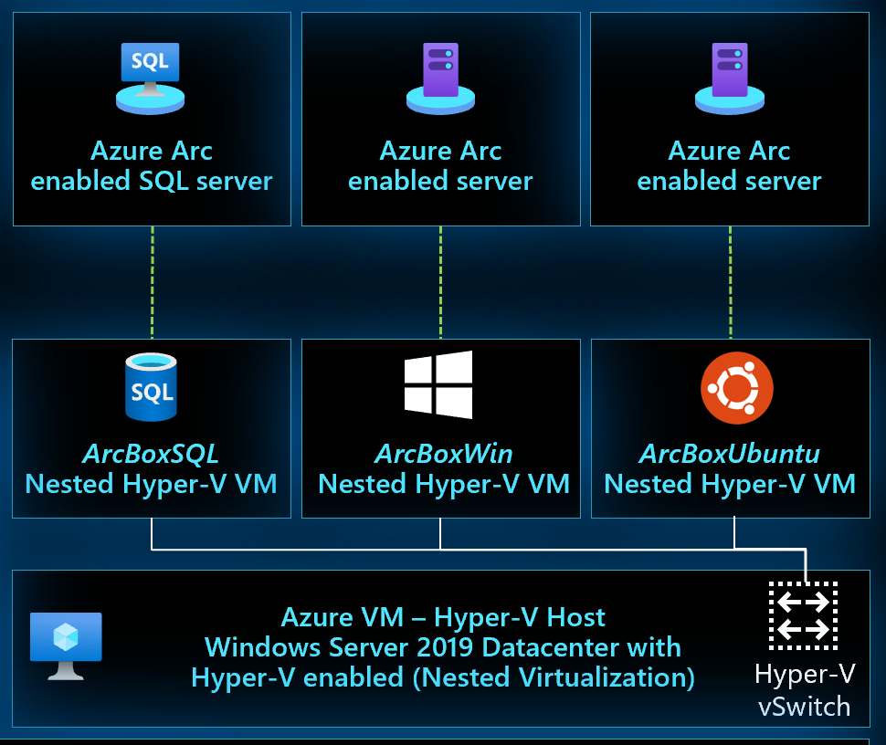
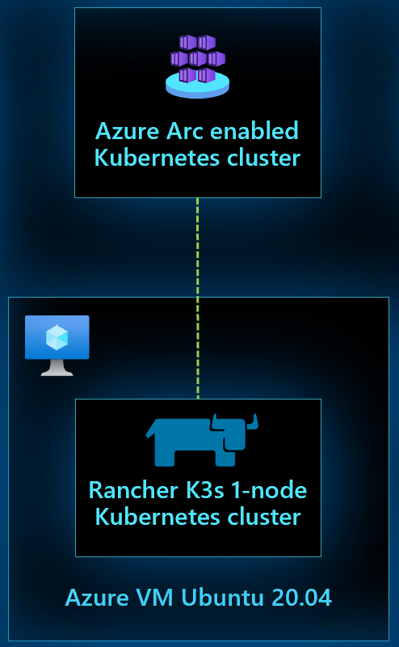
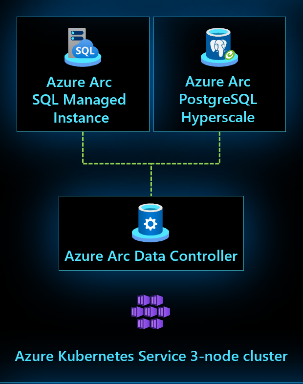
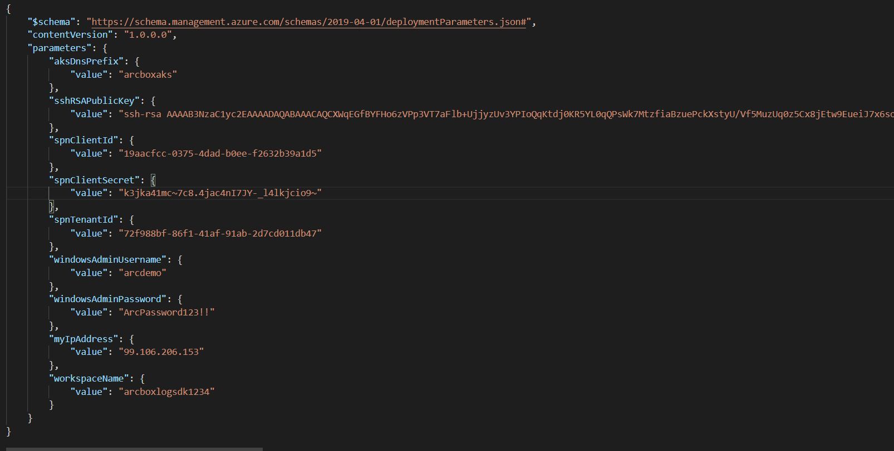
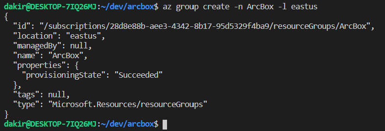
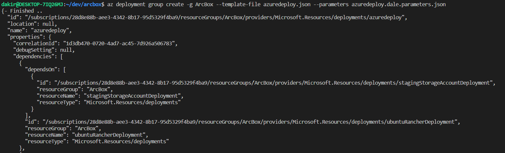
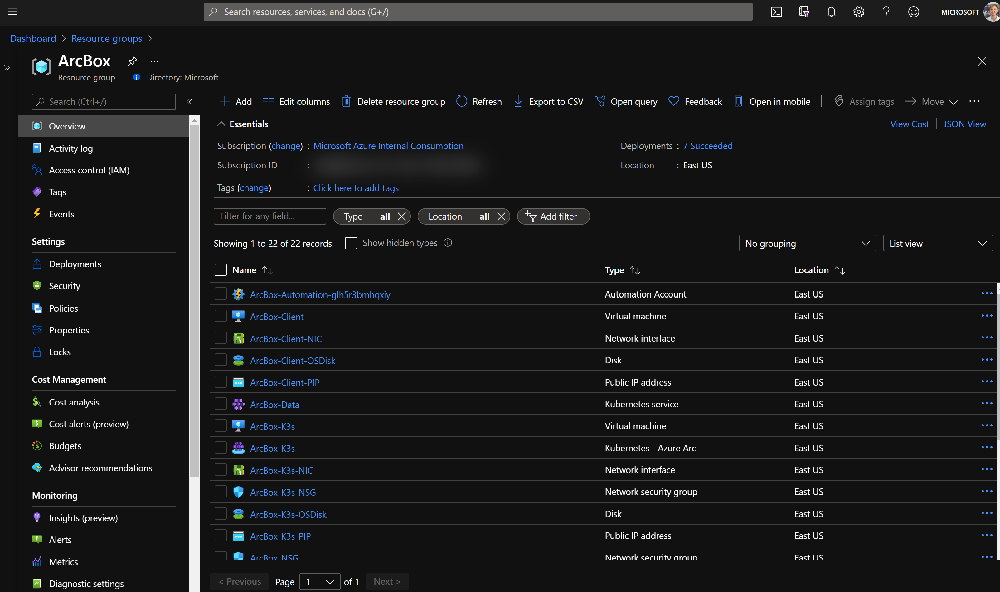
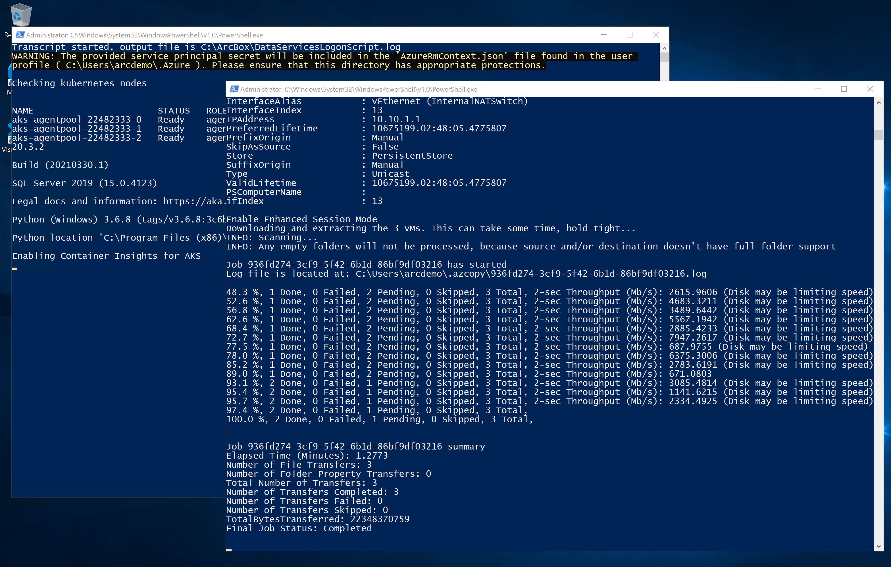
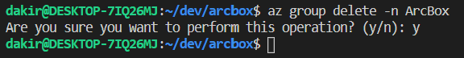

# Jumpstart ArcBox - An Azure Arc Jumpstart project

## Jumpstart ArcBox - Overview



Jumpstart ArcBox is a project that provides an easy to deploy sandbox for all things Azure Arc. ArcBox is designed to be completely self-contained within a single Azure subscription and resource group, which will make it easy for a user to get hands-on with all available Azure Arc technology with nothing more than an available Azure subscription.

Azure Arc capabilities available in ArcBox include:

### Azure Arc enabled Servers



ArcBox includes three Azure Arc enabled server resources. These servers are hosted using nested virtualization in Azure. As part of the deployment, a Hyper-V host (ArcBox-Client) is deployed with three guest virtual machines. These machines, ArcBox-Win, ArcBox-Ubuntu, and ArcBox-SQL are connected as Azure Arc enabled servers via the ArcBox automation.

### Azure Arc enabled Kubernetes



ArcBox deploys one Rancher (K3s) cluster running on an Azure virtual machine. This cluster is then connected to Azure as an Azure Arc enabled Kubernetes resource (ArcBox-K3s).

### Azure Arc enabled Data Services

ArcBox deploys an AKS cluster, which is then used to deploy an Azure Arc enabled data services data controller.



## Prerequisites

* Clone the Azure Arc Jumpstart repository

    ```shell
    git clone https://github.com/microsoft/azure_arc.git
    ```

* [Install or update Azure CLI to version 2.15.0 and above](https://docs.microsoft.com/en-us/cli/azure/install-azure-cli?view=azure-cli-latest). Use the below command to check your current installed version.

  ```shell
  az --version
  ```

* [Generate SSH Key](https://help.github.com/articles/generating-a-new-ssh-key-and-adding-it-to-the-ssh-agent/) (or use existing ssh key)

* Create Azure service principal (SP)

    To connect the GCP virtual machine to Azure Arc, an Azure service principal assigned with the "Contributor" role is required. To create it, login to your Azure account run the below command (this can also be done in [Azure Cloud Shell](https://shell.azure.com/)).

    ```shell
    az login
    az ad sp create-for-rbac -n "<Unique SP Name>" --role contributor
    ```

    For example:

    ```shell
    az ad sp create-for-rbac -n "http://AzureArcGCP" --role contributor
    ```

    Output should look like this:

    ```json
    {
    "appId": "XXXXXXXXXXXXXXXXXXXXXXXXXXXX",
    "displayName": "AzureArcGCP",
    "name": "http://AzureArcGCP",
    "password": "XXXXXXXXXXXXXXXXXXXXXXXXXXXX",
    "tenant": "XXXXXXXXXXXXXXXXXXXXXXXXXXXX"
    }
    ```

    > **Note: It is optional but highly recommended to scope the SP to a specific [Azure subscription and resource group](https://docs.microsoft.com/en-us/cli/azure/ad/sp?view=azure-cli-latest)**

## Automation flow


ArcBox uses an advanced automation flow to deploy and configure all necessary resources with minimal user interaction. The above diagram provides a high level overview of the deployment flow. A high level summary of the deployment is:

* User deploys the primary ARM template (azuredeploy.json). This template contains several nested templates that will run simultaneously.
  * ClientVM ARM template - deploys the Client Windows VM
  * AKS ARM template - deploys AKS cluster which will be used to run Azure Arc enabled data services
  * Rancher K3s template - deploys a Linux VM which will have Rancher (K3s) installed on it and connected as an Azure Arc enabled Kubernetes cluster
  * Storage account template - used for staging files in automation scripts
  * Management artifacts template - deploys Log Analytics workspace and solutions and Azure Policy artifacts
* User remotes into Client Windows VM, which automatically kicks off multiple scripts that:
  * Deploy and configure three (3) nested virtual machines in Hyper-V
    * Windows VM - onboarded as Azure Arc enabled Server
    * Ubuntu VM - onboarded as Azure Arc enabled Server
    * Windows VM running SQL Server - onboarded as Azure Arc enabled SQL Server
  * Deploy and configure Azure Arc enabled data services on the AKS cluster including a data controller, a SQL MI instance, and a Postgres instance. After deployment, Azure Data Studio opens automatically with connection entries for each database instance. Data services deployed by the script are:
    * Data controller
    * SQL MI instance
    * Postgres instance

## Deployment Option 1: Azure Portal

* Click the [](https://portal.azure.com/#create/Microsoft.Template/uri/https%3A%2F%2Fraw.githubusercontent.com%2Fdkirby-ms%2Farcbox%2Fmain%2Fazuredeploy.json) button and enter values for the the ARM template parameters.

## Deployment Option 2: Azure CLI

* First login to AZ CLI using the ```az login``` command.

* Now you will need to edit the [azuredeploy.parameters.json](./azuredeploy.parameters.json) ARM template parameters file and supply some values for your environment.

  * *aksDnsPrefix* - AKS unique DNS prefix
  * *sshRSAPublicKey* - Your SSH public key
  * *spnClientId* - Your Azure service principal id
  * *spnClientSecret* - Your Azure service principal secret
  * *spnTenantId* - Your Azure tenant id
  * *windowsAdminUsername* - Client Windows VM Administrator name
  * *windowsAdminPassword* - Client Windows VM administrator password
  * *myIpAddress* - Your local IP address. This is used to allow remote RDP and SSH connections to the Client Windows VM and K3s Rancher VM.
  * *logAnalyticsWorkspaceName* - Unique name for the ArcBox log analytics workspace

    

* Now you will deploy the ARM template. Navigate to the local cloned [deployment folder](./) and run the below command:

  ```shell
  az group create --name <Name of the Azure resource group> --location <Azure Region>
  az deployment group create \
  --resource-group <Name of the Azure resource group> \
  --template-file azuredeploy.json \
  --parameters azuredeploy.parameters.json 
  ```

  

  

* After deployment, you should see the ArcBox resources inside your resource group.

  

* Open a remote desktop connection into ArcBox-Client. Upon logging in, multiple automated scripts will open and start running. These scripts will take 10-20 minutes to finish. Once completed, Azure Data Studio will start. At this point, the deployment is complete.

  

## Example ArcBox usage scenarios

ArcBox is a sandbox that can be used for a large variety of use cases, such as a sandbox environment for testing and training or kickstarter for proof of concept projects. Some suggested next steps for you to try in your ArcBox are:

* Deploy GitOps configurations on the K8s clusters
* Build policy initiatives that apply to your Azure Arc enabled resources
* Incorporate your own tooling and automation into the existing automation framework
* Build a certificate/secret/key management strategy with your Azure Arc resources

## Clean up the deployment

To clean up your deployment, simply delete the resource group.

```shell
az group delete -n <name of your resource group>
```



## Known issues

* Issue 1
