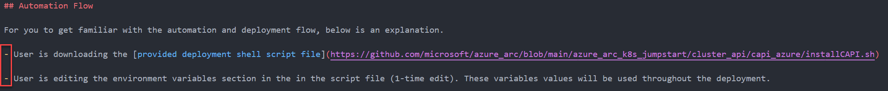
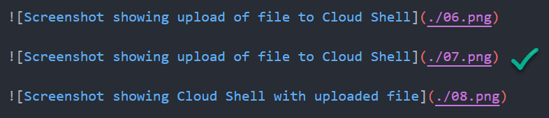
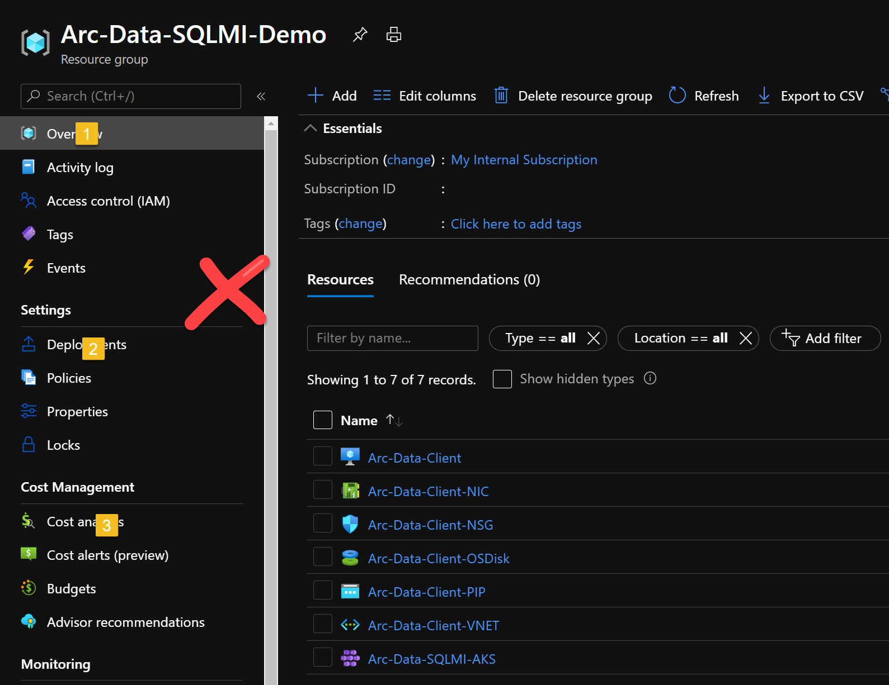
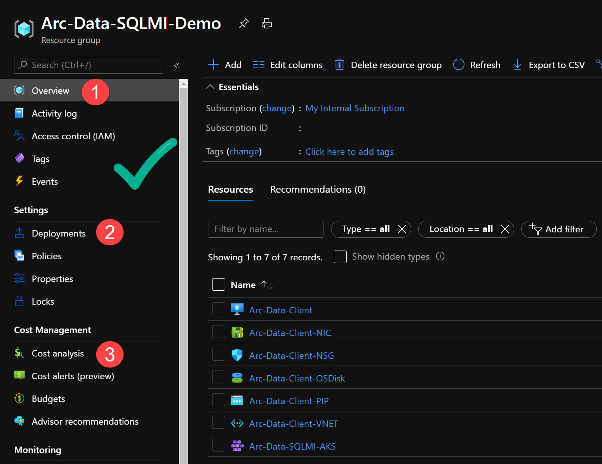
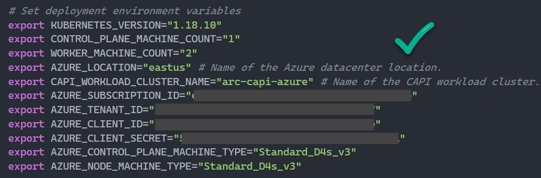

# Jumpstart Scenario Write-up Guidelines

Thank you for considering writing a Jumpstart scenario, we appreciate it, a lot!

The scenarios published as part of the Jumpstart project are high-quality documents and as such we want you to be able to have all the needed guidelines to create one yourself while meeting the project standards and publishing requirements.

In this document, our goal is to provide you with as many details as possible for you to be efficient and successful and as a result, produce an awesome Jumpstart scenario. Our intent here is to give you pointers and tools to achieve just that.

> **IMPORTANT: If you are only getting started with contributing Jumpstart scenarios, it is highly recommended you will review the raw code for existing scenarios. These will help you understand what an approved scenario should look like and will represent all the guidelines provided. For any questions, please reach out or tag one of the Jumpstart project maintainers.**

## Code reviews

The Jumpstart project is a mix of various automation, code styles, and high-quality documentation and requires development effort.

Before a scenario is published, it will go through a code review process by one of the project maintainers. We want your scenario to be successful and widely adopted and to meet the highest standards possible and we are here to help get there!

## Pull requests and issues

Rather you are working on a new scenario or updating an existing one, a contribution must be submitted with a dedicated pull request (PR) to make the review process easier.

- New scenario

    For new scenarios, please also create a new issue using the ["Feature request" template](https://github.com/microsoft/azure_arc/issues/new?assignees=&labels=&template=feature_request.md&title=). If needed, multiple examples can be found under the [Jumpstart project GitHub repository](https://github.com/microsoft/azure_arc/projects/1).

    

- Existing scenario

    If you are updating an existing scenario, please create a new issue using the ["Bug report" template](https://github.com/microsoft/azure_arc/issues/new?assignees=&labels=bug&template=bug_report.md&title=).

    

- On the PR, make sure to associate the issue the PR is designed to solve, so once merged, the issue will be closed automatically.

    

## Folder Structure

The Azure Arc Jumpstart GitHub repository follows a specific folder structure that you should get familiar with before creating or updating a scenario.

- Automation, scripts, templates, JSON & YAML files, etc. must be placed under each Azure Arc technology that corresponds to each scenario.
- The guide for the scenario must be under docs and follow a similar structure.

## Indexing

The Azure Arc Jumpstart website is using [HUGO](https://gohugo.io/) as its web framework alongside [Docsy](https://www.docsy.dev/) as its theme of choice.

- Scenarios must be created in its respected "docs" folder in the project GitHub repository and with the "_index.md_" filename for it to get published.

    

- Both the "_title_" and the "_linkTitle_" must be the same.

    

- The "_Weight_" value number represents the location of the scenario comparing to other scenarios on the same page on the website.

    

    

## Description

All Jumpstart scenarios start with an overview and a description of what will be the result of completing the scenario.

This description should also mention the starting point for the automation, for example for "Unified Operations" (day-2) scenarios you may need an already deployed server or Kubernetes cluster that is onboarded onto Azure Arc, you should also include pointers to scenarios that would allow you to get to that starting point. Below are a couple of examples from existing Jumpstart scenarios:

## Prerequisites

Every Jumpstart scenario must have a "Prerequisites" section as the first section. Below you can find guidelines on what to consider for this section.

- The first rule of thumb is to know what should be considered a prerequisite and what can be automated. Generally speaking, if a prerequisite can be automated, it should be incorporated as part of the overall automation flow of the scenario.
- We would love for you to use good judgment and if the scenario's reviewer will find that a certain prerequisite should be automated he will point that out as part of the pull request code review.
- As mentioned at the beginning of this guidelines readme, to avoid a situation where you will need to refactor code or make unforced changes, it is highly recommended for you to use existing scenarios as a reference and work from there.

## Markdown linting and style

- All the scenarios and README files follow standard markdown and linting rules. We recommend using [Visual Studio Code (VSCode)](https://code.visualstudio.com/) as it provides a rich IDE experience with support for extensions.
- Before submitting a PR for a new/updated scenario, make sure to perform markdown linting to avoid errors and typos. If you are using VSCode, we recommend installing the [_markdownlint_ extension] as it provides an easy way of performing an efficient MD lint.

- Below you can find an example of common markdown lint issues that will be presented to you as you are writing your scenario and must be fixed. [Here](https://marketplace.visualstudio.com/items?itemName=DavidAnson.vscode-markdownlint), you can find detailed explanations of the markdown rules highlighted by the extension and how to fix a violation of these rules.

- For bullets (like the one you are just reading), use hyphens, which will be translated to bullet points on the website.

## Screenshots

Quality, accurate and clean screenshots are critical when it comes to providing a great Jumpstart scenario and reader experience. In this section, you will find examples and guidelines on screenshots standards.

### Format, location and file ordering

- Screenshots must be saved in either a _png_ or _jpg_ file format.
- Images must include an accurate description for ease of accessibility.
- When adding screenshots links, keep them in a serial order.

    

    

- Image files must be located alongside the scenario _index.md_ file.

    

### Boxes, arrows and step numbers

- Either highlighting boxes and/or arrows must be created in a non-freeform fashion. Choose color and line width that make sense so it will be embedded nicely in the screenshot.

    

    

- When creating step numbers, make sure these are positioned correctly and visible to the reader.

    

    

- Be aware of sensitive information on your screenshots and be sure to blur it out: subscription ID, passwords, service principals, etc.
- For Azure portal related screenshots, we recommend using the ["Az Mask" Edge/Chrome browser extension](https://chrome.google.com/webstore/detail/az-mask/amobeamdmdnloajcaiomgegpakjdiacm).

    

## Code blocks and commands

Jumpstart scenarios include code blocks and commands and as such, for it to meet markdown rules and scenario standards, each code block and command must use the correct markdown language highlighter.

As you can see in the below examples, each block is represented differently, depending on the scenario.

- Shell and JSON code blocks example

    

    

- PowerShell code blocks example

    

    

## Positioning and alignments

### Image positioning

Images links position must be aligned with its respective bulletining or header. This helps with readability and creates a cleaner look. Below is an example of what such alignment looks like in the code and on the website.

### Code block positioning

Code blocks must be positionally aligned with its respective bulletining or header. This helps with readability and creates a cleaner look. Below is an example of how such alignment looks like on the website.

## Credentials, secrets and passwords

There is no need to mention how important secrets and passwords are. As you are writing your code and the guide for the scenario, be very cognizant of what code you are committing.

Rather it's a credential that should be included or a secret/password as part of a terminal out, make sure these are mask from the reader.

## Notes, disclaimers and highlighted text

There are many ways for you to emphasize a specific text in your scenario README file.

- To create a note or a disclaimer, below you can find a couple of examples of the format we have been using and how the result would look on the Jumpstart website. **Use capital letters for these types of markdown text**.

    

    

- When you need to either bold or italic a text, use the below markdown characters.

    

    

    

    

## Naming convention and branding

The Jumpstart scenarios include many tech terms, brand names, and various naming conventions. For example, how a company name, a product, or a feature is written down is important.

The project maintainers are keeping a naming convention list which can be found [here](https://github.com/microsoft/azure_arc/tree/main/docs/scenario_guidelines/naming.md).

## Examples

Examples of what a result of output should look like are very useful and contribute to the overall confidence of the reader as well can significantly reduce potential user errors.

Rather if it's in an example code block, a command, or a screenshot, wherever it makes sense, include an example of how something should look like.

[Here](https://azurearcjumpstart.io/azure_arc_jumpstart/azure_arc_k8s/gke/gke_terraform/#deployment) you can find an example of an example :-)

## File trails

Before submitting your PR, make sure to not include unwanted files such as logs, credentials, state files, scripts testing files, etc. If it's not part of the scenario, it shouldn't be included.

## Links

Every scenario includes URLs, either to an external or internal source.

- When you want to point the reader to another Jumpstart scenario, make sure you are using the Jumpstart website URL link, meaning _azurearcjumpstart.io/other-scenario_ and not the GitHub repository _index.md_ file. You want to provide an experience that does not force the reader to go outside of the website.

    

    

- When linking to a script or source code files, use the GitHub repository URL.

    

    

- When linking to Microsoft documentation, in your browser, the URL address will default to your local language of choice. For accessibility purposes, remove the localization reference from the markdown link.

    

- To avoid broken links, we recommend using [HTTP/s and relative link checker](https://marketplace.visualstudio.com/items?itemName=blackmist.LinkCheckMD#:~:text=To%20check%20for%20broken%20links,links%20as%20they%20are%20checked.) VSCode extension. Make sure to fix all issues before submitting your PR.

    

## Automation flows explanation

Incorporating an explanation of how you designed the automation in your scenario is key and helps the reader understand the "how" and the overall success of the scenario.

- Generally speaking, it makes sense for each scenario to have an "Automation Flow" section right after the "Prerequisites" section. That way, the reader can get a sense of what is happening "behind the scenes".
- Automation flow section should be accurate and comprehensive but also not too long. Bullet points explaining the flow are ok.
- Automation flow sections follow specific language and format, there are multiple examples for Automation flow in several scenarios. You can either [take a look at this example](https://azurearcjumpstart.io/azure_arc_jumpstart/azure_arc_data/kubeadm/kubeadm_dc_vanilla_arm_template/#automation-flow) or search for "Automation Flow" in the Jumpstart homepage.

    
