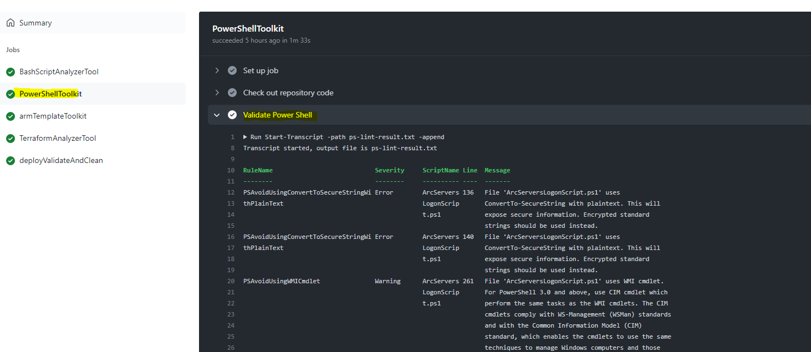
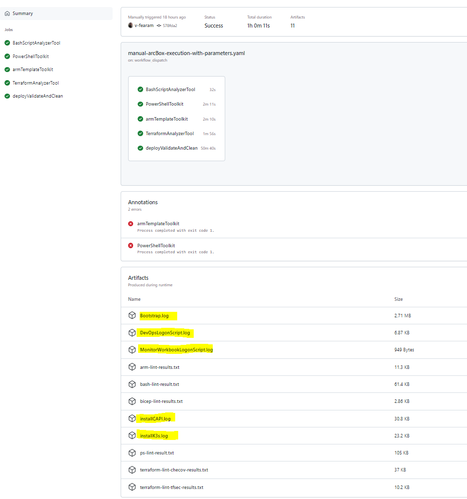

# ArcBox automatic deployment and testing

The goal of the scripts in this folder is to enable the automated deployment and testing of ArcBox in a Continuous Integration / Continuous Deployment (CI/CD) model.

The solution is implemented using [GitHub Actions](https://docs.github.com/actions), and is currently configured to run only when manually invoked.

## Prepare the repo

You need to have permissions to run workflows on the repo where the automation workflow is going to run. You should already have the right level of permissions if you are working on your own fork.

First you need to register some secrets the workflow will consume at run-time.


AZURE_CREDENTIALS is the Azure Service Principal [deployment credentials](https://github.com/marketplace/actions/azure-login#configure-deployment-credentials) the scripts will use to deploy ArcBox to your subscription.  
The other variables are the secret variables defined on the [Azure Arc Box deployment scripts](https://azurearcjumpstart.io/azure_jumpstart_arcbox/).  

The example below illustrates how to user the Azure CLI to create the service principal (--sdk-auth is important):

```azurecli
az ad sp create-for-rbac -n "jumpstartArcBox" --role "User Access Administrator" --scopes /subscriptions/xxx --sdk-auth
```

See possible values for the role parameter on [Azure Arc Box deploys](https://azurearcjumpstart.io/azure_jumpstart_arcbox/).

The complete JSON result must be stored as the value of the AZURE_CREDENTIALS secret

```json
{
  "clientId": "xxx",
  "clientSecret": "xxxx",
  "subscriptionId": "xxxx",
  "tenantId": "xxxx",
  "activeDirectoryEndpointUrl": "https://login.microsoftonline.com",
  "resourceManagerEndpointUrl": "https://management.azure.com/",
  "activeDirectoryGraphResourceId": "https://graph.windows.net/",
  "sqlManagementEndpointUrl": "https://management.core.windows.net:8443/",
  "galleryEndpointUrl": "https://gallery.azure.com/",
  "managementEndpointUrl": "https://management.core.windows.net/"
}
```

You can set the following secrets with the values from the JSON output: SPN_CLIENT_ID, SPN_CLIENT_SECRET,SPN_SUBSCRIPTION_ID, and SPN_TENANT_ID. The ArcBox resources resources will be created using this account.

You also need to define the secrets SSH_RSA_PUBLIC_KEY (instructions are provided in [Azure Arc Box deploys](https://azurearcjumpstart.io/azure_jumpstart_arcbox/)), and WINDOWS_ADMIN_PASSWORD (any valid Azure VM password)

## Execute the workflow

After setting the secrets we are ready to invoke the workflow. Go to the action tab and select the workflow **Manual ArcBox execution with parameters**. The workflow file can be found at `.\.github\workflows\manual-arcBox-execution-with-parameters.yaml`.


After selecting **Run Workflow** in the dropdown, as illustrated in the image above, the following parameters will be shown.

- The first parameter lets you chose the branch containing the definition of the version of the workflow you would like to invoke.
- ArcBox flavor to deploy. At this point the options are: **Full, ITPro, and DevOps**.
- Type of deployment: **ARM, Bicep, or Terraform**.
- Branch containing the ArcBox's scripts to execute.
- Resource group name.
- Resource group location.
- Name of the Log Analytics Workspace.
- Windows VM admin username.
- Select if you would like to deploy Azure Bastion to connect to the client VM.

Once all parameters values have been set, you can click the **Run Workflow** button to begin the deployment. During deployment, each step displays information about what is going on.


## Information generated by the workflow

### Code analysis tools

One aspect of the workflow focuses on code analysis using a variety of code validators and linters. The code analysis steps of the workflow are configured to **continue on error** to prevent code analysis errors from interrupting the execution of the script. You can always have access to the recommendations generated by the code analysis tools.

- **[ShellCheck](https://github.com/koalaman/shellcheck)** is used to validate Bash scripts.
- **[ScriptAnalyzer](https://docs.microsoft.com/powershell/utility-modules/psscriptanalyzer/overview?view=ps-modules)** validates Powershell scripts.
- The **[ARM template test toolkit](https://docs.microsoft.com/azure/azure-resource-manager/templates/test-toolkit)** and **[Pester](https://github.com/pester/Pester)** are used to validate ARM templates.
- **[tfsec](https://github.com/aquasecurity/tfsec)** and **[checov](https://www.checkov.io/)** support the validation of the Terraform codebase.




### Deployment validation

As the ArcBox deployment progresses, the workflow validates the output of each step and generate informational messages so you can follow along.


### Downloadable logs

All the log files generated during the deployment of ArcBox are uploaded to the workflow results folder and made available for download, together with the output of the code analysis tools.



## Adding support to validate new "LogOn" scripts

As the ArcBox continues to evolve, we are expecting new ArcBox flavors or variants to appear. Each new ArcBox flavor would likely introduce a new "LogOn" script as a key component of the deployment. Updating the workflow to support a new LogOn script would require adding steps to invoke the LogOn script, download the log file it generates in the "ClientVM", and uploading the log file as a workflow artifact.  

1. Invoke the LogOn script

    Add a workflow step to invoke the new LogOn script. Pay attention to the flavor reference, the script is only invoked when certain conditions are met.

```

      - name: Open SSH, execute DataServicesLogonScript    // Step Name
        if: github.event.inputs.flavor == 'Full'           // Invoke only if we are deploying the "Full" flavor 

        // Command to execute. The command opens an ssh connection to the ClientVM and executes a script inside the VM
        // normally, you would only need to change the script name here
        run: |
          plink -ssh -P 2204 ${{ github.event.inputs.windowsAdminUsername }}@$(az vm show -d -g ${{ github.event.inputs.resourceGroupName }}  -n ArcBox-Client --query publicIps -o tsv)  -pw  '${{secrets.WINDOWS_ADMIN_PASSWORD}}' -batch 'powershell -InputFormat None -F C:\ArcBox\DataServicesLogonScript.ps1'
```

2. Download the execution log.

   Go to the download file step and add your code in the correct place, which also depends on the target ArcBox flavor. As shown in the example below, the command opens an OpenSSH connection, using the scp protocol, to download a specific log file. Pay attention to the way the location of the log inside the vm is specified as relative to the user folder, for example: `..\..\ArcBox\Logs\Bootstrap.log`.

```
sshpass -p "$secret" scp -o 'StrictHostKeyChecking no' -P 2204 -T $windowsAdminUsername@$(az vm show -d -g $resourceGroupName -n ArcBox-Client --query publicIps -o tsv):'..\..\ArcBox\Logs\Bootstrap.log' '.'  || echo "Bootstrap.log cannot be downloaded"
if [ $flavor == 'Full' ] || [ $flavor == 'ITPro' ]; then
  sshpass -p "$secret" scp -o 'StrictHostKeyChecking no' -P 2204 -T $windowsAdminUsername@$(az vm show -d -g $resourceGroupName -n ArcBox-Client --query publicIps -o tsv):'..\..\ArcBox\Logs\ArcServersLogonScript.log' '.' || echo "ArcServersLogonScript.log cannot be downloaded"
fi
```

3. Upload the log file as workflow artifact so it can be later analyzed in the context of the workflow run.

```
      - name: Upload ArcServersLogonScript.log File
       uses: actions/upload-artifact@v3
       if: (github.event.inputs.flavor == 'Full' || github.event.inputs.flavor == 'ITPro') &&  (success() || failure())
       with:
         name: ArcServersLogonScript.log
         path: ArcServersLogonScript.log
```

_Note:_ It is expected that the new LogOn script is able to run under an OpenSSH connection without errors. If that is not the case, we need evaluate alternatives.

## Workflows execution duration

| Flavor | Bastion | ~Duration |
| ------ | ------- | --------- |
| DevOps | no      | 50 min    |
| DevOps | yes     | 60 min    |
| ITPro  | no      | 60 min    |
| ITPro  | yes     | 70 min    |
| Full   | no      | 110 min   |
| Full   | yes     | 120 min   |

_Note:_ There is a known issue that causes the [Windows Run Command](https://docs.microsoft.com/azure/virtual-machines/windows/run-command) to not being able to detect the end of the execution of a script under some conditions. Usually the script invoked by that step actually runs successfully to completion but the workflow fails to properly collect the results. When that happens, the workflow step will timeout after 90 minutes and the total workflow execution time increases in about 1 hour for every script execution step that ends via timeout.

## Automatic Validations

Below is a list of the types of validations the workflow performs. Keep in mind that many of these validations are driven by criteria that is flavor-specific. For example the number of resources created before the LogOn script is invoked varies depending on the ArcBox flavor being deployed. The configuration file `DeployTestParameters.json` defines the various flavor-specific settings used for validation.

- We are counting resources just after the initial resource deployment, before the LogOn script is invoked. The actual functionality is implemented in `CountResources.sh`.
- After the LogOn script executes, we count the number of elements on the Desktop (mainly links). We look into BOTH, the `C:\Users\Public\Desktop` and `C:\Users\${user}\Desktop` folders. This functionality is implemented in `FileValidations.sh`.
- Verify the Azure Data Studio setting file exist and is properly configured. The code is on the `FileValidations.sh` script.
- Finally, `FinalValidation.sh` implements a few other validations:
  - Count again the number of resources in the resource group.
  - Count the number of Arc-enabled machines and validates each one is in a 'connected' status.
  - Check the number of polices deployed.
  - Check expected number of these type of resources:
    - Log Analytics Workbooks
    - Azure Bastion
    - Azure KeyVault
  - Check the number of Kubernetes clusters
    - Validates 'connected' status for each one
    - Validates these extensions are configured on each cluster: Azure Defender, policyinsights, and Azure Monitor.
    - For the 'ArcBox-CAPI-Data' cluster, it also verifies the extensions KeyVault, Open Service Mesh, and Flux are configured.

## Disclaimer

We are executing four scripts inside the ClientVM on a full deploy to simulate what happens when the user logs on interactively:
  - **ArcServersLogonScript.ps1** This script is remotely invoked through the [Windows Run Command](https://docs.microsoft.com/azure/virtual-machines/windows/run-command). This is a different approach from the rest of the scripts, which are all invoked using OpenSSH. When trying to run it under an ssh session, we observed the execution will come to a halt when reaching the statement `$result = New-AzConnectedMachineExtension -Name "WindowsAgent.SqlServer".
  - **DataServicesLogonScript.ps1** This script blocks when invoked using **Windows Run Command**, so it is invoked remotely via OpenSSH.
  - **DevOpsLogonScript.ps1** and **MonitorWorkbookLogonScript.ps1** work well when invoked either through OpenSSH or the **Windows Run Command**.

In some cases, while the ArcBox scripts are still in the process of creating and configuring its resources, Azure will start applying subscription policies that may interfere with the the correct execution of the deployment script. For example, in subscriptions under the Microsoft tenant we noticed that some times the [Windows Run Command](https://docs.microsoft.com/azure/virtual-machines/windows/run-command) would start to fail randomly. We were able verify from the logs that the command had executed successfully, but the azure cli command would finish with a timeout after 90 minutes. The reason for this failure is described on a note inside the documentation:

    "To function correctly, Run Command requires connectivity (port 443) to Azure public IP addresses. If the extension doesn't have access to these endpoints, **the scripts might run successfully but not return the results**. If you're blocking traffic on the virtual machine, you can use service tags to allow traffic to Azure public IP addresses by using the AzureCloud tag."

As a workaround we are ignoring timeout errors on that step, and explicitly checking environmental conditions that indicate the script finished the execution successfully. The only secondary effect is that the execution time is increased in those situations.

[Open SSH](https://docs.microsoft.com/windows-server/administration/openssh/openssh_install_firstuse) is installed using [Windows Run Command](https://docs.microsoft.com/azure/virtual-machines/windows/run-command), and it listens on port 2204 because of subscription security polices.
