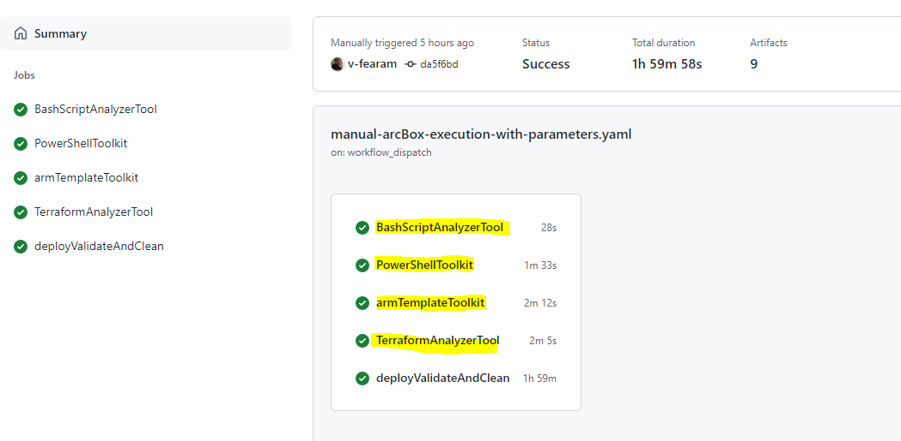

# ArcBox automatic deploy and test

The goal is to provide automation to deploy and test arcbox scenarios.  
We decided to use [GitHub Actions](https://docs.github.com/actions).

The workflow is a manual one, you need to execute it when you consider it is proper.

## Prepare the repo

You need to have enough permission on the repo, it is true when you work on your own fork.  
First you need to create a sequence of secrets.


AZURE_CREDENTIALS is needed for the [Azure Login GitHub Action](https://github.com/marketplace/actions/azure-login#configure-deployment-credentials).  
The other variables are the secret variables defined on [Azure Arc Box deploys](https://azurearcjumpstart.io/azure_jumpstart_arcbox/).  
AZURE_CREDENTIALS Example (--sdk-auth is important):

```azurecli
az ad sp create-for-rbac -n "jumpstartArcBox" --role "User Access Administrator" --scopes /subscriptions/xxx --sdk-auth
```

See possible roles on [Azure Arc Box deploys](https://azurearcjumpstart.io/azure_jumpstart_arcbox/).

The complete json result must be inside the AZURE_CREDENTIALS secret

```json
{
  "clientId": "xxx",
  "clientSecret": "xxxx",
  "subscriptionId": "xxxx",
  "tenantId": "xxxx",
  "activeDirectoryEndpointUrl": "https://login.microsoftonline.com",
  "resourceManagerEndpointUrl": "https://management.azure.com/",
  "activeDirectoryGraphResourceId": "https://graph.windows.net/",
  "sqlManagementEndpointUrl": "https://management.core.windows.net:8443/",
  "galleryEndpointUrl": "https://gallery.azure.com/",
  "managementEndpointUrl": "https://management.core.windows.net/"
}
```

You can complete the following variables based on the same output: SPN_CLIENT_ID, SPN_CLIENT_SECRET,SPN_SUBSCRIPTION_ID, SPN_TENANT_ID.

_Note:_ The resources will be created using this account

You need to define SSH_RSA_PUBLIC_KEY (look here [Azure Arc Box deploys](https://azurearcjumpstart.io/azure_jumpstart_arcbox/) how to do it), and WINDOWS_ADMIN_PASSWORD (Any valid Azure VM password)

## Execute the workflow

We are ready, we need to go to the Action Tab and select our workflow (Manual ArcBox Execution with parameters). The workflow file is on `.\.github\workflows\manual-arcBox-execution-with-parameters.yaml` and github is going to read the files in order to give the workflow as option.  


Selecting **Run Workflow**, the parameters will be present.

- The first parameter is which workflow definition we are you going to use (you can have different workflow versions on differs branches)
- Flavor to be executed, so far Full, ITPro or DevOps
- Kind of deploy: ARM, Bicep or Terraform
- Which branch you are going to use to read the arcbox's scripts
- Resource group name
- Location
- Name of log analytic
- Windows VM admin username
- Choice if you like to deploy Bastion to connect to the client VM

Then you could follow the execution, and on each step there is information about what is going on.  


On the file DeployTestParameters.json are defined the parameters which every flavor has to reach

## Information Generated

We take a look to the quality of the code

- Bash script by **shellcheck**
- Powershell script by **Invoke-ScriptAnalyzer**
- Arm template validation and we are generating arm from bicep script by **ARM-TTK and Pester**
- Terraform validation. It is done by **tfsec** and **checov**

  The validations are configure to continue on error, then they will be always succeed, but you will be able to see the recommendations.




On the deploy workflow there are deploy validation that you could check


Final Validation DevOps Scenario Example  


After finishing the logs from inside the vm and lint code results are available


## How to add a new LogOn Script

It is expected the new script is able to run perfect throught OpenSSH. If that is not the case, we need to work on the root cause and evaluate alternatives.  
We need to add the script execution, then download the log of the execution and finally upload the log as workflow artifact.  
Let see:

1. Add the script execution Step  
   Copy another step and change the script name (and step name). The another point to pay attention is the flavor selection, the script executes when certain conditions are met.

```
      - name: Open SSH, execute DataServicesLogonScript   //Step Name
        if: github.event.inputs.flavor == 'Full'  // condition, this step only will execute on Full scenarios
        run: |
          plink -ssh -P 2204 ${{ github.event.inputs.windowsAdminUsername }}@$(az vm show -d -g ${{ github.event.inputs.resourceGroupName }}  -n ArcBox-Client --query publicIps -o tsv)  -pw  '${{secrets.WINDOWS_ADMIN_PASSWORD}}' -batch 'powershell -InputFormat None -F C:\ArcBox\DataServicesLogonScript.ps1'

          // Command to execute. The command is a ssh conection and execute a script inside the VM, we only need to change the script name

```

2. Download the execution log  
   Go to the download file step and put your line in the correct place. It also depends on the flavor. Each line is a OpenSSH conection (using scp protocol) which download a specific log and close. Code on `DownloadLogs.sh`  
   The important part is the location of the log inisde the vm starting on the user forlder. Example, `..\..\ArcBox\Logs\Bootstrap.log`. Then the `||` is only in case the previous sentence fails, the script is going to put a note for the workflow user

```
#Example
sshpass -p "$secret" scp -o 'StrictHostKeyChecking no' -P 2204 -T $windowsAdminUsername@$(az vm show -d -g $resourceGroupName -n ArcBox-Client --query publicIps -o tsv):'..\..\ArcBox\Logs\Bootstrap.log' '.'  || echo "Bootstrap.log not able to be downloaded"
if [ $flavor == 'Full' ] || [ $flavor == 'ITPro' ]; then
  sshpass -p "$secret" scp -o 'StrictHostKeyChecking no' -P 2204 -T $windowsAdminUsername@$(az vm show -d -g $resourceGroupName -n ArcBox-Client --query publicIps -o tsv):'..\..\ArcBox\Logs\ArcServersLogonScript.log' '.' || echo "ArcServersLogonScript.log not able to be downloaded"
fi
```

3.  Upload the log as workflow artifact  
    Copy a step that already exist and rename properly for your file. Please, pay attention to the condition related to the flavor.

```
      - name: Upload ArcServersLogonScript.log File
       uses: actions/upload-artifact@v3
       if: (github.event.inputs.flavor == 'Full' || github.event.inputs.flavor == 'ITPro') &&  (success() || failure())
       with:
         name: ArcServersLogonScript.log
         path: ArcServersLogonScript.log
```

_Note:_ `success() || failure()` means to run this step even if fails some previous step. The idea is to have the failure logs available

## Workflows execution duration

| Flavor | Bastion | ~Duration |
| ------ | ------- | --------- |
| DevOps | no      | 50 min    |
| DevOps | yes     | 60 min    |
| ITPro  | no      | 60 min    |
| ITPro  | yes     | 70 min    |
| Full   | no      | 110 min   |
| Full   | yes     | 120 min   |

if [Widows Run Command](https://docs.microsoft.com/azure/virtual-machines/windows/run-command) not detect the end, it will finish by time out on 90 min. The scripts might run successfully but not return the results. In this cases the workflow execution time increase in about 1hs.

## Automatic Validations

Many validations depends on the scenario, for example the number of resources. We have a set of value configure for each flavor on `DeployTestParameters.json`

- We are counting resources just after the resource deployments. Step name `name: Count Resources pre vm Script execution`. The code is on the `CountResources.sh` script.
- After the LogOn script executions
  - We count the number of elements on the Desktop (mainly links). We look into the `C:\Users\Public\Desktop` and `C:\Users\${user}\Desktop` folders. The code is on the `FileValidations.sh` script.
  - If check Azure Data Studio setting file exist and the size is bigger than 0 byte. The code is on the `FileValidations.sh` script.
  - Finally, The `FinalValidation.sh` includes may other validations:
    - Count resources again
    - Check Azure Arc enable machines amount
      - If it is needed, it is also check the status 'connected' for each one
    - Check the number of polices deployed
    - Check expected number of
      - Workbooks
      - Azure Bastion
      - KeyVault
    - Check number of Kubernetes Connected Clusters
      - Status 'connected' for each one
      - Azure Defender, policyinsights, and Azure Monitor extensions for each one
      - For 'ArcBox-CAPI-Data' also check key Vault, Open Service Mesh and Flux extension

## Disclaimer

We need to execute 4 script inside the VM on a full deploy to simulate what it happens at LogOn:

- ArcServersLogonScript.ps1, this script is block when execute using OpenSSH, but when we run it using [Widows Run Command](https://docs.microsoft.com/azure/virtual-machines/windows/run-command), it works. Running through OpenSSH the last log entry is `Installing SQL Server - Azure Arc extension. This may take 5+ minutes.`, then I suppose the block is executing `$result = New-AzConnectedMachineExtension -Name "WindowsAgent.SqlServer"...`
- DevOpsLogonScript.ps1, is executed using OpenSSH.
- DataServicesLogonScript.ps1, this script is block when execute using [Widows Run Command](https://docs.microsoft.com/azure/virtual-machines/windows/run-command), so we installed and use OpenSSH to execute it. 
- MonitorWorkbookLogonScript.ps1, execute in both approaches. It currently is running with OpenSSH

After the incorporation of some security polices to the subscription, the [Widows Run Command](https://docs.microsoft.com/azure/virtual-machines/windows/run-command) start to fail randomly, the failure is described on the note inside the documentation:

"To function correctly, Run Command requires connectivity (port 443) to Azure public IP addresses. If the extension doesn't have access to these endpoints, **the scripts might run successfully but not return the results**. If you're blocking traffic on the virtual machine, you can use service tags to allow traffic to Azure public IP addresses by using the AzureCloud tag."

We were able to check from the log that the command execute correctly, but the azure cli command finish with timeout at 90 min.

The ITPro flavor usually works and the Full flavor usually fails. We spouse it is related to the time that the police spent before applying to ClientVM. On ITPro scenario the deploy finish as soon the ClientVM finish, and not in the another case.

We added a kind or "continue on error", and we check a file generated that indicate the script finished the execution. Then it will succeed even after time out. The only secondary effect is the execution time increase.

[Open SSH](https://docs.microsoft.com/windows-server/administration/openssh/openssh_install_firstuse) is installed using [Widows Run Command](https://docs.microsoft.com/azure/virtual-machines/windows/run-command), and for subscription security polices was moved to port 2204
